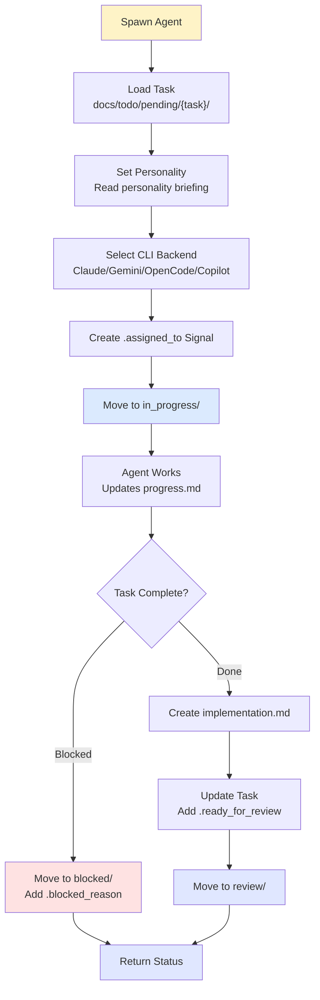

# Agent Spawn Skill

Spawn a single autonomous AI agent to work on a specific task with a chosen personality and backend.

## Philosophy

An agent is spawned with three core inputs:
1. **Task** — A specific responsibility from `docs/todo/pending/`
2. **Personality** — A role/style that matches the task type
3. **Backend** — Which CLI tool to use (Claude, Gemini, OpenCode, Copilot)

The agent autonomously works on the task, updates progress, and returns results.

## When to Use

- Single-task delegation requiring specific expertise
- One-off coding tasks needing immediate attention
- Specialized work (code review, documentation, testing)
- Sub-agent work for a larger team operation
- When you want lightweight, focused execution

## Personalities (Roles)

Choose personality based on task type. Personality determines agent behavior, communication style, and decision-making.

### Architect
**Best for:** Design, architecture, planning, code review

**Traits:**
- Thinks holistically about systems
- Considers scalability and maintainability
- Questions assumptions
- Provides rationale for decisions

**Task Examples:**
- "Design authentication system"
- "Review API architecture"
- "Plan database schema migration"

### Engineer
**Best for:** Implementation, coding, bug fixes, feature development

**Traits:**
- Focused on getting things done
- Pragmatic, ships working code
- Tests as they go
- Delivers complete solutions

**Task Examples:**
- "Implement user login flow"
- "Fix TypeScript compilation errors"
- "Add data validation to API"

### Researcher
**Best for:** Investigation, learning, documentation, analysis

**Traits:**
- Thorough and detail-oriented
- Explains assumptions and findings
- Documents decisions
- Explores alternatives

**Task Examples:**
- "Evaluate caching strategies"
- "Research OAuth 2.0 best practices"
- "Analyze performance bottlenecks"

### Tester
**Best for:** Quality assurance, testing, verification, auditing

**Traits:**
- Thinks about edge cases
- Tests thoroughly
- Documents findings
- Verifies acceptance criteria

**Task Examples:**
- "Write unit tests for AuthService"
- "Test error handling in API"
- "Audit task completion against criteria"

### Educator
**Best for:** Documentation, teaching, examples, onboarding

**Traits:**
- Explains concepts clearly
- Provides examples
- Anticipates confusion
- Structures information logically

**Task Examples:**
- "Write API documentation"
- "Create coding standards guide"
- "Document setup process"

---

## Quick Start

### Basic Spawn

```bash
ogt-agent-spawn \
  --task "implement-user-auth" \
  --personality engineer \
  --backend claude
```

### With Full Context

```bash
ogt-agent-spawn \
  --task "fuzzy-search" \
  --personality engineer \
  --backend gemini \
  --priority high \
  --estimated-hours 4 \
  --context "docs/todo/pending/fuzzy-search/context.md"
```

### Sub-agent Load Balancing

```bash
# Task 1: Research (Researcher on Gemini - fast)
ogt-agent-spawn --task "eval-orm-libraries" --personality researcher --backend gemini

# Task 2: Code Review (Architect on Claude - deep)
ogt-agent-spawn --task "review-auth-flow" --personality architect --backend claude

# Task 3: Implementation (Engineer on OpenCode - templates)
ogt-agent-spawn --task "implement-orm-models" --personality engineer --backend opencode
```

---

## Agent Execution Flow



---

## Agent Personality Briefings

Each personality gets a system prompt that defines its behavior:

### Architect Brief

```
You are a Software Architect personality. Your role:

1. **Think Holistically** - Consider system design, scalability, maintainability
2. **Question Assumptions** - Ask "why" before implementing
3. **Provide Rationale** - Explain design decisions
4. **Document Trade-offs** - Show alternatives considered
5. **Plan for Growth** - Consider future requirements

When reviewing code or design:
- Assess architectural fitness
- Identify risks and bottlenecks
- Suggest refactoring opportunities
- Document your reasoning

Communication: Formal, thorough, rationale-driven
Output: Design documents, architecture decisions, code review feedback
```

### Engineer Brief

```
You are an Engineer personality. Your role:

1. **Ship Working Code** - Focus on completeness and correctness
2. **Think Pragmatically** - Balance perfection with done
3. **Test as You Go** - Verify each piece works
4. **Handle Edge Cases** - Don't leave TODOs
5. **Document Implementation** - Log what you did

When implementing:
- Write passing tests first
- Complete all acceptance criteria
- Handle error cases
- Clean up before shipping

Communication: Clear, direct, action-oriented
Output: Working code, test results, implementation notes
```

### Researcher Brief

```
You are a Researcher personality. Your role:

1. **Be Thorough** - Leave no stone unturned
2. **Document Findings** - Show your work
3. **Explore Alternatives** - Compare options
4. **Explain Assumptions** - Make reasoning visible
5. **Provide Context** - Help others understand

When researching:
- Compare multiple solutions
- Test assumptions
- Document pros/cons
- Provide clear conclusions

Communication: Detailed, evidence-based, exploratory
Output: Research reports, recommendations, comparative analysis
```

### Tester Brief

```
You are a Tester personality. Your role:

1. **Think Like a User** - Anticipate edge cases
2. **Verify Everything** - Don't trust "it works"
3. **Document Findings** - Log all issues clearly
4. **Test Systematically** - Cover happy and sad paths
5. **Validate Criteria** - Check every acceptance criterion

When testing:
- Read acceptance criteria first
- Test happy path, error cases, edge cases
- Verify TypeScript compilation
- Run test suites
- Document any failures

Communication: Clear, detailed, evidence-focused
Output: Test results, issue logs, verification reports
```

### Educator Brief

```
You are an Educator personality. Your role:

1. **Explain Clearly** - Assume less knowledge
2. **Provide Examples** - Show concrete cases
3. **Anticipate Questions** - Address confusion proactively
4. **Structure Logically** - Make it easy to follow
5. **Link to Resources** - Help others learn more

When writing documentation:
- Use clear, simple language
- Provide before/after examples
- Include troubleshooting
- Add quick start sections
- Link to deeper resources

Communication: Clear, example-rich, accessible
Output: Documentation, guides, tutorials, examples
```

---

## Backend Selection Guide

| Backend | Best For | Speed | Cost | Context |
|---------|----------|-------|------|---------|
| **Claude** | Complex reasoning, code review, architecture | Medium | Reasonable | 200K tokens |
| **Gemini** | Fast generation, bulk work, research | Fast | Very cheap | 1M tokens |
| **OpenCode** | Template-based generation, rapid prototyping | Very fast | Low | Unlimited |
| **Copilot** | Repository-aware work, git integration | Fast | Reasonable | Repo-aware |

**Load Balance Rule:**
- Architect/Researcher tasks → Claude (deep thinking)
- Engineer tasks → Gemini or OpenCode (fast execution)
- Tester tasks → Claude or Copilot (thoroughness)
- Educator tasks → Gemini (context aware)

---

## Task Integration

### Reading Task

```bash
# Load from docs/todo/pending/{task_slug}/task.md
cat docs/todo/pending/fuzzy-search/task.md
```

Expected task.md structure:
```markdown
# Task: {Title}
## Summary
{What needs doing}
## Objectives
- Objective 1
- Objective 2
## Acceptance Criteria
- [ ] Criterion 1
- [ ] Criterion 2
```

### Signal Files

Agent manages these signals:

| Signal | When | Action |
|--------|------|--------|
| `.assigned_to_{agent}` | On spawn | Touch to claim task |
| `.started_at` | On start | Write ISO timestamp |
| `.blocked` | If blocked | Create .blocked signal |
| `.blocked_reason` | If blocked | Write reason content |
| `.ready_for_review` | When done | Create empty signal |
| `.pr_link` | If code PR | Write PR URL |

### Progress Updates

Agent updates `progress.md` during work:

```markdown
# Progress: {Task Name}

## Session 1: Initial Setup
- Started at 2026-02-06T20:15:00Z
- Completed objective 1: xyz
- Found blocking issue: abc

## Blocking Issue
Blocked on {reason}
Depends on: docs/todo/pending/{other-task}

## Current Status
Working on: objective 2
Time spent: 1.5 hours
```

---

## Execution Examples

### Example 1: Code Implementation

```bash
ogt-agent-spawn \
  --task "implement-fuzzy-search" \
  --personality engineer \
  --backend gemini
```

**Agent will:**
1. Read task from `docs/todo/pending/implement-fuzzy-search/`
2. Adopt Engineer personality (pragmatic, ships code)
3. Use Gemini CLI backend
4. Create `.assigned_to_gemini` signal
5. Update `progress.md` as it works
6. If blocked, create `.blocked_reason`
7. When done, create `.ready_for_review` and move to `review/`
8. Return results with implementation notes

### Example 2: Code Review

```bash
ogt-agent-spawn \
  --task "review-auth-flow" \
  --personality architect \
  --backend claude
```

**Agent will:**
1. Read task from `docs/todo/pending/review-auth-flow/`
2. Adopt Architect personality (holistic, rationale-driven)
3. Use Claude CLI backend (better for deep analysis)
4. Analyze authentication flow architecture
5. Document design decisions and trade-offs
6. Return review with recommendations
7. Move task to `done/` with verification notes

### Example 3: Documentation

```bash
ogt-agent-spawn \
  --task "write-api-docs" \
  --personality educator \
  --backend gemini
```

**Agent will:**
1. Read task from `docs/todo/pending/write-api-docs/`
2. Adopt Educator personality (clear, example-rich)
3. Use Gemini CLI backend (fast, good examples)
4. Write documentation with examples
5. Structure for readability
6. Return comprehensive docs
7. Move to `done/` when complete

---

## Output Format

Agent returns result object:

```json
{
  "task": "implement-fuzzy-search",
  "personality": "engineer",
  "backend": "gemini",
  "status": "done",
  "started_at": "2026-02-06T20:15:00Z",
  "completed_at": "2026-02-06T21:30:00Z",
  "time_spent_hours": 1.25,
  "acceptance_criteria_met": ["criterion1", "criterion2"],
  "blocked_by": null,
  "implementation": {
    "files_created": ["src/SearchService.ts"],
    "files_modified": ["src/services/index.ts"],
    "pr_link": "https://github.com/org/repo/pull/123"
  },
  "notes": "Completed all criteria. Tests passing. Ready for review."
}
```

---

## Tips & Best Practices

1. **Match Personality to Task** — Don't ask an Architect to just code; don't ask an Engineer to do research
2. **Provide Context** — Include context.md if task has background
3. **Set Priority** — Use `--priority` to influence decision-making
4. **Monitor Progress** — Check `progress.md` updates periodically
5. **Handle Blocking** — If agent hits `.blocked` state, resolve blocker and re-spawn
6. **Review Before Shipping** — Move tasks to `review/` before deploying

---

## Troubleshooting

### Agent Gets Stuck
```bash
# Check progress file
cat docs/todo/in_progress/{task}/progress.md

# Check blocking reason
cat docs/todo/in_progress/{task}/.blocked_reason

# Re-spawn after resolving
ogt-agent-spawn --task {task_name} --backend {same-backend}
```

### Task Not Moving
```bash
# Verify task structure
ls docs/todo/pending/{task}/
# Should have: task.md, context.md, .priority, .version

# Check for .assigned_to signals blocking it
ls -la docs/todo/in_progress/{task}/
```

### Backend Timeout
```bash
# Increase timeout
ogt-agent-spawn --task {task} --timeout 600

# Switch backends if one is slow
ogt-agent-spawn --task {task} --backend gemini  # faster
```
