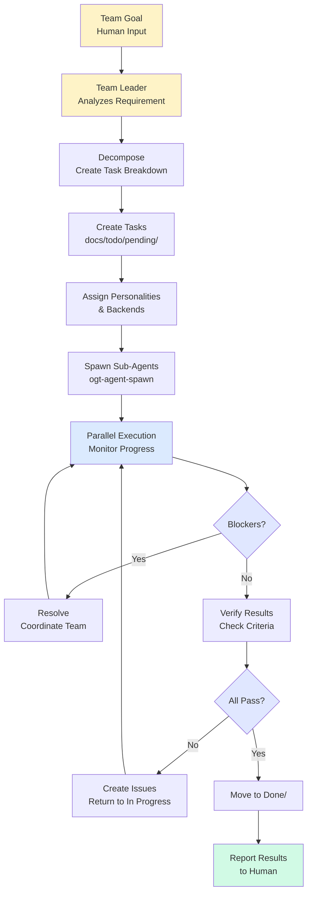

# Team Leadership Skill

Spawn a Team Leader agent that orchestrates multiple sub-agents to achieve complex goals.

## Philosophy

A team operates as follows:

1. **Team Leader** receives a high-level goal or requirement
2. **Decomposes** the goal into smaller, independent tasks
3. **Creates tasks** in `docs/todo/pending/` with clear ownership
4. **Selects personalities** that match each task type
5. **Spawns sub-agents** using `ogt-agent-spawn`
6. **Manages communication** between team members (shared progress docs)
7. **Monitors progress** via task signals and `.assigned_to_` markers
8. **Resolves blockers** by coordinating across the team
9. **Verifies completion** against acceptance criteria
10. **Reports results** to human with final status

The Team Leader acts as a project manager and technical orchestrator.

---

## When to Use

- Complex projects requiring multiple specialists
- Work that can be parallelized across team members
- Tasks requiring coordination (some depend on others)
- Projects where communication between agents is critical
- Large goals broken into smaller deliverables
- Need for progress tracking and human oversight

---

## Team Leader Personality

The Team Leader always adopts this personality:

```
You are a Team Leader. Your role:

1. **Understand the Goal** - Read the requirement fully
2. **Decompose Work** - Break into independent, parallel tasks
3. **Create Tasks** - Write task definitions in docs/todo/pending/
4. **Assign Specialists** - Choose personalities matching each task
5. **Spawn Sub-Agents** - Use ogt-agent-spawn with right backend mix
6. **Coordinate** - Manage dependencies and blockers
7. **Monitor** - Track progress via task signals
8. **Communicate** - Update humans on status and blockers
9. **Verify** - Ensure all tasks meet acceptance criteria
10. **Report** - Provide final results with complete accounting

Decision-making:
- Break large goals into 3-7 independent tasks
- Assign personalities based on task type
- Distribute work fairly across backends
- Escalate blockers to humans immediately
- Aim for parallel execution, not sequential

Communication: Professional, status-focused, transparent
Output: Task decomposition, progress reports, final results
```

---

## Quick Start

### Basic Team Operation

```bash
ogt-agent-team \
  --goal "Build user authentication system" \
  --team-size 3-5 \
  --deadline "2 days"
```

### With Specific Requirements

```bash
ogt-agent-team \
  --goal "Refactor API from REST to GraphQL" \
  --requirements "docs/requirements.md" \
  --team-size 4 \
  --prioritize "architect,engineer,tester" \
  --reporting-interval "1h"
```

### With Dependencies

```bash
ogt-agent-team \
  --goal "Build multi-tenant system" \
  --dependencies "docs/architecture.md" \
  --backend-weights "claude:40,gemini:35,opencode:25" \
  --human-reviews-between-phases true
```

---

## Team Operation Flow



---

## Task Decomposition

Team Leader reads the goal and breaks it into tasks:

### Goal Analysis

Read the goal/requirement and identify:
- **Scope** — What's in vs out
- **Dependencies** — Task ordering
- **Complexity** — Effort levels
- **Specializations** — What types of work

### Task Creation

Create tasks in `docs/todo/pending/{task_slug}/` with:

```markdown
# Task: {Clear Title}

## Summary
One sentence about this task.

## Objectives
- Objective 1
- Objective 2

## Acceptance Criteria
- [ ] Criterion 1
- [ ] Criterion 2

## Dependencies
- Depends on: docs/todo/pending/{other-task}
- OR: None

## Estimated Effort
{Size} ({hours} hours)

## Team Assignment
Personality: {architect|engineer|researcher|tester|educator}
Backend: {claude|gemini|opencode|copilot}
```

### Personality Assignment Rules

| Task Type | Best Personality | Reason |
|-----------|------------------|--------|
| Design/Architecture | Architect | Holistic thinking |
| Implementation | Engineer | Pragmatism, ships code |
| Testing/Verification | Tester | Thoroughness |
| Investigation | Researcher | Detailed analysis |
| Documentation | Educator | Clear communication |
| Code Review | Architect | Critical analysis |

---

## Sub-Agent Management

### Spawning Pattern

```bash
# Task 1: Research (needs deep analysis)
ogt-agent-spawn \
  --task "evaluate-db-options" \
  --personality researcher \
  --backend claude  # deep thinking

# Task 2: Architecture (needs design thinking)
ogt-agent-spawn \
  --task "design-auth-system" \
  --personality architect \
  --backend claude  # deep thinking

# Task 3: Implementation (needs fast execution)
ogt-agent-spawn \
  --task "implement-auth-service" \
  --personality engineer \
  --backend gemini  # fast execution

# Task 4: Testing (needs thoroughness)
ogt-agent-spawn \
  --task "test-auth-flow" \
  --personality tester \
  --backend claude  # thorough analysis

# Task 5: Documentation (needs clarity)
ogt-agent-spawn \
  --task "document-auth-api" \
  --personality educator \
  --backend gemini  # good examples
```

### Load Balancing

Distribute across backends to balance cost/quality/speed:

```
Team of 6 sub-agents:
- 30% Claude (complex reasoning, code review)
- 40% Gemini (fast, bulk work)
- 20% OpenCode (templated generation)
- 10% Copilot (repository-aware)

Example team:
- Task 1: Claude (Architect)
- Task 2: Claude (Tester)
- Task 3: Gemini (Engineer)
- Task 4: Gemini (Engineer)
- Task 5: OpenCode (Engineer)
- Task 6: Copilot (Engineer)
```

---

## Progress Tracking

Team Leader monitors tasks via signals and files:

### Tracking Signals

Check these signals to understand task state:

```bash
# Find all tasks assigned to current team
find docs/todo -name ".assigned_to_*" | wc -l

# Find blocked tasks
find docs/todo/blocked -name ".blocked_reason" -exec cat {} \;

# Find ready for review
find docs/todo/review -name ".ready_for_review" | wc -l

# Find completed
find docs/todo/done -name ".verified" | wc -l
```

### Progress File Format

Team Leader updates `team_progress.md` in project root:

```markdown
# Team Progress Report

## Goal
Implement user authentication system

## Team Composition
- Task 1: evaluate-db-options (Researcher/Claude) - 40% complete
- Task 2: design-auth-system (Architect/Claude) - 80% complete
- Task 3: implement-auth-service (Engineer/Gemini) - Blocked
- Task 4: test-auth-flow (Tester/Claude) - Waiting on Task 3
- Task 5: document-auth-api (Educator/Gemini) - Not started

## Blockers
**Task 3: implement-auth-service**
- Blocked on: Task 2 design approval
- Details: Waiting for final architecture sign-off
- Expected resolution: 2 hours

## Time Tracking
- Total hours available: 16h
- Hours used: 6.5h
- Hours remaining: 9.5h

## Next Actions
1. Review Task 2 architecture
2. Unblock Task 3 once approved
3. Monitor Tasks 3, 4 for completion

## Completed Tasks
- None yet
```

---

## Coordination Patterns

### Sequential Dependency

When tasks depend on each other:

```bash
# Task A (must complete first)
ogt-agent-spawn --task task-a --priority high

# Wait for task-a to complete (check done/ directory)
# Then spawn Task B
ogt-agent-spawn --task task-b --depends-on task-a
```

### Parallel Execution

When tasks are independent:

```bash
# Spawn all at once
ogt-agent-spawn --task task-1 &
ogt-agent-spawn --task task-2 &
ogt-agent-spawn --task task-3 &
wait  # Wait for all to complete
```

### Blocking Resolver

When a task is blocked:

1. **Identify blocker**
   ```bash
   cat docs/todo/blocked/{task}/.blocked_reason
   ```

2. **Resolve blocker** (might require human input)
   ```bash
   # If blocker is another task, spawn it
   ogt-agent-spawn --task {blocking-task} --priority critical
   
   # If blocker is human decision, ask human
   echo "Need decision on {thing}..."
   ```

3. **Unblock task**
   ```bash
   # Remove blocking signals
   rm docs/todo/blocked/{task}/.blocked
   rm docs/todo/blocked/{task}/.blocked_reason
   
   # Move back to pending
   mv docs/todo/blocked/{task} docs/todo/pending/{task}
   
   # Re-spawn agent
   ogt-agent-spawn --task {task}
   ```

---

## Verification & Reporting

### Verification Process

After all sub-agents complete, Team Leader verifies:

```bash
# For each task, check acceptance criteria
for task in docs/todo/done/*/; do
  echo "=== $(basename $task) ==="
  grep "## Acceptance Criteria" "$task/task.md" -A 10
  
  # Check if .verified signal exists
  if [ -f "$task/.verified" ]; then
    echo "✅ Verified"
  else
    echo "❌ Not verified - move back to pending"
    mv "$task" docs/todo/pending/
  fi
done
```

### Final Report

Team Leader returns comprehensive report:

```json
{
  "goal": "Build user authentication system",
  "status": "completed",
  "started_at": "2026-02-06T20:15:00Z",
  "completed_at": "2026-02-06T23:45:00Z",
  "total_time_hours": 3.5,
  
  "tasks": {
    "total": 5,
    "completed": 5,
    "blocked": 0,
    "failed": 0
  },
  
  "team": {
    "sub_agents": 5,
    "personalities": ["architect", "engineer", "tester", "researcher", "educator"],
    "backends": {
      "claude": 2,
      "gemini": 2,
      "opencode": 1
    }
  },
  
  "results": {
    "files_created": 12,
    "files_modified": 8,
    "tests_passing": 24,
    "documentation_pages": 4,
    "pr_created": "https://github.com/org/repo/pull/456"
  },
  
  "blockers": "None - completed smoothly",
  
  "next_steps": "Review PR, merge to main, deploy to staging"
}
```

---

## Communication with Team

### Status Updates

Team Leader provides periodic updates to human:

```
🚀 Team Update - User Auth System
─────────────────────────────────

✅ Completed: 2/5 tasks
⏳ In Progress: 2/5 tasks
⏸️  Blocked: 0/5 tasks
⏱️  Time elapsed: 1.5h / 3.5h estimated

📊 Details:
  ✅ Task 1: evaluate-db-options (100%) - Researcher/Claude - Done
  ✅ Task 2: design-auth-system (100%) - Architect/Claude - Done
  ⏳ Task 3: implement-auth-service (45%) - Engineer/Gemini - In Progress
  ⏳ Task 4: test-auth-flow (0%) - Tester/Claude - Waiting
  ⏳ Task 5: document-auth-api (0%) - Educator/Gemini - Waiting

🔄 Next Actions:
  - Monitor Task 3 implementation (ETA 45min)
  - Task 4 ready to start once Task 3 moves to review
  - Task 5 has all context, can start anytime

❓ Blockers: None
💬 Communication: Team members updating progress.md every 30min
```

### Human Escalation

For issues Team Leader cannot resolve:

```
🆘 Blocker Alert - User Auth System
─────────────────────────────────

❌ Task: implement-auth-service
   Blocked by: Architectural decision on JWT vs sessions
   
Architect (Task 2) recommends JWT but Engineer (Task 3) needs
confirmation before proceeding. Both are standby waiting for decision.

📋 Decision Needed:
  Q: Use JWT or session-based auth?
     - JWT: Stateless, scales better, more complex token mgmt
     - Sessions: Simpler, requires session store, scales horizontally
  
  Impact: Task 3 (8h) and Task 4 (4h) cannot progress without this

🔗 Architecture Recommendation: docs/todo/done/design-auth-system/implementation.md

⏰ Team is idle. Each hour costs equivalent to sub-agent time.

👤 Please decide and respond with: JWT or SESSIONS
```

---

## Configuration

### Team Size

```bash
# Small team (3-4 agents) - simple goals
ogt-agent-team --goal "Refactor UserComponent" --team-size 3

# Medium team (5-7 agents) - complex goals
ogt-agent-team --goal "Build auth system" --team-size 5

# Large team (8+) - enterprise goals
ogt-agent-team --goal "Microservices migration" --team-size 8
```

### Reporting Interval

```bash
# Quick feedback (updates every 15 min)
ogt-agent-team --goal "..." --reporting-interval "15m"

# Standard (updates every hour)
ogt-agent-team --goal "..." --reporting-interval "1h"

# Minimal (updates on blocker or completion only)
ogt-agent-team --goal "..." --reporting-interval "on-change"
```

### Backend Weighting

```bash
# Balanced (even distribution)
ogt-agent-team --goal "..." --backend-weights "equal"

# Quality-focused (prefer Claude)
ogt-agent-team --goal "..." --backend-weights "claude:50,gemini:30,opencode:20"

# Speed-focused (prefer Gemini)
ogt-agent-team --goal "..." --backend-weights "gemini:50,claude:30,opencode:20"

# Cost-focused (prefer OpenCode)
ogt-agent-team --goal "..." --backend-weights "opencode:50,gemini:30,claude:20"
```

---

## Examples

### Example 1: Feature Implementation

```bash
ogt-agent-team --goal "Implement dark mode toggle" --team-size 4
```

**Team decomposition:**
1. **Architect** - Design theme system architecture
2. **Engineer** - Implement theme provider and toggle
3. **Tester** - Write tests and edge case scenarios
4. **Educator** - Document theme API for other developers

**Result:** Complete feature with tests, docs, ready to merge

### Example 2: API Migration

```bash
ogt-agent-team \
  --goal "Migrate REST API to GraphQL" \
  --requirements "docs/migration-plan.md" \
  --team-size 6
```

**Team decomposition:**
1. **Researcher** - Evaluate GraphQL libraries and best practices
2. **Architect** - Design new GraphQL schema and resolver structure
3. **Engineer** - Implement GraphQL resolvers and types
4. **Engineer** - Implement client-side GraphQL queries
5. **Tester** - Test API and client integration
6. **Educator** - Write GraphQL API documentation

**Result:** Fully migrated API with client code and documentation

### Example 3: System Redesign

```bash
ogt-agent-team \
  --goal "Redesign authentication from password to OAuth" \
  --dependencies "docs/security-requirements.md" \
  --team-size 7 \
  --human-reviews-between-phases true
```

**Team decomposition:**
1. **Researcher** - Research OAuth providers and security practices
2. **Architect** - Design OAuth integration architecture
3. **Engineer** - Implement OAuth provider integration
4. **Engineer** - Implement client-side OAuth flow
5. **Engineer** - Implement token management service
6. **Tester** - Test OAuth flow and security edge cases
7. **Educator** - Document OAuth setup and usage

**Result:** Complete OAuth system with security audited and documented

---

## Tips & Best Practices

1. **Clear Requirements** — Provide detailed goals, not vague ones
2. **Size Teams Appropriately** — 3-7 agents typically optimal
3. **Monitor Blockers** — Check progress every 1-2 hours
4. **Escalate Early** — Don't let teams spin on decisions
5. **Verify Thoroughly** — Check acceptance criteria, not just "done"
6. **Document Decisions** — Have Team Leader log why tasks were decomposed that way
7. **Plan for Dependencies** — Order tasks to enable parallelism
8. **Review Before Shipping** — Have human review final results

---

## Troubleshooting

### Team Gets Stuck

```bash
# Check for blockers
find docs/todo/blocked -name ".blocked_reason" -exec cat {} \;

# Check progress files
find docs/todo/in_progress -name "progress.md" -exec tail -20 {} \;

# If blocked for >30min, escalate to human
```

### Task Keeps Failing

```bash
# Check task definition
cat docs/todo/pending/{task}/task.md

# Verify acceptance criteria are achievable
# If too vague, edit task.md with clearer criteria

# Switch to different personality/backend
ogt-agent-spawn --task {task} --personality {different} --backend {different}
```

### Team Not Communicating

```bash
# Create shared progress doc if missing
touch team_progress.md

# Ensure all tasks have progress.md
for task in docs/todo/in_progress/*/; do
  if [ ! -f "$task/progress.md" ]; then
    cp docs/_templates/progress.md "$task/progress.md"
  fi
done
```

### Team Slow

```bash
# Check which tasks are in_progress but idle
ls -lt docs/todo/in_progress/

# If not changing for >30min, may be stuck
# Check progress.md for last update time

# If truly stuck, move back to pending and re-spawn
mv docs/todo/in_progress/{task} docs/todo/pending/{task}
ogt-agent-spawn --task {task} --backend {different}
```
