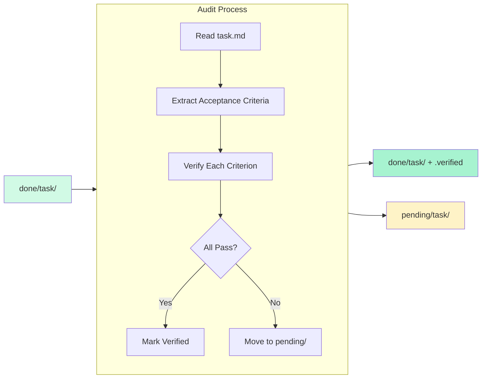
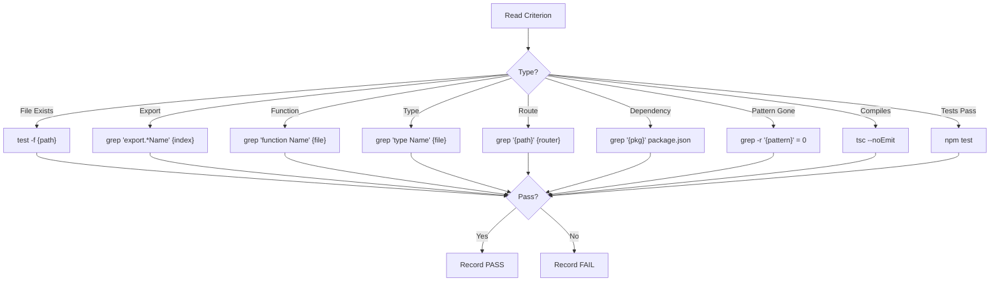

# OGT Docs - Audit Task

Verify that completed tasks actually have working implementations in the codebase.

## Overview

Tasks in `docs/todo/done/` claim to be complete. This skill verifies those claims by checking that the implementation actually exists and works. Unverified tasks are moved back to `pending/` for re-implementation.



## When to Use

- Before a release to ensure all "done" tasks are actually done
- During periodic audits (weekly/monthly)
- When a bug reveals a task may not be complete
- When onboarding to verify codebase state
- After agent work sessions to validate claims

## Verification Types

Different acceptance criteria require different verification methods:

| Criterion Type       | Verification Method        | Example                  |
| -------------------- | -------------------------- | ------------------------ |
| File exists          | `test -f {path}`           | "Create UserService.ts"  |
| File exported        | `grep export {index}`      | "Export from index.ts"   |
| Route exists         | `grep {route} {router}`    | "Add /users route"       |
| Type exists          | `grep "type X" {file}`     | "Add User type"          |
| Function exists      | `grep "function X" {file}` | "Add calculateTotal()"   |
| Dependency installed | `grep {pkg} package.json`  | "Install lodash"         |
| Pattern removed      | `grep -r {pattern}` = 0    | "Remove all console.log" |
| TypeScript compiles  | `tsc --noEmit`             | "No type errors"         |
| Tests pass           | `npm test`                 | "Tests pass"             |
| Feature works        | Manual or E2E test         | "User can login"         |

---

## Folder Structure

Audit operates on `docs/todo/done/` and may move tasks to `pending/`:

```
docs/todo/
├── done/                           # Tasks claiming completion
│   └── {task_slug}/
│       ├── task.md                 # Has acceptance criteria
│       ├── implementation.md       # Claims what was done
│       ├── verification.md         # Should have proof
│       ├── .verified               # REQUIRED - but may be false claim
│       └── .completed_at
│
├── pending/                        # Where failed audits go
│   └── {task_slug}/
│       ├── task.md
│       ├── audit_failure.md        # Why it failed audit
│       ├── .audit_failed           # Signal
│       └── .audit_failed_at
│
└── audit_log/                      # Audit history
    └── {date}/
        ├── summary.md              # Audit summary
        ├── passed.txt              # List of passed tasks
        └── failed.txt              # List of failed tasks
```

---

## Audit Workflow

### Step 1: List Tasks to Audit

```bash
# Find all tasks in done/
ls docs/todo/done/
```

### Step 2: For Each Task, Extract Criteria

Read `task.md` and find the `## Acceptance Criteria` section:

```markdown
## Acceptance Criteria

- [ ] File exists: front/services/SearchService.ts
- [ ] Exported from: front/services/index.ts
- [ ] Function: fuzzySearch(query: string): SearchResult[]
- [ ] TypeScript compiles clean
- [ ] Search returns results within 16ms
```

### Step 3: Verify Each Criterion



### Step 4: Handle Results

#### If ALL Pass:

```bash
# Ensure .verified exists
touch docs/todo/done/{task_slug}/.verified

# Update verification.md with proof
echo "Verified: $(date)" >> docs/todo/done/{task_slug}/verification.md
```

#### If ANY Fail:

```bash
# Move to pending
mv docs/todo/done/{task_slug} docs/todo/pending/

# Add audit failure documentation
cat > docs/todo/pending/{task_slug}/audit_failure.md << 'EOF'
# Audit Failure

## Date
2026-02-06

## Failed Criteria

1. File exists: front/services/SearchService.ts
   - FAILED: File not found

2. TypeScript compiles
   - FAILED: 3 type errors in related files

## Action Required

Re-implement the task following the original acceptance criteria.
EOF

# Add signal
touch docs/todo/pending/{task_slug}/.audit_failed
echo "$(date -Iseconds)" > docs/todo/pending/{task_slug}/.audit_failed_at

# Remove false .verified if it existed
rm -f docs/todo/pending/{task_slug}/.verified
```

---

## Example: Auditing a Task

### Task: docs/todo/done/fuzzy_search/

#### task.md (excerpt)

```markdown
# Task: Fuzzy Search Implementation

## Acceptance Criteria

- [ ] MiniSearch installed in package.json
- [ ] File exists: front/services/SearchService.ts
- [ ] Exported from: front/services/index.ts
- [ ] Function: createSearchIndex(items: Searchable[]): MiniSearch
- [ ] Function: fuzzySearch(query: string): SearchResult[]
- [ ] TypeScript compiles clean
```

#### Verification Commands

```bash
# 1. MiniSearch installed
grep '"minisearch"' front/package.json
# Expected: "minisearch": "^6.0.0"

# 2. File exists
test -f front/services/SearchService.ts && echo "EXISTS" || echo "MISSING"
# Expected: EXISTS

# 3. Exported from index
grep "SearchService\|createSearchIndex\|fuzzySearch" front/services/index.ts
# Expected: export { createSearchIndex, fuzzySearch } from './SearchService';

# 4. Function createSearchIndex exists
grep "function createSearchIndex\|const createSearchIndex\|createSearchIndex =" front/services/SearchService.ts
# Expected: match found

# 5. Function fuzzySearch exists
grep "function fuzzySearch\|const fuzzySearch\|fuzzySearch =" front/services/SearchService.ts
# Expected: match found

# 6. TypeScript compiles
cd front && npx tsc --noEmit
# Expected: exit code 0
```

#### Audit Result: PASS

All criteria verified. Task remains in `done/` with `.verified` confirmed.

---

## Example: Failed Audit

### Task: docs/todo/done/spell_routes/

#### task.md (excerpt)

```markdown
# Task: Wire SpellDetailView into Router

## Acceptance Criteria

- [ ] Route added: /spells/:slug
- [ ] SpellDetailView imported in App.tsx
- [ ] Route element renders SpellDetailView
- [ ] Navigation works from spell cards
```

#### Verification Commands

```bash
# 1. Route in router config
grep "spells/:slug\|spell_detail" front/data/app-configs.ts
# Result: NO MATCH

# 2. Import in App.tsx
grep "SpellDetailView" front/app/App.tsx
# Result: NO MATCH

# 3. Route element
grep "SpellDetailView" front/app/App.tsx | grep -i route
# Result: NO MATCH
```

#### Audit Result: FAIL

Route never implemented. Move to pending:

```bash
# Move task
mv docs/todo/done/spell_routes docs/todo/pending/

# Document failure
cat > docs/todo/pending/spell_routes/audit_failure.md << 'EOF'
# Audit Failure

## Date
2026-02-06

## Failed Criteria

1. Route added: /spells/:slug
   - FAILED: No route found in app-configs.ts

2. SpellDetailView imported in App.tsx
   - FAILED: No import found

3. Route element renders SpellDetailView
   - FAILED: No route element found

## Analysis

The task was marked done but no implementation exists.
SpellDetailView.tsx exists but was never wired into the router.

## Action Required

1. Add spell_detail route to APP_ROUTES in app-configs.ts
2. Import SpellDetailView in App.tsx
3. Add <Route path="/spells/:slug" element={<SpellDetailView />} />
4. Verify navigation works
EOF

# Add signals
touch docs/todo/pending/spell_routes/.audit_failed
echo "2026-02-06T10:00:00Z" > docs/todo/pending/spell_routes/.audit_failed_at
rm -f docs/todo/pending/spell_routes/.verified
```

---

## Batch Audit Script

For auditing multiple tasks at once:

```bash
#!/bin/bash
# audit-done-tasks.sh

AUDIT_DATE=$(date +%Y-%m-%d)
AUDIT_DIR="docs/todo/audit_log/${AUDIT_DATE}"
mkdir -p "$AUDIT_DIR"

PASSED=()
FAILED=()

for task_dir in docs/todo/done/*/; do
    task_name=$(basename "$task_dir")
    echo "Auditing: $task_name"

    # Run verification (implement per-task logic)
    if verify_task "$task_dir"; then
        PASSED+=("$task_name")
        echo "  PASS"
    else
        FAILED+=("$task_name")
        echo "  FAIL - moving to pending/"
        mv "$task_dir" docs/todo/pending/
        # Add audit_failure.md...
    fi
done

# Write summary
cat > "$AUDIT_DIR/summary.md" << EOF
# Audit Summary: $AUDIT_DATE

## Results

- **Passed**: ${#PASSED[@]}
- **Failed**: ${#FAILED[@]}
- **Total**: $((${#PASSED[@]} + ${#FAILED[@]}))

## Pass Rate

$(echo "scale=1; ${#PASSED[@]} * 100 / (${#PASSED[@]} + ${#FAILED[@]})" | bc)%
EOF

printf '%s\n' "${PASSED[@]}" > "$AUDIT_DIR/passed.txt"
printf '%s\n' "${FAILED[@]}" > "$AUDIT_DIR/failed.txt"
```

---

## Verification Patterns by Domain

### Frontend Tasks

```bash
# Component exists
test -f front/components/{path}/{Component}.tsx

# Component exported
grep "export.*{Component}" front/components/{path}/index.ts

# Hook exists
test -f front/hooks/use-{name}.ts

# Route exists
grep "{route}" front/app/App.tsx

# Style applied (check for className or styled-component)
grep "className=\|styled\." front/components/{path}/{Component}.tsx
```

### Backend Tasks

```bash
# API endpoint exists
grep "{endpoint}" back/src/api/{type}/routes/{type}.ts

# Controller method exists
grep "{method}" back/src/api/{type}/controllers/{type}.ts

# Content type schema
test -f back/src/api/{type}/content-types/{type}/schema.json

# Service exists
test -f back/src/api/{type}/services/{type}.ts
```

### Infrastructure Tasks

```bash
# Docker service defined
grep "{service}" docker-compose.yml

# Environment variable documented
grep "{VAR_NAME}" .env.example

# CI step exists
grep "{step_name}" .github/workflows/*.yml
```

### Data/Content Tasks

```bash
# Data file exists
test -f front/data/{collection}/{slug}/data.ts

# Asset exists
test -f static/public/{collection}/{slug}/{asset}

# Index entry
grep "{slug}" front/data/{collection}/index.ts
```

---

## Common Audit Failures

| Symptom            | Likely Cause                   | Fix                   |
| ------------------ | ------------------------------ | --------------------- |
| File not found     | Never created                  | Implement file        |
| Not exported       | Created but not added to index | Add export            |
| TypeScript errors  | Partial implementation         | Fix types             |
| Route not found    | Added to wrong file            | Add to correct router |
| Function missing   | Different name used            | Rename or implement   |
| Tests failing      | Implementation incomplete      | Fix implementation    |
| Dependency missing | Not installed                  | Run npm install       |

---

## Audit Frequency Recommendations

| Trigger             | Frequency     | Scope                              |
| ------------------- | ------------- | ---------------------------------- |
| Before release      | Every release | All done/ tasks since last release |
| Weekly maintenance  | Weekly        | All done/ tasks                    |
| After agent session | Per session   | Tasks marked done in session       |
| Bug discovered      | As needed     | Related tasks                      |
| Onboarding          | Once          | All done/ tasks                    |

---

## Signal Files Reference

### Audit Signals

| Signal             | Location | Purpose            |
| ------------------ | -------- | ------------------ |
| `.verified`        | done/    | Task passed audit  |
| `.audit_failed`    | pending/ | Task failed audit  |
| `.audit_failed_at` | pending/ | When it failed     |
| `.last_audited`    | done/    | When last verified |

### Audit Log Files

| File                          | Purpose               |
| ----------------------------- | --------------------- |
| `audit_log/{date}/summary.md` | Audit session summary |
| `audit_log/{date}/passed.txt` | List of passed tasks  |
| `audit_log/{date}/failed.txt` | List of failed tasks  |
| `{task}/audit_failure.md`     | Detailed failure info |

---

## Audit Checklist

Before marking an audit complete:

- [ ] Read task.md acceptance criteria
- [ ] Verified each criterion with actual commands
- [ ] Captured command output as proof
- [ ] Failed tasks moved to pending/
- [ ] audit_failure.md created for failures
- [ ] .audit_failed signal added
- [ ] .verified confirmed for passes
- [ ] Audit log updated
- [ ] Summary includes pass rate

---

## Integration with CI

Add audit to CI pipeline for automatic verification:

```yaml
# .github/workflows/audit-tasks.yml
name: Audit Done Tasks

on:
  schedule:
    - cron: "0 0 * * 0" # Weekly
  workflow_dispatch:

jobs:
  audit:
    runs-on: ubuntu-latest
    steps:
      - uses: actions/checkout@v4

      - name: Run task audit
        run: ./scripts/audit-done-tasks.sh

      - name: Fail if tasks failed audit
        run: |
          if [ -s docs/todo/audit_log/$(date +%Y-%m-%d)/failed.txt ]; then
            echo "Tasks failed audit:"
            cat docs/todo/audit_log/$(date +%Y-%m-%d)/failed.txt
            exit 1
          fi
```
