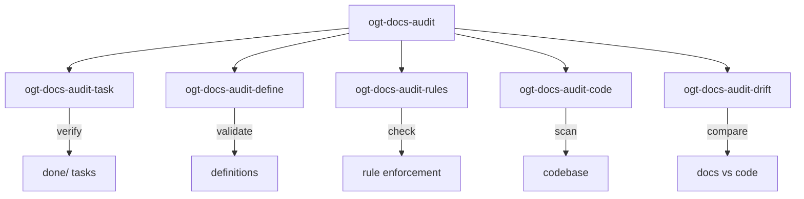

# OGT Docs - Audit

Root skill for running documentation and project audits.

## Overview

Audits verify that documentation matches reality and that project standards are being followed. This skill routes to specialized audit types.



## When to Use

- Before releases to validate project health
- Periodically (weekly/monthly) for maintenance
- When onboarding to understand current state
- After major changes to verify consistency
- When bugs suggest documentation drift

## Audit Types

| Audit      | Sub-Skill             | Purpose                          |
| ---------- | --------------------- | -------------------------------- |
| Task       | `ogt-docs-audit-task` | Verify done/ tasks exist in code |
| Definition | (inline)              | Validate definition completeness |
| Rules      | (inline)              | Check rule enforcement           |
| Code       | (inline)              | Scan code for issues             |
| Drift      | (inline)              | Compare docs to reality          |

## Quick Commands

```bash
# Full project audit
ogt audit all

# Specific audit types
ogt audit tasks              # Verify done/ tasks
ogt audit definitions        # Check definition completeness
ogt audit rules              # Verify rule enforcement
ogt audit drift              # Find docs/code mismatches
```

---

## Audit: Tasks

Verify that completed tasks have working implementations.

**Delegate to:** `ogt-docs-audit-task`

```bash
ogt audit tasks
```

See `ogt-docs-audit-task` for complete documentation.

---

## Audit: Definitions

Validate that definitions are complete and consistent.

### What It Checks

| Check          | Description                          |
| -------------- | ------------------------------------ |
| Required files | definition.md exists in each folder  |
| Links valid    | Internal links resolve               |
| Schema valid   | Follows expected structure           |
| No orphans     | All definitions referenced somewhere |
| No stubs       | No empty/placeholder definitions     |

### Folder Audit

```bash
# Audit all definitions
find docs/define -type d -mindepth 2 | while read dir; do
  if [ ! -f "$dir/definition.md" ] && [ ! -f "$dir/feature.md" ]; then
    echo "MISSING: $dir needs primary document"
  fi
done
```

### Completeness Audit

Check that definitions have required sections:

```bash
# For each definition.md, check for required sections
for file in $(find docs/define -name "definition.md"); do
  missing=""
  grep -q "## Summary" "$file" || missing+="Summary "
  grep -q "## Details\|## The " "$file" || missing+="Details "

  if [ -n "$missing" ]; then
    echo "INCOMPLETE: $file missing: $missing"
  fi
done
```

### Example Output

```
Auditing definitions...

docs/define/features/
  ✓ user_auth/feature.md - Complete
  ✓ search/feature.md - Complete
  ✗ notifications/ - MISSING feature.md

docs/define/code/services/
  ✓ auth_service/definition.md - Complete
  ✗ api_client/definition.md - Missing: Examples section

Summary:
  Total: 24
  Complete: 21
  Incomplete: 2
  Missing: 1
```

---

## Audit: Rules

Verify that rules are enforced and up-to-date.

### What It Checks

| Check              | Description                       |
| ------------------ | --------------------------------- |
| Enforcement exists | .enforced_by lists actual tools   |
| Tools configured   | ESLint/hooks actually enforce     |
| Rules followed     | Codebase follows stated rules     |
| No conflicts       | Rules don't contradict each other |

### Enforcement Audit

```bash
# For each rule, verify enforcement mechanism exists
for rule_dir in $(find docs/rules -type d -mindepth 2); do
  enforced_by="$rule_dir/.enforced_by"

  if [ ! -f "$enforced_by" ]; then
    echo "MISSING: $rule_dir has no .enforced_by"
    continue
  fi

  # Check each enforcement mechanism
  while read mechanism; do
    case "$mechanism" in
      eslint*)
        grep -q "eslint" package.json || echo "  NOT CONFIGURED: eslint"
        ;;
      commitlint*)
        grep -q "commitlint" package.json || echo "  NOT CONFIGURED: commitlint"
        ;;
      husky*)
        test -d .husky || echo "  NOT CONFIGURED: husky"
        ;;
    esac
  done < "$enforced_by"
done
```

### Compliance Audit

Check if codebase follows rules:

```bash
# Example: Check naming convention compliance
# Rule: React components must be PascalCase

find src -name "*.tsx" -type f | while read file; do
  basename=$(basename "$file" .tsx)
  if [[ ! "$basename" =~ ^[A-Z] ]]; then
    echo "VIOLATION: $file - Component not PascalCase"
  fi
done
```

### Example Output

```
Auditing rules...

docs/rules/code/typescript/
  ✓ strict_mode - Enforced by: tsc
  ✓ no_any - Enforced by: eslint

docs/rules/git/commits/
  ✓ conventional - Enforced by: commitlint
  ✗ conventional - NOT ENFORCED: husky not installed

docs/rules/code/naming/files/
  ✗ kebab_case - 3 violations found

Summary:
  Rules: 12
  Enforced: 10
  Unenforced: 1
  Violations: 3
```

---

## Audit: Drift

Find mismatches between documentation and code.

### What It Checks

| Check           | Description                        |
| --------------- | ---------------------------------- |
| File references | Documented files exist             |
| API endpoints   | Documented APIs match code         |
| Types           | Documented types match definitions |
| Config          | Documented config matches actual   |

### File Reference Audit

```bash
# Find file paths in docs and verify they exist
grep -roh "src/[^[:space:]\"'\`]*\.\(ts\|tsx\|js\)" docs/ | sort -u | while read path; do
  if [ ! -f "$path" ]; then
    echo "DRIFT: $path referenced in docs but doesn't exist"
  fi
done
```

### API Drift Audit

```bash
# Compare documented endpoints to actual routes
# Extract from docs
grep -roh "POST\|GET\|PUT\|DELETE /api/[^[:space:]]*" docs/ | sort -u > /tmp/doc-endpoints

# Extract from code
grep -roh "router\.\(post\|get\|put\|delete\)(['\"][^'\"]*" src/routes/ | sort -u > /tmp/code-endpoints

# Compare
diff /tmp/doc-endpoints /tmp/code-endpoints
```

### Example Output

```
Auditing for drift...

File References:
  ✗ docs/define/code/services/auth.md references:
    - src/services/AuthService.ts (EXISTS)
    - src/services/TokenManager.ts (MISSING - was renamed to TokenService.ts)

API Endpoints:
  ✗ docs/define/code/api/users.md documents:
    - POST /api/users (EXISTS)
    - GET /api/users/:id (EXISTS)
    - DELETE /api/users/:id (MISSING - not implemented)

Type Definitions:
  ✗ docs/define/code/data_models/user.md shows:
    - User.email: string (MATCHES)
    - User.role: 'admin' | 'user' (DRIFT - code has 'admin' | 'user' | 'guest')

Summary:
  Checked: 45 references
  Valid: 41
  Drift: 4
```

---

## Full Project Audit

Run all audits at once:

```bash
#!/bin/bash
# audit-all.sh

echo "=== OGT Full Project Audit ==="
echo "Date: $(date)"
echo ""

echo "## Task Audit"
ogt audit tasks
echo ""

echo "## Definition Audit"
./scripts/audit-definitions.sh
echo ""

echo "## Rules Audit"
./scripts/audit-rules.sh
echo ""

echo "## Drift Audit"
./scripts/audit-drift.sh
echo ""

echo "=== Audit Complete ==="
```

---

## Audit Report Format

### docs/todo/audit_log/{date}/summary.md

```markdown
# Audit Summary: 2026-02-06

## Overview

| Audit Type  | Passed | Failed | Total  |
| ----------- | ------ | ------ | ------ |
| Tasks       | 15     | 3      | 18     |
| Definitions | 21     | 2      | 23     |
| Rules       | 10     | 1      | 11     |
| Drift       | 41     | 4      | 45     |
| **Total**   | **87** | **10** | **97** |

## Pass Rate

89.7%

## Critical Issues

1. **Task: spell_routes** - Never implemented (moved to pending/)
2. **Rule: commit format** - Husky not installed
3. **Drift: User.role** - Type mismatch between docs and code

## Recommendations

1. Install husky: `npm install -D husky`
2. Update User type documentation
3. Re-implement spell_routes task

## Next Audit

Scheduled: 2026-02-13
```

---

## Scheduling Audits

### CI Integration

```yaml
# .github/workflows/audit.yml
name: Weekly Audit

on:
  schedule:
    - cron: "0 9 * * 1" # Monday 9am
  workflow_dispatch:

jobs:
  audit:
    runs-on: ubuntu-latest
    steps:
      - uses: actions/checkout@v4

      - name: Run audits
        run: ./scripts/audit-all.sh > audit-report.md

      - name: Check for failures
        run: |
          if grep -q "FAIL\|MISSING\|DRIFT" audit-report.md; then
            echo "Audit found issues"
            cat audit-report.md
            exit 1
          fi

      - name: Upload report
        uses: actions/upload-artifact@v4
        with:
          name: audit-report
          path: audit-report.md
```

### Local Cron

```bash
# Add to crontab
0 9 * * 1 cd /path/to/project && ./scripts/audit-all.sh >> logs/audit.log 2>&1
```

---

## Signal Files Reference

| Signal          | Location   | Purpose                  |
| --------------- | ---------- | ------------------------ |
| `.last_audited` | Any folder | When last audited        |
| `.audit_passed` | Any folder | Passed last audit        |
| `.audit_failed` | pending/   | Failed audit, moved back |
| `.needs_review` | Any folder | Flagged for review       |

---

## Audit Checklist

Before considering an audit complete:

- [ ] All task audits run
- [ ] All definition folders checked
- [ ] All rules enforcement verified
- [ ] Drift check completed
- [ ] Failed items moved/documented
- [ ] Audit log created
- [ ] Summary generated
- [ ] Critical issues flagged
- [ ] Next audit scheduled
