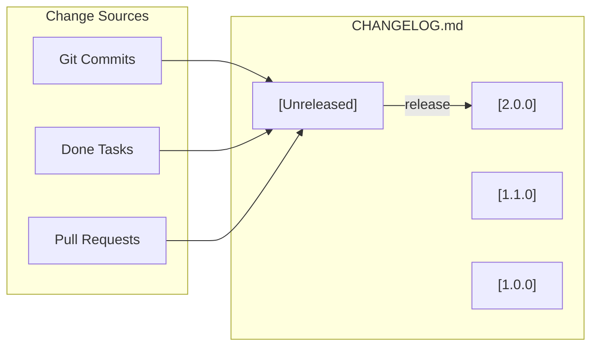

# OGT Docs - Changelog

Manage project changelog following Keep a Changelog format.

## Overview

The changelog documents all notable changes to the project. It follows [Keep a Changelog](https://keepachangelog.com/) format and is maintained in `CHANGELOG.md` at the project root.



## When to Use

- Adding entries for completed work
- Preparing a release
- Generating changelog from commits
- Reviewing change history
- Communicating updates to users

## Changelog Structure

```markdown
# Changelog

All notable changes to this project will be documented in this file.

The format is based on [Keep a Changelog](https://keepachangelog.com/en/1.1.0/),
and this project adheres to [Semantic Versioning](https://semver.org/spec/v2.0.0.html).

## [Unreleased]

### Added

- New feature description

### Changed

- Change description

### Deprecated

- Deprecation notice

### Removed

- Removal description

### Fixed

- Bug fix description

### Security

- Security fix description

## [1.0.0] - 2026-02-01

### Added

- Initial release features

[Unreleased]: https://github.com/org/repo/compare/v1.0.0...HEAD
[1.0.0]: https://github.com/org/repo/releases/tag/v1.0.0
```

---

## Change Categories

| Category       | Description                       | Examples                         |
| -------------- | --------------------------------- | -------------------------------- |
| **Added**      | New features                      | New API endpoint, new component  |
| **Changed**    | Changes to existing functionality | Updated behavior, redesign       |
| **Deprecated** | Features to be removed            | Old API marked for removal       |
| **Removed**    | Removed features                  | Deleted endpoint, removed option |
| **Fixed**      | Bug fixes                         | Crash fix, data correction       |
| **Security**   | Security fixes                    | Vulnerability patch              |

### Category Order

Always list in this order:

1. Added
2. Changed
3. Deprecated
4. Removed
5. Fixed
6. Security

---

## Entry Format

### Basic Entry

```markdown
### Added

- Steam OAuth authentication support (#123)
```

### Entry with Details

```markdown
### Added

- Steam OAuth authentication support (#123)
  - Login via Steam OpenID
  - Profile sync with Steam display name
  - Automatic account linking for existing users
```

### Entry with Migration Note

```markdown
### Changed

- API authentication header format (#456)
  - Now requires "Bearer " prefix
  - See [migration guide](docs/guides/auth-migration.md)
```

### Breaking Change Entry

```markdown
### Changed

- **BREAKING**: Renamed `/api/monsters` to `/api/creatures` (#789)
  - All monster endpoints now use creature terminology
  - See [migration guide](docs/guides/creature-rename.md)
```

---

## Adding Entries

### Manual Addition

```bash
# Open changelog
vim CHANGELOG.md

# Add entry under [Unreleased] in appropriate category
```

### From Completed Task

When a task moves to `done/`:

```bash
# 1. Read the task summary
cat docs/todo/done/{task}/task.md | head -20

# 2. Determine category (Added/Changed/Fixed/etc.)

# 3. Add to CHANGELOG.md under [Unreleased]
```

### From Conventional Commits

Parse conventional commits to generate entries:

```bash
# Get commits since last tag
git log $(git describe --tags --abbrev=0)..HEAD --oneline

# Parse by type
# feat: -> Added
# fix: -> Fixed
# refactor: -> Changed
# docs: -> (usually skip or Added)
```

---

## Release Workflow

### Step 1: Review Unreleased

```bash
# View current unreleased changes
sed -n '/## \[Unreleased\]/,/## \[/p' CHANGELOG.md | head -n -1
```

### Step 2: Determine Version

Based on changes:

- **MAJOR**: Breaking changes present → `X.0.0`
- **MINOR**: New features, no breaking → `x.X.0`
- **PATCH**: Only fixes → `x.x.X`

### Step 3: Create Release Section

```markdown
## [Unreleased]

## [2.1.0] - 2026-02-06

### Added

- Steam OAuth authentication support (#123)
- Global fuzzy search (#124)

### Fixed

- Null response handling in legacy API (#125)
```

### Step 4: Update Links

```markdown
[Unreleased]: https://github.com/org/repo/compare/v2.1.0...HEAD
[2.1.0]: https://github.com/org/repo/compare/v2.0.0...v2.1.0
[2.0.0]: https://github.com/org/repo/releases/tag/v2.0.0
```

### Step 5: Commit and Tag

```bash
# Commit changelog update
git add CHANGELOG.md
git commit -m "chore(release): v2.1.0"

# Create tag
git tag -a v2.1.0 -m "Release v2.1.0"

# Push
git push origin main --tags
```

---

## Automated Generation

### From Conventional Commits

```bash
#!/bin/bash
# generate-changelog.sh

LAST_TAG=$(git describe --tags --abbrev=0 2>/dev/null || echo "")

if [ -z "$LAST_TAG" ]; then
  COMMITS=$(git log --oneline)
else
  COMMITS=$(git log ${LAST_TAG}..HEAD --oneline)
fi

echo "## [Unreleased]"
echo ""

# Added (feat commits)
ADDED=$(echo "$COMMITS" | grep "^[a-f0-9]* feat" | sed 's/^[a-f0-9]* feat[^:]*: /- /')
if [ -n "$ADDED" ]; then
  echo "### Added"
  echo "$ADDED"
  echo ""
fi

# Fixed (fix commits)
FIXED=$(echo "$COMMITS" | grep "^[a-f0-9]* fix" | sed 's/^[a-f0-9]* fix[^:]*: /- /')
if [ -n "$FIXED" ]; then
  echo "### Fixed"
  echo "$FIXED"
  echo ""
fi

# Changed (refactor commits)
CHANGED=$(echo "$COMMITS" | grep "^[a-f0-9]* refactor" | sed 's/^[a-f0-9]* refactor[^:]*: /- /')
if [ -n "$CHANGED" ]; then
  echo "### Changed"
  echo "$CHANGED"
  echo ""
fi
```

### From Done Tasks

```bash
#!/bin/bash
# changelog-from-tasks.sh

echo "## Changes from completed tasks"
echo ""

for task_dir in docs/todo/done/*/; do
  task_name=$(basename "$task_dir")

  # Read summary from task.md
  summary=$(sed -n '/## Summary/,/##/p' "$task_dir/task.md" | head -n -1 | tail -n +2)

  # Determine category from task name or content
  if echo "$task_name" | grep -qi "fix\|bug"; then
    category="Fixed"
  elif echo "$task_name" | grep -qi "add\|new\|create"; then
    category="Added"
  else
    category="Changed"
  fi

  echo "### $category"
  echo "- $summary (task: $task_name)"
  echo ""
done
```

---

## Example CHANGELOG.md

```markdown
# Changelog

All notable changes to this project will be documented in this file.

The format is based on [Keep a Changelog](https://keepachangelog.com/en/1.1.0/),
and this project adheres to [Semantic Versioning](https://semver.org/spec/v2.0.0.html).

## [Unreleased]

### Added

- Dark mode toggle in settings (#234)
- Keyboard shortcuts for navigation (#235)

### Changed

- Improved search performance with MiniSearch (#236)

## [2.0.0] - 2026-02-01

### Added

- Steam OAuth authentication (#123)
- Global fuzzy search (#124)
- Card variant system with Condensed views (#126)

### Changed

- **BREAKING**: Renamed Monster to Creature throughout API (#127)
  - All `/api/monsters/*` endpoints now at `/api/creatures/*`
  - Frontend components renamed accordingly
  - See [migration guide](docs/guides/monster-to-creature.md)

### Fixed

- Null response crash in legacy API handler (#125)
- Image flash on card hover (#128)

### Security

- Updated dependencies to patch CVE-2026-1234 (#129)

## [1.1.0] - 2026-01-15

### Added

- User profile page (#101)
- Campaign management (#102)

### Fixed

- Login redirect loop (#103)

## [1.0.0] - 2026-01-01

### Added

- Initial release
- User authentication (Google, Discord)
- Creature compendium
- Item database
- Spell reference
- Character builder

[Unreleased]: https://github.com/org/orc/compare/v2.0.0...HEAD
[2.0.0]: https://github.com/org/orc/compare/v1.1.0...v2.0.0
[1.1.0]: https://github.com/org/orc/compare/v1.0.0...v1.1.0
[1.0.0]: https://github.com/org/orc/releases/tag/v1.0.0
```

---

## Best Practices

### Do

- Write for users, not developers
- Use past tense ("Added" not "Add")
- Include issue/PR numbers
- Highlight breaking changes clearly
- Keep entries concise but informative
- Update changelog with every PR
- Group related changes

### Don't

- Include internal implementation details
- Use technical jargon users won't understand
- Forget to update links at bottom
- Let [Unreleased] get too long (release often)
- Mix user-facing and internal changes
- Skip security updates

---

## Integration with CI

### Changelog Validation

```yaml
# .github/workflows/changelog.yml
name: Changelog Check

on:
  pull_request:
    types: [opened, synchronize]

jobs:
  changelog:
    runs-on: ubuntu-latest
    steps:
      - uses: actions/checkout@v4

      - name: Check changelog updated
        run: |
          if git diff --name-only origin/main | grep -q "CHANGELOG.md"; then
            echo "Changelog updated"
          else
            echo "WARNING: CHANGELOG.md not updated"
            echo "Please add an entry under [Unreleased]"
            # Optionally fail: exit 1
          fi
```

### Auto-Release Notes

```yaml
# .github/workflows/release.yml
name: Release

on:
  push:
    tags:
      - "v*"

jobs:
  release:
    runs-on: ubuntu-latest
    steps:
      - uses: actions/checkout@v4

      - name: Extract changelog
        id: changelog
        run: |
          VERSION=${GITHUB_REF#refs/tags/v}
          # Extract section for this version
          NOTES=$(sed -n "/## \[${VERSION}\]/,/## \[/p" CHANGELOG.md | head -n -1)
          echo "notes<<EOF" >> $GITHUB_OUTPUT
          echo "$NOTES" >> $GITHUB_OUTPUT
          echo "EOF" >> $GITHUB_OUTPUT

      - name: Create Release
        uses: actions/create-release@v1
        with:
          tag_name: ${{ github.ref }}
          release_name: Release ${{ github.ref }}
          body: ${{ steps.changelog.outputs.notes }}
```

---

## Signal Files

For tracking changelog state:

| Signal               | Location     | Content                  |
| -------------------- | ------------ | ------------------------ |
| `.changelog_version` | Project root | Last released version    |
| `.needs_changelog`   | PR folder    | PR needs changelog entry |

---

## Changelog Checklist

When adding entries:

- [ ] Entry is under [Unreleased]
- [ ] Correct category (Added/Changed/Fixed/etc.)
- [ ] Written for end users
- [ ] Includes issue/PR number
- [ ] Breaking changes marked with **BREAKING**
- [ ] Migration notes linked if needed

When releasing:

- [ ] Version follows semver
- [ ] Date is correct (YYYY-MM-DD)
- [ ] All entries are accurate
- [ ] Links updated at bottom
- [ ] Empty [Unreleased] section remains
- [ ] Git tag matches version
