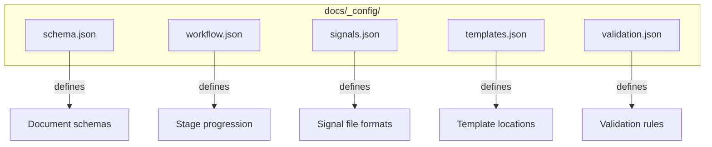

# OGT Docs - Config

Configure the docs-first system for your project.

## Overview

The OGT docs system is configurable via `docs/_config/` files. Configuration controls schema versions, workflow stages, signal file formats, and validation rules.



## When to Use

- Setting up docs-first for a new project
- Customizing workflow stages
- Adding new document types
- Configuring validation rules
- Updating schema versions

## Configuration Files

```
docs/_config/
├── schema.json           # Document schemas and versions
├── workflow.json         # Workflow stages and transitions
├── signals.json          # Signal file definitions
├── templates.json        # Template file mappings
├── validation.json       # Validation rules
└── project.json          # Project-specific settings
```

---

## Schema Configuration

### docs/\_config/schema.json

Defines document schemas and their versions.

```json
{
  "$schema": "https://ogt.dev/schemas/config/schema.json",
  "version": "1.0",
  "documents": {
    "task": {
      "version": "1.0",
      "primary_file": "task.md",
      "required_sections": [
        "## Summary",
        "## Objectives",
        "## Acceptance Criteria"
      ],
      "optional_sections": [
        "## Dependencies",
        "## Estimated Effort",
        "## References"
      ]
    },
    "feature": {
      "version": "1.0",
      "primary_file": "feature.md",
      "required_sections": ["## Summary", "## User Stories", "## Scope"],
      "supporting_files": ["mvp.md", "phase_0.md"]
    },
    "definition": {
      "version": "1.0",
      "primary_file": "definition.md",
      "required_sections": ["## Summary", "## Details"]
    },
    "rule": {
      "version": "1.0",
      "primary_file": "rule.md",
      "required_sections": [
        "## Summary",
        "## Rationale",
        "## The Rule",
        "## Examples",
        "## Enforcement"
      ]
    }
  }
}
```

### Using Schema Version

Documents reference their schema:

```json
// docs/todo/pending/my-task/.version
{
  "schema": "task",
  "version": "1.0",
  "created": "2026-02-06T10:00:00Z"
}
```

---

## Workflow Configuration

### docs/\_config/workflow.json

Defines workflow stages and allowed transitions.

```json
{
  "$schema": "https://ogt.dev/schemas/config/workflow.json",
  "version": "1.0",
  "workflows": {
    "task": {
      "stages": [
        "pending",
        "in_progress",
        "review",
        "blocked",
        "done",
        "rejected",
        "implemented"
      ],
      "initial": "pending",
      "terminal": ["done", "rejected", "implemented"],
      "transitions": {
        "pending": ["in_progress", "rejected"],
        "in_progress": ["review", "blocked", "pending"],
        "review": ["done", "rejected", "in_progress"],
        "blocked": ["in_progress", "pending"],
        "done": ["implemented"],
        "rejected": ["pending"],
        "implemented": []
      },
      "required_signals": {
        "in_progress": [".assigned_to_*", ".started_at"],
        "review": [".ready_for_review"],
        "blocked": [".blocked", ".blocked_reason"],
        "done": [".verified", ".completed_at"],
        "rejected": [".rejected", ".rejected_reason"]
      }
    },
    "content": {
      "stages": ["drafts", "review", "scheduled", "published", "rejected"],
      "initial": "drafts",
      "terminal": ["published", "rejected"],
      "transitions": {
        "drafts": ["review"],
        "review": ["scheduled", "rejected", "drafts"],
        "scheduled": ["published"],
        "rejected": ["drafts"]
      }
    }
  }
}
```

### Customizing Workflows

Add project-specific stages:

```json
{
  "workflows": {
    "task": {
      "stages": [
        "pending",
        "in_progress",
        "review",
        "qa", // Custom: QA testing stage
        "staging", // Custom: staging deployment
        "done",
        "production" // Custom: production deployment
      ],
      "transitions": {
        "review": ["qa", "in_progress"],
        "qa": ["staging", "review"],
        "staging": ["done", "qa"],
        "done": ["production"]
      }
    }
  }
}
```

---

## Signal Configuration

### docs/\_config/signals.json

Defines signal file formats and meanings.

```json
{
  "$schema": "https://ogt.dev/schemas/config/signals.json",
  "version": "1.0",
  "signals": {
    "status": {
      ".blocked": {
        "type": "empty",
        "description": "Task is blocked"
      },
      ".verified": {
        "type": "empty",
        "description": "Task verified complete",
        "required_in": ["done", "implemented"]
      },
      ".rejected": {
        "type": "empty",
        "description": "Task rejected"
      },
      ".ready_for_review": {
        "type": "empty",
        "description": "Ready for review"
      }
    },
    "metadata": {
      ".version": {
        "type": "json",
        "description": "Schema version",
        "schema": {
          "type": "object",
          "required": ["schema", "version"],
          "properties": {
            "schema": { "type": "string" },
            "version": { "type": "string" },
            "created": { "type": "string", "format": "date-time" },
            "updated": { "type": "string", "format": "date-time" }
          }
        }
      },
      ".priority": {
        "type": "text",
        "description": "Priority level",
        "allowed_values": ["critical", "high", "medium", "low"]
      }
    },
    "timestamps": {
      ".started_at": {
        "type": "text",
        "description": "ISO timestamp when started",
        "format": "date-time"
      },
      ".completed_at": {
        "type": "text",
        "description": "ISO timestamp when completed",
        "format": "date-time"
      },
      ".blocked_at": {
        "type": "text",
        "description": "ISO timestamp when blocked",
        "format": "date-time"
      }
    },
    "assignments": {
      ".assigned_to_*": {
        "type": "empty",
        "pattern": ".assigned_to_{agent_name}",
        "description": "Who is assigned"
      },
      ".verified_by_*": {
        "type": "empty",
        "pattern": ".verified_by_{agent_name}",
        "description": "Who verified"
      }
    },
    "content": {
      ".blocked_reason": {
        "type": "text",
        "description": "Why blocked"
      },
      ".rejected_reason": {
        "type": "text",
        "description": "Why rejected"
      },
      ".depends_on": {
        "type": "text",
        "description": "Dependencies list"
      },
      ".pr_link": {
        "type": "text",
        "description": "Pull request URL"
      }
    }
  }
}
```

---

## Template Configuration

### docs/\_config/templates.json

Maps document types to template files.

```json
{
  "$schema": "https://ogt.dev/schemas/config/templates.json",
  "version": "1.0",
  "templates": {
    "task": {
      "file": "_templates/task.md",
      "variables": {
        "title": { "prompt": "Task title" },
        "effort": {
          "prompt": "Estimated effort",
          "options": ["Tiny", "Small", "Medium", "Large", "XLarge"]
        }
      }
    },
    "feature": {
      "file": "_templates/feature.md",
      "additional_files": ["_templates/mvp.md", "_templates/phase.md"]
    },
    "definition": {
      "file": "_templates/definition.md"
    },
    "rule": {
      "file": "_templates/rule.md"
    },
    "tweet": {
      "file": "_templates/tweet.md"
    },
    "blog_post": {
      "file": "_templates/blog_post.md"
    }
  },
  "auto_signals": {
    "all": [".version"],
    "task": [".priority"],
    "rule": [".enforced_by"]
  }
}
```

---

## Validation Configuration

### docs/\_config/validation.json

Defines validation rules for documents.

```json
{
  "$schema": "https://ogt.dev/schemas/config/validation.json",
  "version": "1.0",
  "rules": {
    "folder_naming": {
      "pattern": "^[a-z][a-z0-9-]*$",
      "max_length": 50,
      "error": "Folder names must be lowercase with hyphens"
    },
    "required_files": {
      "task": ["task.md", ".version", ".priority"],
      "feature": ["feature.md", "mvp.md", ".version"],
      "rule": ["rule.md", ".version", ".enforced_by"]
    },
    "done_requirements": {
      "must_have": [".verified", ".completed_at", "verification.md"],
      "must_not_have": [".blocked"]
    },
    "content_rules": {
      "no_todo_placeholders": {
        "pattern": "TODO:|FIXME:|XXX:",
        "error": "Document contains TODO placeholders"
      },
      "links_valid": {
        "check": "internal_links",
        "error": "Document contains broken internal links"
      }
    }
  },
  "ignore": ["_templates/*", "_config/*"]
}
```

---

## Project Configuration

### docs/\_config/project.json

Project-specific settings.

```json
{
  "$schema": "https://ogt.dev/schemas/config/project.json",
  "version": "1.0",
  "project": {
    "name": "ORC",
    "description": "Open Roll Client - VTT Content Platform",
    "repository": "https://github.com/org/orc"
  },
  "paths": {
    "docs": "docs/",
    "templates": "docs/_templates/",
    "config": "docs/_config/"
  },
  "conventions": {
    "date_format": "ISO8601",
    "timestamp_timezone": "UTC",
    "slug_format": "kebab-case"
  },
  "integrations": {
    "github": {
      "auto_link_issues": true,
      "pr_template": ".github/PULL_REQUEST_TEMPLATE.md"
    },
    "changelog": {
      "file": "CHANGELOG.md",
      "format": "keepachangelog"
    }
  },
  "agents": {
    "shared_context": "docs/agents/_shared/",
    "agent_definitions": "docs/agents/"
  }
}
```

---

## Using Configuration

### Reading Config in Scripts

```typescript
// scripts/validate-docs.ts
import schema from "../docs/_config/schema.json";
import workflow from "../docs/_config/workflow.json";

function validateTask(taskPath: string) {
  const taskConfig = schema.documents.task;

  // Check required sections
  for (const section of taskConfig.required_sections) {
    if (!fileContains(taskPath, section)) {
      throw new Error(`Missing required section: ${section}`);
    }
  }
}

function validateTransition(from: string, to: string) {
  const taskWorkflow = workflow.workflows.task;
  const allowed = taskWorkflow.transitions[from];

  if (!allowed.includes(to)) {
    throw new Error(`Invalid transition: ${from} -> ${to}`);
  }
}
```

### CLI Integration

```bash
# Validate against config
ogt validate docs/todo/pending/my-task

# Check workflow transition
ogt workflow check docs/todo/pending/my-task in_progress

# Generate from template
ogt create task --title "My Task" --effort Medium
```

---

## Extending Configuration

### Adding Custom Document Type

1. Add schema in `schema.json`:

```json
{
  "documents": {
    "adr": {
      "version": "1.0",
      "primary_file": "adr.md",
      "required_sections": ["## Context", "## Decision", "## Consequences"]
    }
  }
}
```

2. Add template in `templates.json`:

```json
{
  "templates": {
    "adr": {
      "file": "_templates/adr.md"
    }
  }
}
```

3. Create template file `_templates/adr.md`

4. Add workflow if needed in `workflow.json`

---

## Configuration Checklist

When setting up config:

- [ ] Schema version defined for all document types
- [ ] Required sections specified
- [ ] Workflow stages match folder structure
- [ ] Transitions are logical
- [ ] Signal files documented
- [ ] Templates exist for all types
- [ ] Validation rules are reasonable
- [ ] Project info is complete
- [ ] Integrations configured
