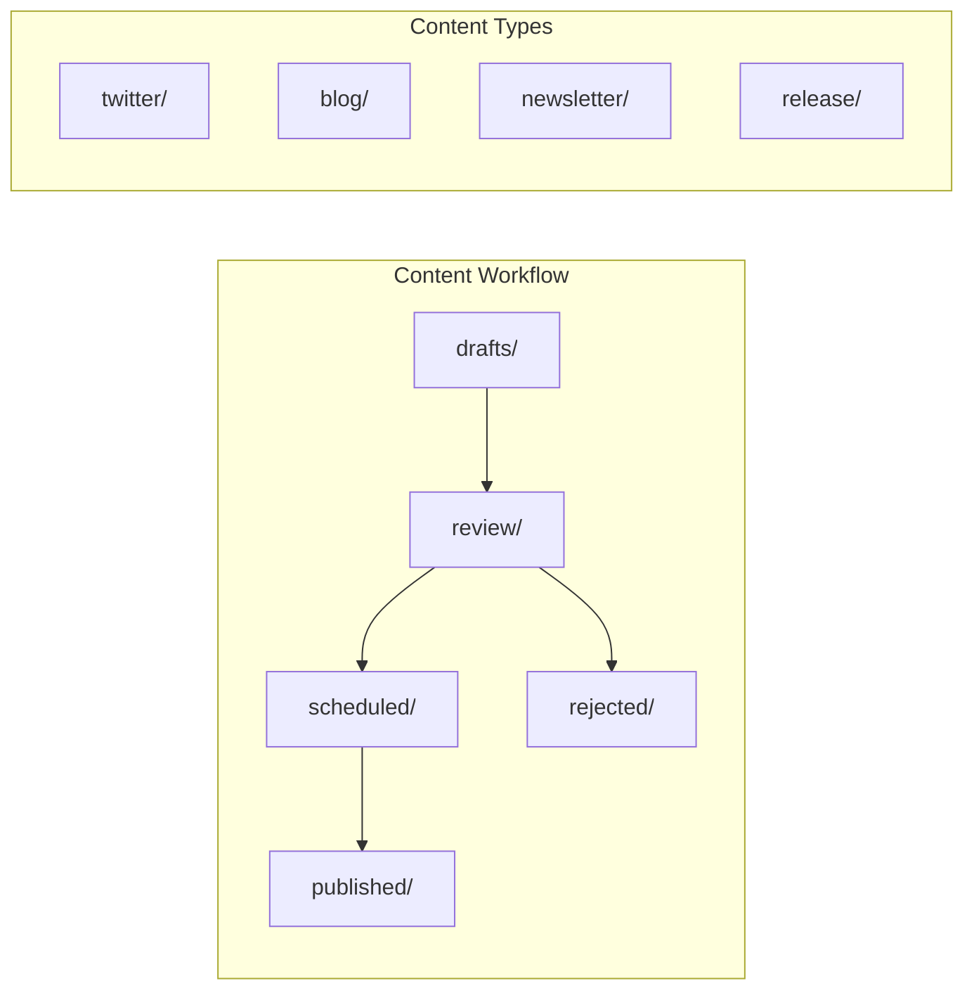

# OGT Docs - Create Social

Create and manage social media and marketing content.

## Overview

Social content documents live in `docs/content/` and follow a workflow similar to tasks. Content moves through drafting, review, and publishing stages.



## When to Use

- Announcing new features or releases
- Creating Twitter/X threads
- Writing blog posts
- Drafting newsletter content
- Preparing launch communications
- Documenting social media strategy

## Folder Structure

```
docs/content/
├── social/                         # Social media posts
│   ├── twitter/
│   │   ├── drafts/
│   │   ├── review/
│   │   ├── scheduled/
│   │   └── published/
│   │
│   ├── linkedin/
│   │   └── ...
│   │
│   └── discord/
│       └── ...
│
├── blog/                           # Blog posts
│   ├── drafts/
│   ├── review/
│   └── published/
│
├── newsletter/                     # Newsletter content
│   ├── drafts/
│   ├── scheduled/
│   └── sent/
│
├── release/                        # Release announcements
│   └── {version}/
│       ├── announcement.md
│       ├── twitter_thread.md
│       ├── blog_post.md
│       └── .published
│
└── _templates/                     # Content templates
    ├── tweet.md
    ├── thread.md
    ├── blog_post.md
    ├── newsletter.md
    └── release_announcement.md
```

---

## Content Types

### Twitter/X Posts

Single tweets or threads for announcements.

#### Folder: docs/content/social/twitter/drafts/{slug}/

```
twitter/drafts/v2-launch/
├── content.md          # The tweet(s)
├── .version
├── .scheduled_for      # Optional: scheduled date
└── .thread             # Signal: this is a thread
```

#### content.md (Single Tweet)

```markdown
# Tweet: v2.0 Launch

## Content

We just shipped v2.0!

Key highlights:

- Steam OAuth
- Global fuzzy search
- Card variants

Check it out: https://example.com

## Hashtags

#gamedev #vtt #dnd

## Media

- screenshot_v2.png (attach)

## Scheduled

2026-02-06 10:00 UTC
```

#### content.md (Thread)

```markdown
# Thread: Building ORC v2

## Tweet 1/5

We just shipped ORC v2.0!

Here's the story of how we built it...

A thread.

## Tweet 2/5

First, we tackled authentication.

Steam OAuth was the most requested feature. We built it on top of our existing Google/Discord flow.

The key insight: abstract the provider layer early.

## Tweet 3/5

Next: search.

Users wanted instant, fuzzy search. We evaluated:

- Fuse.js (heavy)
- Lunr (no fuzzy)
- MiniSearch (perfect)

MiniSearch is 6KB and blazing fast.

## Tweet 4/5

Card variants took the longest.

8 entity types × 4 variants = 32 components.

We used composition patterns to share logic. CardBase handles the common stuff.

## Tweet 5/5

Try it out: https://example.com

We'd love your feedback. What should we build next?

#gamedev #vtt #dnd

---

## Media

- Tweet 1: hero_image.png
- Tweet 3: search_demo.gif
- Tweet 4: card_variants.png
```

---

### Blog Posts

Longer form content for the company blog.

#### Folder: docs/content/blog/drafts/{slug}/

```
blog/drafts/fuzzy-search-deep-dive/
├── post.md             # The blog post
├── meta.md             # SEO metadata
├── assets/             # Images, diagrams
│   ├── cover.png
│   └── benchmark.png
├── .version
└── .word_count         # Target word count
```

#### post.md

````markdown
# How We Built Instant Fuzzy Search

## Summary

A deep dive into implementing sub-16ms fuzzy search for 10,000+ items.

## Content

### The Problem

Our users needed to search across creatures, items, spells, and more. The old approach used `String.includes()` - fine for small datasets, but slow and inflexible at scale.

### Requirements

1. Instant results (<16ms for 10k items)
2. Fuzzy matching ("fir" matches "Fireball")
3. Relevance ranking
4. TypeScript support

### Choosing a Library

We evaluated three options:

| Library    | Size | Fuzzy | Speed |
| ---------- | ---- | ----- | ----- |
| Fuse.js    | 25KB | Yes   | Slow  |
| Lunr       | 20KB | No    | Fast  |
| MiniSearch | 6KB  | Yes   | Fast  |

MiniSearch won: small, fast, and battle-tested (used by VitePress).

### Implementation

```typescript
import MiniSearch from "minisearch";

const searchIndex = new MiniSearch({
  fields: ["name", "description", "type"],
  storeFields: ["name", "slug", "type"],
  searchOptions: {
    fuzzy: 0.2,
    prefix: true,
  },
});

searchIndex.addAll(creatures);

const results = searchIndex.search("fir");
// Returns: Fireball, Fire Elemental, Fire Giant...
```
````

### Performance

Benchmarks on 10,000 items:

- Index build: 45ms (one-time)
- Search: 2-8ms
- Memory: ~2MB

### Conclusion

MiniSearch delivered exactly what we needed. The key was choosing the right tool for the job.

---

## Author

Jane Developer

## Published

2026-02-06

````

#### meta.md

```markdown
# SEO Metadata

## Title

How We Built Instant Fuzzy Search | ORC Blog

## Description

A deep dive into implementing sub-16ms fuzzy search for 10,000+ game content items using MiniSearch.

## Keywords

- fuzzy search
- MiniSearch
- React search
- instant search
- TypeScript

## Open Graph

- og:title: How We Built Instant Fuzzy Search
- og:description: Sub-16ms search for 10,000+ items
- og:image: /blog/fuzzy-search/cover.png

## Canonical

https://example.com/blog/fuzzy-search-deep-dive
````

---

### Release Announcements

Coordinated multi-channel release communications.

#### Folder: docs/content/release/v2.0.0/

```
release/v2.0.0/
├── announcement.md     # Main announcement
├── twitter_thread.md   # Twitter version
├── blog_post.md        # Blog version
├── newsletter.md       # Email version
├── discord.md          # Discord announcement
├── assets/
│   ├── hero.png
│   └── features.png
├── .version
├── .release_date       # When to publish
└── .published          # Signal: all published
```

#### announcement.md

```markdown
# Release Announcement: v2.0.0

## Tagline

The biggest ORC update yet: Steam login, instant search, and beautiful new cards.

## Key Features

### Steam OAuth

Log in with your Steam account. Your Steam display name syncs automatically.

### Global Fuzzy Search

Press Ctrl+K to search everything. Instant, fuzzy, and ranked by relevance.

### Card Variants

Condensed cards for dense grids. List items for compact tables. More ways to view your content.

## Call to Action

Try it now at https://example.com

## Quotes

> "This update transforms how you interact with your content." - Lead Developer

## Links

- Full changelog: /changelog
- Documentation: /docs
- Discord: /discord

## Assets

- Hero image: assets/hero.png
- Feature grid: assets/features.png
- Video demo: assets/demo.mp4
```

---

### Newsletter Content

Email newsletter drafts.

#### Folder: docs/content/newsletter/drafts/2026-02-weekly/

```
newsletter/drafts/2026-02-weekly/
├── content.md          # Newsletter content
├── subject_lines.md    # A/B test subjects
├── .version
├── .send_date          # Scheduled send
└── .segment            # Target audience
```

#### content.md

```markdown
# Newsletter: February Week 1

## Subject

ORC v2.0 is here - Steam login, instant search, and more

## Preview Text

The biggest update yet. Here's what's new.

## Header


## Body

### Hey {first_name},

Big news: ORC v2.0 just shipped!

### What's New

**Steam Login**
Connect your Steam account for seamless authentication.

**Instant Search**
Press Ctrl+K for lightning-fast, fuzzy search across all content.

**Card Variants**
New condensed and list views for your creature and item collections.

### Try It Now

[Launch ORC](https://example.com)

### Coming Next

- Dark mode
- Mobile improvements
- API access

### Feedback

Reply to this email or join us on [Discord](https://discord.gg/example).

Cheers,
The ORC Team

## Footer

You're receiving this because you signed up at example.com.
[Unsubscribe]({{unsubscribe_url}}) | [Preferences]({{preferences_url}})
```

#### subject_lines.md

```markdown
# Subject Line Options

## A/B Test

A: "ORC v2.0 is here - Steam login, instant search, and more"
B: "Big update: Connect Steam, search instantly, new card views"
C: "v2.0 shipped! Here's what's new in ORC"

## Winner Criteria

Open rate > 25%

## Notes

- Keep under 50 characters for mobile
- Include version number for clarity
- Action-oriented preferred
```

---

## Content Workflow

### Creating New Content

```mermaid
flowchart TD
    A[Identify Content Need] --> B{Type?}

    B -->|Tweet| C[twitter/drafts/]
    B -->|Blog| D[blog/drafts/]
    B -->|Newsletter| E[newsletter/drafts/]
    B -->|Release| F[release/{version}/]

    C --> G[Create Folder]
    D --> G
    E --> G
    F --> G

    G --> H[Copy Template]
    H --> I[Write Content]
    I --> J[Add Assets]
    J --> K[Move to review/]
```

### Moving Through Stages

```bash
# Draft complete, request review
mv docs/content/social/twitter/drafts/{slug} docs/content/social/twitter/review/

# Approved, schedule
mv docs/content/social/twitter/review/{slug} docs/content/social/twitter/scheduled/
echo "2026-02-06T10:00:00Z" > docs/content/social/twitter/scheduled/{slug}/.scheduled_for

# Published
mv docs/content/social/twitter/scheduled/{slug} docs/content/social/twitter/published/
touch docs/content/social/twitter/published/{slug}/.published
```

---

## Templates

### docs/content/\_templates/tweet.md

```markdown
# Tweet: {Title}

## Content

{Tweet text, max 280 characters}

## Hashtags

{Relevant hashtags}

## Media

- {image/video to attach}

## Scheduled

{Date and time, or "immediate"}

## Notes

{Internal notes, not published}
```

### docs/content/\_templates/thread.md

```markdown
# Thread: {Title}

## Tweet 1/N

{Opening tweet with hook}

## Tweet 2/N

{Content}

## Tweet N/N

{Call to action and hashtags}

---

## Media

- Tweet N: {filename}

## Notes

{Internal notes}
```

---

## Signal Files Reference

| Signal           | Content       | Purpose                   |
| ---------------- | ------------- | ------------------------- |
| `.version`       | JSON          | Schema version            |
| `.scheduled_for` | ISO date      | When to publish           |
| `.published`     | Empty         | Content is live           |
| `.thread`        | Empty         | This is a thread          |
| `.segment`       | Audience name | Newsletter segment        |
| `.word_count`    | Number        | Target word count         |
| `.send_date`     | ISO date      | Newsletter send date      |
| `.release_date`  | ISO date      | Release announcement date |

---

## Content Checklist

### Before Review

- [ ] Content is complete
- [ ] Spelling/grammar checked
- [ ] Links are valid
- [ ] Assets attached/referenced
- [ ] Hashtags appropriate (social)
- [ ] SEO metadata complete (blog)
- [ ] Call to action included

### Before Publishing

- [ ] Reviewed and approved
- [ ] Scheduled time confirmed
- [ ] All assets uploaded
- [ ] Links tested
- [ ] Analytics tracking in place
