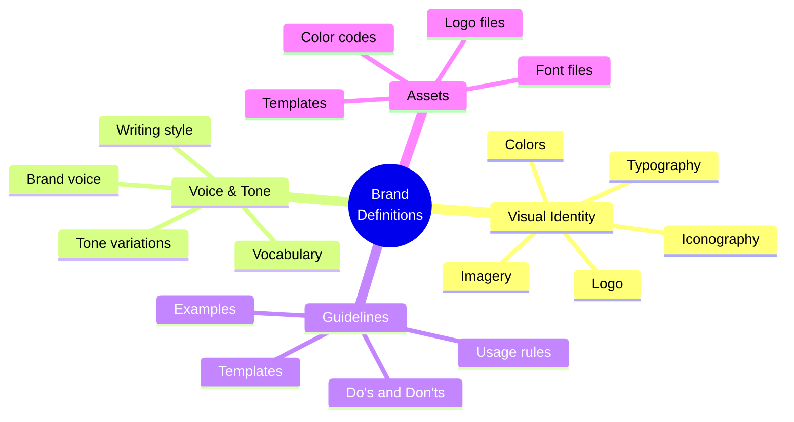

# OGT Docs - Define Branding

Complete guide for creating brand definition documents.

## Overview

Brand definitions establish how your product looks, sounds, and feels across all touchpoints. They ensure consistent brand expression from website to emails to product UI.



## When to Use This Skill

Use `ogt-docs-define-branding` when:

- Establishing brand identity for a new product
- Documenting existing brand guidelines
- Creating brand consistency rules
- Defining voice and tone
- Organizing brand assets

## Folder Structure

```
docs/definitions/branding/
├── visual_identity/
│   ├── definition.md           # Visual identity overview
│   ├── logo/
│   │   ├── definition.md       # Logo usage rules
│   │   ├── variations.md       # Logo variations
│   │   ├── clearspace.md       # Clear space requirements
│   │   └── misuse.md           # What NOT to do
│   ├── colors/
│   │   ├── definition.md       # Color system overview
│   │   ├── primary.md          # Primary palette
│   │   ├── secondary.md        # Secondary palette
│   │   ├── semantic.md         # Semantic colors
│   │   └── accessibility.md    # Color accessibility
│   ├── typography/
│   │   ├── definition.md       # Type system overview
│   │   ├── typefaces.md        # Font families
│   │   ├── scale.md            # Type scale
│   │   └── usage.md            # When to use what
│   ├── imagery/
│   │   ├── definition.md       # Image style
│   │   ├── photography.md      # Photo guidelines
│   │   ├── illustration.md     # Illustration style
│   │   └── icons.md            # Iconography
│   └── .version
│
├── voice_and_tone/
│   ├── definition.md           # Voice overview
│   ├── brand_voice.md          # Core voice attributes
│   ├── tone_spectrum.md        # Tone variations
│   ├── writing_style.md        # Writing guidelines
│   ├── vocabulary.md           # Words we use/avoid
│   └── .version
│
├── brand_guidelines/
│   ├── definition.md           # Guidelines overview
│   ├── usage_rules.md          # General rules
│   ├── applications/           # Application examples
│   │   ├── website.md
│   │   ├── email.md
│   │   ├── social.md
│   │   ├── product_ui.md
│   │   └── print.md
│   └── .version
│
└── assets/
    ├── definition.md           # Asset inventory
    ├── logo_files.md           # Logo file locations
    ├── font_files.md           # Font file locations
    ├── templates.md            # Template locations
    └── .version
```

---

## Brand Definition Types

### 1. Visual Identity

Defines how your brand looks.

#### Example: visual_identity/colors/

```
colors/
├── definition.md
├── primary.md
├── secondary.md
├── semantic.md
└── accessibility.md
```

#### definition.md

```markdown
# Definition: Color System

## Overview

The {Product} color system is designed for clarity, accessibility, and
brand recognition. Our palette balances vibrant brand colors with
functional UI colors.

## Color Philosophy

- **Bold but accessible**: Colors meet WCAG AA standards
- **Consistent**: Same colors across all touchpoints
- **Purposeful**: Each color has a specific role
- **Dark-mode ready**: Colors work in both light and dark themes

## Palette Overview
```

┌─────────────────────────────────────────────────────────────┐
│ PRIMARY │
│ ┌─────────┐ ┌─────────┐ ┌─────────┐ │
│ │ Primary │ │ Primary │ │ Primary │ │
│ │ 500 │ │ 600 │ │ 700 │ │
│ └─────────┘ └─────────┘ └─────────┘ │
├─────────────────────────────────────────────────────────────┤
│ SECONDARY │
│ ┌─────────┐ ┌─────────┐ │
│ │Secondary│ │ Accent │ │
│ └─────────┘ └─────────┘ │
├─────────────────────────────────────────────────────────────┤
│ SEMANTIC │
│ ┌─────────┐ ┌─────────┐ ┌─────────┐ ┌─────────┐ │
│ │ Success │ │ Warning │ │ Error │ │ Info │ │
│ └─────────┘ └─────────┘ └─────────┘ └─────────┘ │
├─────────────────────────────────────────────────────────────┤
│ NEUTRAL │
│ ┌───┐ ┌───┐ ┌───┐ ┌───┐ ┌───┐ ┌───┐ ┌───┐ ┌───┐ ┌───┐ │
│ │50 │ │100│ │200│ │300│ │400│ │500│ │600│ │700│ │800│ │
│ └───┘ └───┘ └───┘ └───┘ └───┘ └───┘ └───┘ └───┘ └───┘ │
└─────────────────────────────────────────────────────────────┘

```

## Related Documents
- [Primary Colors](./primary.md)
- [Secondary Colors](./secondary.md)
- [Semantic Colors](./semantic.md)
- [Accessibility](./accessibility.md)
```

#### primary.md

````markdown
# Primary Colors

## Brand Primary

The primary color is the most recognizable element of our visual identity.
Use it for primary actions, key UI elements, and brand moments.

### Primary Blue

| Token         | Hex     | RGB           | HSL            | Usage           |
| ------------- | ------- | ------------- | -------------- | --------------- |
| `primary-50`  | #EFF6FF | 239, 246, 255 | 214, 100%, 97% | Backgrounds     |
| `primary-100` | #DBEAFE | 219, 234, 254 | 214, 95%, 93%  | Hover states    |
| `primary-200` | #BFDBFE | 191, 219, 254 | 213, 97%, 87%  | Borders         |
| `primary-300` | #93C5FD | 147, 197, 253 | 212, 96%, 78%  | Disabled        |
| `primary-400` | #60A5FA | 96, 165, 250  | 213, 94%, 68%  | Links           |
| `primary-500` | #3B82F6 | 59, 130, 246  | 217, 91%, 60%  | **Primary**     |
| `primary-600` | #2563EB | 37, 99, 235   | 221, 83%, 53%  | Hover           |
| `primary-700` | #1D4ED8 | 29, 78, 216   | 224, 76%, 48%  | Pressed         |
| `primary-800` | #1E40AF | 30, 64, 175   | 226, 71%, 40%  | Dark mode       |
| `primary-900` | #1E3A8A | 30, 58, 138   | 224, 64%, 33%  | Dark mode hover |

### Usage Guidelines

#### Do

- Use `primary-500` for primary buttons
- Use `primary-600` for button hover states
- Use `primary-100` for highlighted backgrounds
- Use `primary-400` for links on white backgrounds

#### Don't

- Don't use primary colors for error states
- Don't use primary-500 on primary backgrounds (contrast)
- Don't modify primary colors with opacity
- Don't use more than 2 primary shades in one component

### CSS Variables

```css
:root {
  --color-primary-50: #eff6ff;
  --color-primary-100: #dbeafe;
  --color-primary-200: #bfdbfe;
  --color-primary-300: #93c5fd;
  --color-primary-400: #60a5fa;
  --color-primary-500: #3b82f6;
  --color-primary-600: #2563eb;
  --color-primary-700: #1d4ed8;
  --color-primary-800: #1e40af;
  --color-primary-900: #1e3a8a;
}
```
````

### Tailwind Config

```javascript
colors: {
  primary: {
    50: '#EFF6FF',
    100: '#DBEAFE',
    // ... etc
  }
}
```

````

#### accessibility.md

```markdown
# Color Accessibility

## WCAG Requirements

### AA Compliance (Required)
- Normal text: 4.5:1 contrast ratio
- Large text (18pt+): 3:1 contrast ratio
- UI components: 3:1 contrast ratio

### AAA Compliance (Recommended)
- Normal text: 7:1 contrast ratio
- Large text: 4.5:1 contrast ratio

## Contrast Matrix

### On White (#FFFFFF)

| Color | Hex | Ratio | Small Text | Large Text |
|-------|-----|-------|------------|------------|
| primary-500 | #3B82F6 | 3.1:1 | ❌ | ✅ |
| primary-600 | #2563EB | 4.5:1 | ✅ | ✅ |
| primary-700 | #1D4ED8 | 5.8:1 | ✅ | ✅ |
| gray-600 | #4B5563 | 5.9:1 | ✅ | ✅ |
| gray-700 | #374151 | 8.6:1 | ✅ | ✅ |

### On Primary-500 (#3B82F6)

| Color | Hex | Ratio | Small Text | Large Text |
|-------|-----|-------|------------|------------|
| white | #FFFFFF | 3.1:1 | ❌ | ✅ |
| primary-50 | #EFF6FF | 2.8:1 | ❌ | ❌ |

**Note**: Use white text on primary-600+ for AA compliance.

## Color Blindness Considerations

### Safe Combinations
- Blue + Orange (distinguishable in all types)
- Blue + Yellow
- Purple + Yellow

### Avoid Relying On
- Red vs Green alone (use icons/text)
- Subtle shade differences for meaning

### Testing Tools
- Figma: Color Blind plugin
- Chrome: DevTools → Rendering → Emulate vision deficiencies
- Online: Coblis, Color Oracle
````

---

### 2. Voice and Tone

Defines how your brand sounds.

#### Example: voice_and_tone/

```
voice_and_tone/
├── definition.md
├── brand_voice.md
├── tone_spectrum.md
├── writing_style.md
└── vocabulary.md
```

#### brand_voice.md

```markdown
# Brand Voice

## Voice Attributes

Our voice has four core attributes that should come through in all communications.

### 1. Clear

We explain complex things simply. No jargon, no buzzwords, no fluff.

**Do**: "Your deploy finished in 3 seconds."
**Don't**: "Leveraging our proprietary pipeline optimization, your deployment has been successfully processed."

### 2. Confident

We know our product is good. We state things directly without hedging.

**Do**: "The fastest way to ship."
**Don't**: "We believe we might be one of the faster options available."

### 3. Helpful

We're here to help you succeed, not to show off. We anticipate questions.

**Do**: "Deploys failed? Here's how to fix the 3 most common issues."
**Don't**: "Deploy failed. Check the logs."

### 4. Human

We're people talking to people. Warm, not robotic. Personality allowed.

**Do**: "Nice work! Your site is live."
**Don't**: "Deployment successful. Status: Active."

## Voice Spectrum
```

├─────────────────────────────────────────────────────────────┤
│ MORE SERIOUS MORE PLAYFUL │
│ ◆─────────────────────●─────────────────────────────◆ │
│ Legal, Security Marketing, Docs Social, Success │
├─────────────────────────────────────────────────────────────┤
│ MORE FORMAL MORE CASUAL │
│ ◆────────────●──────────────────────────────────────◆ │
│ Enterprise General Community │
├─────────────────────────────────────────────────────────────┤

```

## Voice by Context

| Context | Clarity | Confidence | Helpfulness | Human |
|---------|---------|------------|-------------|-------|
| Marketing | High | Very High | Medium | High |
| Documentation | Very High | High | Very High | Medium |
| Error Messages | Very High | Medium | Very High | Medium |
| Success Messages | High | High | Medium | Very High |
| Legal/Security | Very High | Very High | High | Low |
| Social Media | High | Medium | Medium | Very High |
```

#### vocabulary.md

```markdown
# Vocabulary Guide

## Words We Use

### Product Terms

| Concept     | We Say          | We Don't Say               |
| ----------- | --------------- | -------------------------- |
| Publishing  | Deploy, Ship    | Push, Release, Publish     |
| Users       | You, Developers | Users, Customers           |
| Our product | {Product}       | The platform, The solution |
| Projects    | Projects        | Apps, Applications, Sites  |
| Teams       | Teams           | Organizations, Workspaces  |

### Technical Terms

| Concept  | We Say               | We Don't Say          |
| -------- | -------------------- | --------------------- |
| Speed    | Fast, Quick, Instant | Performant, Optimized |
| Problems | Issues, Problems     | Errors, Failures      |
| Fix      | Fix, Resolve         | Remediate, Address    |
| Start    | Start, Begin         | Initialize, Commence  |

### Action Words

| We Say      | We Don't Say     |
| ----------- | ---------------- |
| Get started | Sign up now      |
| Learn more  | Click here       |
| Try it free | Start free trial |
| See how     | Discover         |

## Words We Avoid

### Corporate Jargon

- Leverage
- Synergy
- Paradigm
- Disrupt
- Revolutionary
- Best-in-class
- World-class
- Cutting-edge

### Hedge Words

- Might
- Maybe
- Possibly
- We think
- We believe

### Complexity

- Utilize (use "use")
- Implement (use "add", "set up")
- Functionality (use "features")
- Capabilities (use "features", "can")

## Inclusive Language

### Gender

- Use "they/them" for unknown individuals
- Avoid "guys" → use "everyone", "folks", "team"
- Avoid gendered roles → "developer" not "dev guy"

### Ability

- Avoid "simply", "easily", "just" (implies difficulty is user's fault)
- Use "select" not "click" (works for keyboard users too)
- Describe actions, not mechanisms

### Global

- Avoid US-centric references
- Use international date formats in docs
- Don't assume timezone
```

---

### 3. Brand Guidelines

Defines usage rules and applications.

#### Example: brand_guidelines/applications/product_ui.md

````markdown
# Brand in Product UI

## Overview

The product UI is where users spend the most time with our brand.
Consistency here builds trust and familiarity.

## Logo Usage in Product

### Header/Navigation

- Use logomark only (no wordmark)
- Size: 32px height
- Color: Primary on light, White on dark

### Loading/Empty States

- Use logomark with subtle animation
- Max size: 48px

### Favicon

- Use simplified logomark
- Sizes: 16px, 32px, 180px (Apple touch)

## Colors in Product

### Light Theme

| Element        | Color Token | Hex     |
| -------------- | ----------- | ------- |
| Background     | neutral-50  | #F9FAFB |
| Surface        | white       | #FFFFFF |
| Border         | neutral-200 | #E5E7EB |
| Text primary   | neutral-900 | #111827 |
| Text secondary | neutral-600 | #4B5563 |
| Primary action | primary-600 | #2563EB |

### Dark Theme

| Element        | Color Token | Hex     |
| -------------- | ----------- | ------- |
| Background     | neutral-900 | #111827 |
| Surface        | neutral-800 | #1F2937 |
| Border         | neutral-700 | #374151 |
| Text primary   | neutral-50  | #F9FAFB |
| Text secondary | neutral-400 | #9CA3AF |
| Primary action | primary-500 | #3B82F6 |

## Typography in Product

### Font Stack

```css
font-family:
  "Inter",
  -apple-system,
  BlinkMacSystemFont,
  "Segoe UI",
  Roboto,
  Oxygen,
  Ubuntu,
  sans-serif;
```
````

### Type Scale

| Size | Use                |
| ---- | ------------------ |
| 12px | Captions, labels   |
| 14px | Body text, inputs  |
| 16px | Emphasis, subheads |
| 20px | Section headers    |
| 24px | Page titles        |

## Voice in Product

### Success Messages

Tone: Celebratory but brief

**Do**: "Deployed! Your changes are live."
**Don't**: "Deployment completed successfully."

### Error Messages

Tone: Helpful and clear

**Do**: "Couldn't deploy. The build failed on line 42 of index.js."
**Don't**: "Error: BUILD_FAILED"

### Empty States

Tone: Encouraging and actionable

**Do**: "No projects yet. Create your first project to get started."
**Don't**: "No data."

### Confirmation Dialogs

Tone: Clear about consequences

**Do**: "Delete this project? This can't be undone."
**Don't**: "Are you sure you want to proceed with deletion?"

```

---

## Signal Files for Brand Definitions

| Signal | Meaning |
|--------|---------|
| `.draft` | In progress |
| `.approved` | Approved by brand/design |
| `.approved_by_design` | Design lead approved |
| `.approved_by_founder` | Founder approved (major changes) |
| `.version` | Schema version |
| `.last_updated` | Last significant update |

---

## Quality Checklist

Before requesting review:

- [ ] All color values include Hex, RGB, and HSL
- [ ] Typography includes web-safe fallbacks
- [ ] Accessibility requirements met (WCAG AA)
- [ ] Do/Don't examples for every guideline
- [ ] Dark mode considerations included
- [ ] Asset file locations documented
- [ ] Voice examples cover all major contexts
- [ ] Vocabulary lists are comprehensive
```
