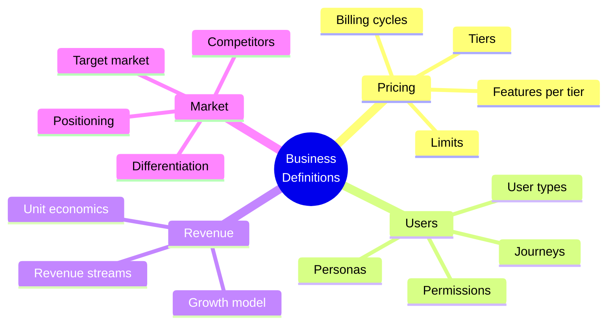
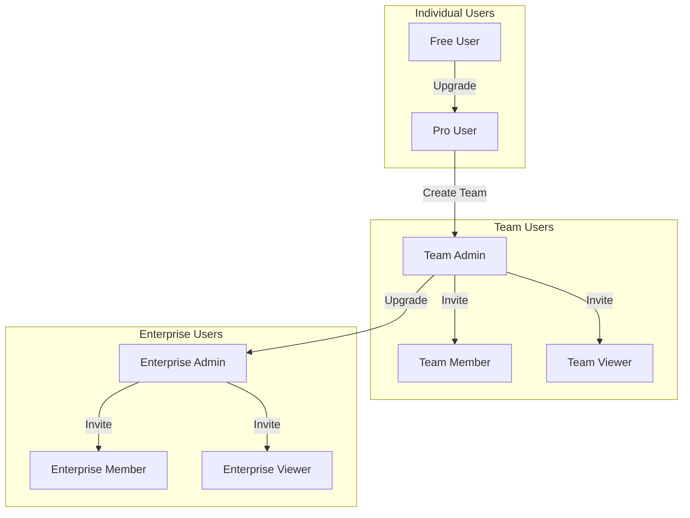
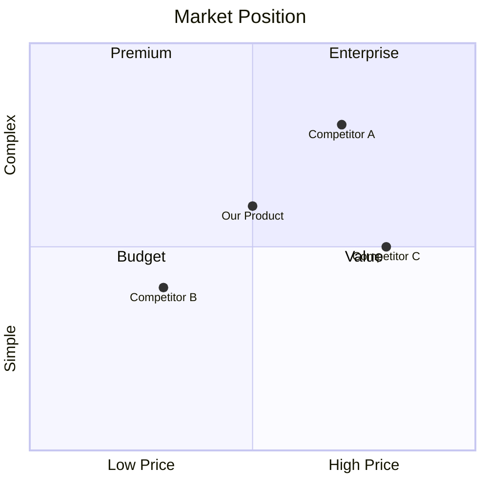

# OGT Docs - Define Business

Complete guide for creating business definition documents.

## Overview

Business definitions establish the commercial and operational foundation of your product. They answer questions about money, users, markets, and constraints.



## When to Use This Skill

Use `ogt-docs-define-business` when defining:

- Pricing models and tiers
- User types and permissions
- Revenue models and streams
- Market positioning
- Customer personas
- Operational limits and quotas
- Business rules and constraints

## Folder Structure

```
docs/definitions/business/
├── pricing_model/
│   ├── definition.md           # Core pricing philosophy
│   ├── tiers.md                # Tier breakdown
│   ├── limits.md               # Usage limits per tier
│   ├── billing.md              # Billing cycles and rules
│   ├── enterprise.md           # Enterprise/custom pricing
│   ├── .version
│   └── .approved_by_founder
│
├── user_types/
│   ├── definition.md           # User type taxonomy
│   ├── free_user.md            # Free tier user
│   ├── pro_user.md             # Pro tier user
│   ├── team_admin.md           # Team administrator
│   ├── enterprise_admin.md     # Enterprise administrator
│   ├── permissions.md          # Permission matrix
│   └── .version
│
├── customer_personas/
│   ├── definition.md           # Persona framework
│   ├── indie_developer.md      # Persona: Indie dev
│   ├── startup_founder.md      # Persona: Founder
│   ├── enterprise_buyer.md     # Persona: Enterprise
│   ├── hobbyist.md             # Persona: Hobbyist
│   └── .version
│
├── revenue_model/
│   ├── definition.md           # Revenue philosophy
│   ├── streams.md              # Revenue streams breakdown
│   ├── unit_economics.md       # CAC, LTV, margins
│   ├── growth_model.md         # Growth projections
│   └── .version
│
├── market_position/
│   ├── definition.md           # Market positioning
│   ├── target_market.md        # Target market definition
│   ├── competitors.md          # Competitive analysis
│   ├── differentiation.md      # Unique value proposition
│   └── .version
│
└── operational_limits/
    ├── definition.md           # Limits philosophy
    ├── api_limits.md           # API rate limits
    ├── storage_limits.md       # Storage quotas
    ├── feature_limits.md       # Feature usage limits
    └── .version
```

---

## Business Definition Types

### 1. Pricing Model

Defines how you charge for your product.

#### Example: pricing_model/

```
pricing_model/
├── definition.md
├── tiers.md
├── limits.md
├── billing.md
├── enterprise.md
├── .version
└── .approved_by_founder
```

#### definition.md

```markdown
# Definition: Pricing Model

## Overview

{Product} uses a freemium pricing model with usage-based scaling.
Free tier provides core functionality with limits. Paid tiers unlock
higher limits and premium features. Enterprise tier offers custom limits
and dedicated support.

## Philosophy

- **Value-first**: Free tier must be genuinely useful, not crippled
- **Clear upgrade path**: Users know exactly what they get by upgrading
- **No surprise charges**: Limits are soft (warnings) before hard (blocks)
- **Fair for all sizes**: Pricing scales with value received

## Pricing Strategy

| Strategy Element | Approach                            |
| ---------------- | ----------------------------------- |
| Model            | Freemium + Usage-based              |
| Anchor           | Pro tier ($X/mo) is the anchor      |
| Free tier goal   | Conversion to Pro within 30 days    |
| Enterprise goal  | Predictable revenue, long contracts |

## Key Decisions

1. **Why freemium?** Lower barrier to entry, viral growth potential
2. **Why usage-based?** Aligns cost with value, fair scaling
3. **Why not per-seat?** Product value is per-project, not per-person

## Success Metrics

- Free → Pro conversion rate: Target X%
- Pro → Enterprise conversion rate: Target Y%
- Monthly churn rate: Target < Z%

## Related Definitions

- [User Types](../user_types/)
- [Operational Limits](../operational_limits/)
- [Revenue Model](../revenue_model/)
```

#### tiers.md

```markdown
# Pricing Tiers

## Tier Overview

| Tier       | Price  | Target User             | Core Value             |
| ---------- | ------ | ----------------------- | ---------------------- |
| Free       | $0     | Hobbyists, evaluators   | Try before buy         |
| Pro        | $X/mo  | Indie devs, freelancers | Full feature access    |
| Team       | $Y/mo  | Small teams             | Collaboration features |
| Enterprise | Custom | Large orgs              | Scale + support        |

---

## Free Tier

### Target User

Hobbyists exploring the product, developers evaluating for future purchase.

### Included Features

- Feature A (limited)
- Feature B (limited)
- Feature C (full)
- Community support only

### Limits

| Resource      | Limit         |
| ------------- | ------------- |
| Projects      | 3             |
| API calls/day | 100           |
| Storage       | 100MB         |
| Team members  | 1 (solo only) |

### Upgrade Triggers

User should consider upgrading when:

- Hitting project limit
- Needing collaboration
- Requiring priority support

---

## Pro Tier

### Price

$X/month (billed monthly)
$X×10/year (billed annually, 2 months free)

### Target User

Independent developers, freelancers, small projects.

### Included Features

- All Free features (unlimited)
- Feature D
- Feature E
- Feature F
- Email support (48h response)

### Limits

| Resource      | Limit         |
| ------------- | ------------- |
| Projects      | 20            |
| API calls/day | 10,000        |
| Storage       | 10GB          |
| Team members  | 1 (solo only) |

### Upgrade Triggers

User should consider upgrading when:

- Needing team collaboration
- Hitting API limits
- Requiring faster support

---

## Team Tier

### Price

$Y/month base + $Z/member/month
Billed monthly or annually (2 months free)

### Target User

Small teams (2-20 people) needing collaboration.

### Included Features

- All Pro features
- Team collaboration
- Shared projects
- Role-based permissions
- Priority support (24h response)

### Limits

| Resource      | Limit   |
| ------------- | ------- |
| Projects      | 100     |
| API calls/day | 100,000 |
| Storage       | 100GB   |
| Team members  | 20      |

### Upgrade Triggers

Team should consider upgrading when:

- Exceeding 20 members
- Needing SSO/SAML
- Requiring dedicated support
- Compliance requirements

---

## Enterprise Tier

### Price

Custom pricing based on:

- Number of users
- Usage volume
- Support requirements
- Compliance needs

### Target User

Large organizations, regulated industries, high-volume users.

### Included Features

- All Team features
- SSO/SAML integration
- Custom integrations
- Dedicated account manager
- SLA guarantees
- Compliance certifications
- Custom contracts

### Limits

| Resource      | Limit     |
| ------------- | --------- |
| Projects      | Unlimited |
| API calls/day | Custom    |
| Storage       | Custom    |
| Team members  | Unlimited |

### Sales Process

1. Contact sales
2. Discovery call
3. Custom proposal
4. Security review
5. Contract negotiation
6. Onboarding
```

#### limits.md

```markdown
# Usage Limits

## Limit Philosophy

- Limits exist to ensure fair usage and system stability
- Soft limits warn users before blocking
- Hard limits block with clear upgrade path
- Limits should feel generous for the tier's target user

## Limit Types

### Soft Limits

User is warned but not blocked. Exceeding triggers:

- In-app notification
- Email warning
- Usage dashboard highlight

### Hard Limits

User is blocked from the action. Exceeding shows:

- Clear error message
- Current usage vs limit
- Upgrade CTA

## Limits by Resource

### Projects

| Tier       | Soft Limit | Hard Limit |
| ---------- | ---------- | ---------- |
| Free       | 2          | 3          |
| Pro        | 15         | 20         |
| Team       | 80         | 100        |
| Enterprise | N/A        | Unlimited  |

**When exceeded:**

- Cannot create new projects
- Can still access existing projects
- Must delete or archive to create new

### API Calls (per day)

| Tier       | Soft Limit | Hard Limit | Burst Limit |
| ---------- | ---------- | ---------- | ----------- |
| Free       | 80         | 100        | 10/min      |
| Pro        | 8,000      | 10,000     | 100/min     |
| Team       | 80,000     | 100,000    | 500/min     |
| Enterprise | Custom     | Custom     | Custom      |

**When exceeded:**

- Returns 429 Too Many Requests
- Retry-After header indicates reset time
- Daily limit resets at midnight UTC

### Storage

| Tier       | Soft Limit | Hard Limit |
| ---------- | ---------- | ---------- |
| Free       | 80MB       | 100MB      |
| Pro        | 8GB        | 10GB       |
| Team       | 80GB       | 100GB      |
| Enterprise | Custom     | Custom     |

**When exceeded:**

- Cannot upload new files
- Can still access existing files
- Must delete files or upgrade

### Team Members

| Tier       | Limit        |
| ---------- | ------------ |
| Free       | 1 (no teams) |
| Pro        | 1 (no teams) |
| Team       | 20           |
| Enterprise | Unlimited    |

**When exceeded:**

- Cannot invite new members
- Existing members unaffected
- Must remove members or upgrade

## Overage Handling

### Free Tier

No overages. Hard block at limit.

### Pro Tier

No overages. Hard block at limit with upgrade prompt.

### Team Tier

Optional overage billing:

- API calls: $X per 10,000 over limit
- Storage: $Y per GB over limit
- Must opt-in to overage billing

### Enterprise Tier

Custom overage terms in contract.
```

#### billing.md

```markdown
# Billing Rules

## Billing Cycles

### Monthly Billing

- Charged on signup date each month
- Example: Sign up Jan 15 → charged Feb 15, Mar 15, etc.
- Pro-rated for mid-cycle changes

### Annual Billing

- Charged on signup date each year
- 2 months free (pay for 10, get 12)
- No pro-rating for downgrades
- Pro-rated upgrades

## Payment Methods

### Accepted

- Credit/debit cards (Visa, Mastercard, Amex)
- PayPal (Pro and above)
- Wire transfer (Enterprise only)
- Purchase orders (Enterprise only)

### Failed Payments

1. First failure: Retry in 24 hours, email notification
2. Second failure: Retry in 48 hours, in-app warning
3. Third failure: Account downgraded to Free after 7 days grace
4. Grace period: Full access for 7 days to update payment

## Upgrades

### Free → Pro

- Immediate access to Pro features
- First charge: Full month
- Billing date: Day of upgrade

### Pro → Team

- Immediate access to Team features
- Pro-rated credit for remaining Pro period
- New billing date: Day of upgrade

### Any → Enterprise

- Custom contract required
- Migration assistance provided
- Billing per contract terms

## Downgrades

### Pro → Free

- Effective at end of current billing period
- Data retained for 30 days after downgrade
- Over-limit resources become read-only

### Team → Pro

- Effective at end of current billing period
- Must remove team members first
- Team features disabled at period end

### Enterprise → Lower

- Per contract terms
- Typically 30-day notice required
- Migration assistance provided

## Refunds

### Policy

- 14-day money-back guarantee for first payment
- No refunds for renewals
- No partial refunds for downgrades
- Enterprise: Per contract terms

### Process

1. Request via support
2. Review within 48 hours
3. Refund processed within 5-7 business days
```

---

### 2. User Types

Defines the different types of users in your system.

#### Example: user_types/

```
user_types/
├── definition.md
├── free_user.md
├── pro_user.md
├── team_admin.md
├── team_member.md
├── enterprise_admin.md
├── permissions.md
└── .version
```

#### definition.md

````markdown
# Definition: User Types

## Overview

{Product} has distinct user types based on subscription tier and role
within teams. User type determines feature access, limits, and permissions.

## User Type Hierarchy


````

## User Type Matrix

| Type              | Tier       | Role   | Can Create         | Can Invite |
| ----------------- | ---------- | ------ | ------------------ | ---------- |
| Free User         | Free       | Owner  | Projects (limited) | No         |
| Pro User          | Pro        | Owner  | Projects           | No         |
| Team Admin        | Team       | Admin  | Projects, Members  | Yes        |
| Team Member       | Team       | Editor | Projects           | No         |
| Team Viewer       | Team       | Viewer | Nothing            | No         |
| Enterprise Admin  | Enterprise | Admin  | Everything         | Yes        |
| Enterprise Member | Enterprise | Editor | Projects           | No         |
| Enterprise Viewer | Enterprise | Viewer | Nothing            | No         |

## Key Concepts

### Owner vs Admin vs Member

- **Owner**: Created/purchased the account, billing contact
- **Admin**: Can manage users and settings, may not be owner
- **Member**: Can use features, cannot manage

### Viewer Role

Read-only access for stakeholders who need visibility but not edit access.

## Related Definitions

- [Pricing Model](../pricing_model/)
- [Permissions](./permissions.md)

````

#### free_user.md
```markdown
# User Type: Free User

## Definition
Individual user on the Free tier with limited access to core features.

## Characteristics
- Individual account (no team)
- Limited project count
- Limited API calls
- Community support only
- No collaboration features

## Permissions

| Permission | Allowed |
|------------|---------|
| Create projects | Yes (up to limit) |
| Edit own projects | Yes |
| Delete own projects | Yes |
| Invite others | No |
| Access API | Yes (limited) |
| Export data | Yes |
| Priority support | No |

## Limits
See [Pricing Limits](../pricing_model/limits.md) - Free Tier

## Upgrade Path
Free User → Pro User (upgrade subscription)

## Identification
```typescript
interface FreeUser {
  type: 'free';
  tier: 'free';
  role: 'owner';
  teamId: null;
}
````

## User Journey

1. Sign up (email or OAuth)
2. Onboarding flow
3. Create first project
4. Hit limits → Upgrade prompt
5. Convert to Pro or continue with limits

````

#### permissions.md
```markdown
# User Permissions Matrix

## Permission Categories

### Project Permissions
| Permission | Free | Pro | Team Admin | Team Member | Team Viewer |
|------------|------|-----|------------|-------------|-------------|
| Create project | ✅ | ✅ | ✅ | ✅ | ❌ |
| View project | ✅ | ✅ | ✅ | ✅ | ✅ |
| Edit project | ✅ | ✅ | ✅ | ✅ | ❌ |
| Delete project | ✅ | ✅ | ✅ | ❌ | ❌ |
| Share project | ❌ | ❌ | ✅ | ❌ | ❌ |
| Transfer project | ❌ | ❌ | ✅ | ❌ | ❌ |

### Team Permissions
| Permission | Free | Pro | Team Admin | Team Member | Team Viewer |
|------------|------|-----|------------|-------------|-------------|
| Create team | ❌ | ❌ | ✅ | ❌ | ❌ |
| Invite member | ❌ | ❌ | ✅ | ❌ | ❌ |
| Remove member | ❌ | ❌ | ✅ | ❌ | ❌ |
| Change roles | ❌ | ❌ | ✅ | ❌ | ❌ |
| View team | ❌ | ❌ | ✅ | ✅ | ✅ |

### Billing Permissions
| Permission | Free | Pro | Team Admin | Team Member | Team Viewer |
|------------|------|-----|------------|-------------|-------------|
| View billing | ✅ | ✅ | ✅ | ❌ | ❌ |
| Update payment | ✅ | ✅ | ✅ | ❌ | ❌ |
| Change plan | ✅ | ✅ | ✅ | ❌ | ❌ |
| View invoices | ✅ | ✅ | ✅ | ❌ | ❌ |

### API Permissions
| Permission | Free | Pro | Team Admin | Team Member | Team Viewer |
|------------|------|-----|------------|-------------|-------------|
| Generate API key | ✅ | ✅ | ✅ | ✅ | ❌ |
| Revoke API key | ✅ | ✅ | ✅ | Own only | ❌ |
| View API usage | ✅ | ✅ | ✅ | Own only | ❌ |

## Permission Inheritance
- Team Members inherit all Viewer permissions
- Team Admins inherit all Member permissions
- Enterprise users follow same hierarchy with additional enterprise permissions
````

---

### 3. Revenue Model

Defines how your business makes money.

#### Example: revenue_model/

```
revenue_model/
├── definition.md
├── streams.md
├── unit_economics.md
├── growth_model.md
└── .version
```

#### definition.md

```markdown
# Definition: Revenue Model

## Overview

{Product} generates revenue through a combination of subscription fees
and usage-based charges. Primary revenue comes from Pro and Team
subscriptions with high-value Enterprise contracts providing stability.

## Revenue Philosophy

- **Sustainable**: Revenue must cover costs with margin for growth
- **Aligned**: Revenue grows when customers get more value
- **Predictable**: Subscription base provides predictable MRR
- **Scalable**: Usage-based components scale with customer success

## Revenue Mix Target

| Stream               | % of Revenue | Rationale                |
| -------------------- | ------------ | ------------------------ |
| Pro subscriptions    | 40%          | Volume, predictable      |
| Team subscriptions   | 35%          | Higher ARPU, lower churn |
| Enterprise contracts | 20%          | High value, annual       |
| Usage overage        | 5%           | Aligned with value       |

## Key Metrics

- MRR (Monthly Recurring Revenue)
- ARR (Annual Recurring Revenue)
- ARPU (Average Revenue Per User)
- Net Revenue Retention
- Gross Margin

## Related Definitions

- [Pricing Model](../pricing_model/)
- [Unit Economics](./unit_economics.md)
```

#### unit_economics.md

```markdown
# Unit Economics

## Customer Acquisition Cost (CAC)

### Definition

Total cost to acquire a new paying customer.

### Calculation
```

CAC = (Marketing Spend + Sales Spend) / New Customers Acquired

```

### Targets by Tier
| Tier | Target CAC | Acceptable Range |
|------|------------|------------------|
| Pro | $X | $X-Y |
| Team | $Y | $Y-Z |
| Enterprise | $Z | $Z-W |

### CAC Components
| Component | % of CAC |
|-----------|----------|
| Paid ads | 40% |
| Content marketing | 25% |
| Sales team | 20% |
| Events/conferences | 10% |
| Other | 5% |

---

## Lifetime Value (LTV)

### Definition
Total revenue expected from a customer over their lifetime.

### Calculation
```

LTV = ARPU × Gross Margin × (1 / Churn Rate)

```

### Targets by Tier
| Tier | Target LTV | Calculation |
|------|------------|-------------|
| Pro | $X | $A × B% × (1/C%) |
| Team | $Y | $D × E% × (1/F%) |
| Enterprise | $Z | $G × H% × (1/I%) |

---

## LTV:CAC Ratio

### Target
LTV:CAC > 3:1 (healthy SaaS benchmark)

### Current by Tier
| Tier | LTV | CAC | Ratio | Status |
|------|-----|-----|-------|--------|
| Pro | $X | $Y | X:1 | ✅/⚠️/❌ |
| Team | $X | $Y | X:1 | ✅/⚠️/❌ |
| Enterprise | $X | $Y | X:1 | ✅/⚠️/❌ |

---

## Payback Period

### Definition
Months to recover CAC from a customer.

### Calculation
```

Payback Period = CAC / (ARPU × Gross Margin)

```

### Target
< 12 months for Pro
< 18 months for Team
< 24 months for Enterprise

---

## Gross Margin

### Definition
Revenue minus cost of goods sold (COGS).

### Calculation
```

Gross Margin = (Revenue - COGS) / Revenue × 100

```

### Target
> 80% (typical for SaaS)

### COGS Components
| Component | % of Revenue |
|-----------|--------------|
| Infrastructure | X% |
| Support | Y% |
| Payment processing | Z% |
| Total COGS | X+Y+Z% |
```

---

### 4. Market Position

Defines your place in the market.

#### Example: market_position/

```
market_position/
├── definition.md
├── target_market.md
├── competitors.md
├── differentiation.md
└── .version
```

#### competitors.md

````markdown
# Competitive Analysis

## Competitor Landscape


````

## Direct Competitors

### Competitor A

| Aspect  | Details      |
| ------- | ------------ |
| Website | example.com  |
| Founded | 20XX         |
| Funding | $XM Series B |
| Pricing | $X-Y/mo      |
| Target  | Enterprise   |

**Strengths:**

- Strong brand recognition
- Enterprise features
- Large customer base

**Weaknesses:**

- Expensive
- Complex setup
- Slow innovation

**How we differentiate:**

- Simpler UX
- Lower price point
- Faster time-to-value

### Competitor B

| Aspect  | Details      |
| ------- | ------------ |
| Website | example2.com |
| Founded | 20XX         |
| Funding | $XM Seed     |
| Pricing | Free / $X/mo |
| Target  | SMB          |

**Strengths:**

- Free tier
- Easy to use
- Growing fast

**Weaknesses:**

- Limited features
- Reliability issues
- Poor support

**How we differentiate:**

- More features
- Better reliability
- Professional support

## Indirect Competitors

### Spreadsheets (Excel, Google Sheets)

Many potential customers use spreadsheets instead of dedicated tools.

**Why they choose spreadsheets:**

- Already have it
- Familiar interface
- Free

**Why they should switch to us:**

- Purpose-built features
- Collaboration
- Automation

## Competitive Positioning Statement

For [target customer] who [need], {Product} is a [category] that
[key benefit]. Unlike [competitor], we [key differentiator].

```

---

## Signal Files for Business Definitions

### Status Signals

| Signal | Meaning |
|--------|---------|
| `.draft` | Still being written |
| `.ready_for_review` | Ready for stakeholder review |
| `.approved` | Approved for implementation |
| `.approved_by_founder` | Founder approved |
| `.approved_by_finance` | Finance approved (pricing) |
| `.approved_by_legal` | Legal approved (terms) |

### Content Signals

| Signal | Content |
|--------|---------|
| `.version` | Schema version JSON |
| `.effective_date` | When this takes effect |
| `.review_date` | When to review again |
| `.supersedes` | Previous version this replaces |

---

## Quality Checklist for Business Definitions

Before requesting review:

- [ ] All monetary values use consistent currency
- [ ] Percentages are clearly labeled
- [ ] Tiers are exhaustively defined
- [ ] Limits have soft and hard values
- [ ] Edge cases documented (overages, refunds)
- [ ] Competitive analysis is current
- [ ] User types map to pricing tiers
- [ ] Permissions matrix is complete
- [ ] Unit economics calculated
- [ ] Related definitions linked
```
