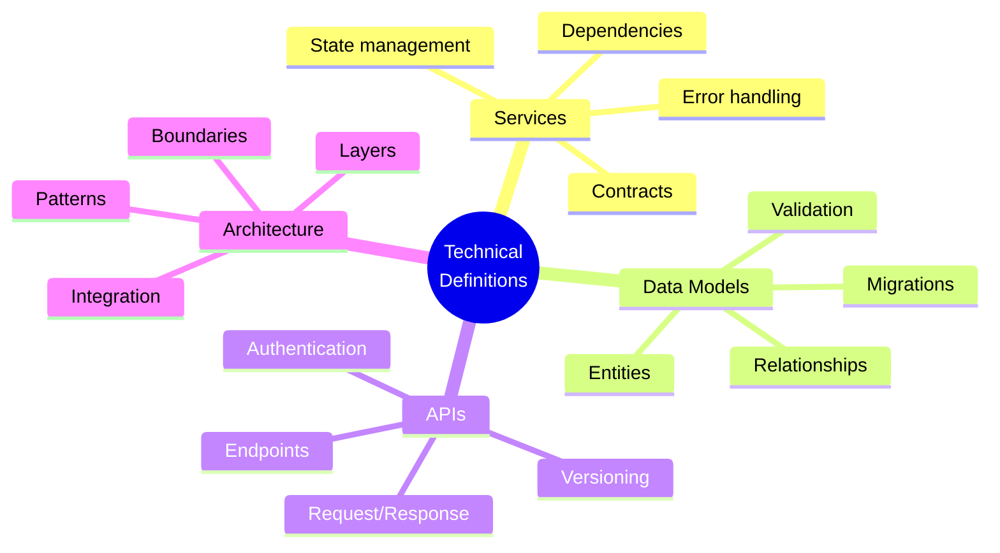
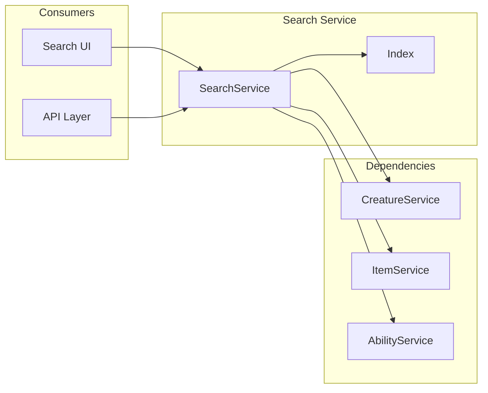
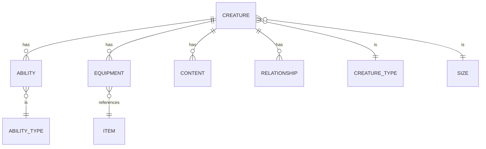
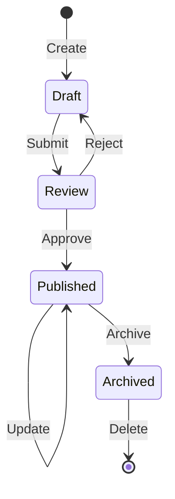

# OGT Docs - Define Code

Complete guide for creating technical architecture definitions.

## Overview

Technical definitions establish the architectural foundation of your system. They define services, data models, APIs, and system boundaries at an interface level - NOT implementation details.



## When to Use This Skill

Use `ogt-docs-define-code` when defining:

- Service interfaces and contracts
- Data models and entity relationships
- API endpoints and schemas
- Architectural patterns and layers
- System boundaries and integrations
- State management approaches

## Folder Structure

```
docs/definitions/technical/
├── service_layer/
│   ├── definition.md           # Service layer philosophy
│   ├── contracts.md            # Service contracts
│   ├── patterns.md             # Required patterns
│   ├── error_handling.md       # Error conventions
│   └── .version
│
├── data_model/
│   ├── definition.md           # Data layer philosophy
│   ├── entities/               # Entity definitions
│   │   ├── user.md
│   │   ├── campaign.md
│   │   └── creature.md
│   ├── relationships.md        # Entity relationships
│   ├── validation.md           # Validation rules
│   └── .version
│
├── api_design/
│   ├── definition.md           # API philosophy
│   ├── rest_conventions.md     # REST standards
│   ├── authentication.md       # Auth approach
│   ├── versioning.md           # Version strategy
│   ├── error_responses.md      # Error format
│   └── .version
│
├── state_management/
│   ├── definition.md           # State philosophy
│   ├── global_state.md         # Global state approach
│   ├── local_state.md          # Component state
│   ├── persistence.md          # Storage strategy
│   └── .version
│
├── authentication/
│   ├── definition.md           # Auth architecture
│   ├── flows.md                # Auth flows
│   ├── tokens.md               # Token management
│   ├── providers.md            # OAuth providers
│   └── .version
│
└── integration/
    ├── definition.md           # Integration philosophy
    ├── external_apis.md        # Third-party APIs
    ├── webhooks.md             # Webhook patterns
    └── .version
```

---

## Technical Definition Types

### 1. Service Definition

Defines a service's interface, responsibilities, and contracts.

#### Example: technical/services/search_service/

```
services/search_service/
├── definition.md
├── interface.md
├── dependencies.md
├── error_handling.md
├── state.md
└── .version
```

#### definition.md

````markdown
# Definition: Search Service

## Overview

The Search Service provides full-text search capabilities across all content
types. It maintains an in-memory index and exposes a simple query interface.

## Responsibilities

### Primary Responsibilities

- Build and maintain search index
- Execute search queries
- Return ranked results

### NOT Responsible For

- Data fetching (delegates to content services)
- UI rendering
- Navigation

## Architecture Context


````

## Key Decisions

| Decision        | Choice               | Rationale                             |
| --------------- | -------------------- | ------------------------------------- |
| Index location  | Client-side (memory) | Low latency, offline capable          |
| Index library   | MiniSearch           | Small, fast, fuzzy matching           |
| Update strategy | Rebuild on change    | Simple, data size is small            |
| Query debounce  | 100ms                | Balance responsiveness and efficiency |

## Quality Attributes

| Attribute    | Requirement                               |
| ------------ | ----------------------------------------- |
| Latency      | <16ms per query                           |
| Memory       | <10MB index size                          |
| Availability | Works offline                             |
| Consistency  | Eventually consistent (rebuild on change) |

## Related Definitions

- [Service Layer](../service_layer/)
- [Feature: Global Search](../../features/global_search/)

````

#### interface.md

```markdown
# Interface: Search Service

## TypeScript Interface

```typescript
/**
 * Search Service Interface
 *
 * Provides full-text search across content types.
 *
 * @example
 * const results = await searchService.search('fireball');
 * const creatures = await searchService.search('dragon', { types: ['creature'] });
 */
interface ISearchService {
  /**
   * Initialize the search index.
   * Must be called before any search operations.
   * Fetches all content and builds the index.
   *
   * @returns Promise that resolves when index is ready
   * @throws IndexBuildError if content fetch fails
   */
  initialize(): Promise<void>;

  /**
   * Check if the index is ready for queries.
   */
  isReady(): boolean;

  /**
   * Execute a search query.
   *
   * @param query - Search query string
   * @param options - Optional search configuration
   * @returns Array of search results, ranked by relevance
   */
  search(query: string, options?: SearchOptions): SearchResult[];

  /**
   * Add a document to the index.
   * Called when new content is created.
   *
   * @param document - Document to index
   */
  addDocument(document: Searchable): void;

  /**
   * Remove a document from the index.
   * Called when content is deleted.
   *
   * @param id - Document ID to remove
   */
  removeDocument(id: string): void;

  /**
   * Rebuild the entire index.
   * Called when bulk changes occur.
   */
  rebuild(): Promise<void>;

  /**
   * Get index statistics.
   */
  getStats(): IndexStats;
}
````

## Types

```typescript
interface SearchOptions {
  /** Filter by content types */
  types?: ContentType[];
  /** Maximum results to return */
  limit?: number;
  /** Minimum relevance score (0-1) */
  minScore?: number;
  /** Fields to search (default: all) */
  fields?: string[];
}

interface SearchResult {
  /** Unique identifier */
  id: string;
  /** Content type */
  type: ContentType;
  /** Display name */
  name: string;
  /** URL-friendly identifier */
  slug: string;
  /** Relevance score (0-1) */
  score: number;
  /** Matched terms with positions */
  matches: Match[];
}

interface Match {
  /** Field that matched */
  field: string;
  /** Matched term */
  term: string;
  /** Position in field */
  position: number;
}

interface Searchable {
  /** Unique identifier */
  id: string;
  /** Content type */
  type: ContentType;
  /** Primary searchable text */
  name: string;
  /** URL-friendly identifier */
  slug: string;
  /** Additional searchable text */
  description?: string;
  /** Searchable tags */
  tags?: string[];
}

interface IndexStats {
  /** Number of indexed documents */
  documentCount: number;
  /** Index size in bytes */
  sizeBytes: number;
  /** Last rebuild timestamp */
  lastRebuilt: Date;
  /** Documents by type */
  byType: Record<ContentType, number>;
}

type ContentType = "creature" | "item" | "ability" | "campaign" | "scenario";
```

## Method Contracts

### initialize()

**Preconditions:**

- Content services are available
- Not already initialized

**Postconditions:**

- Index contains all current content
- `isReady()` returns true

**Errors:**

- `IndexBuildError`: Content fetch failed

### search()

**Preconditions:**

- `isReady()` returns true
- Query is non-empty string

**Postconditions:**

- Returns results sorted by score descending
- Results match query with fuzzy tolerance

**Errors:**

- `IndexNotReadyError`: Called before initialize
- `InvalidQueryError`: Empty or invalid query

### addDocument() / removeDocument()

**Preconditions:**

- Index is initialized

**Postconditions:**

- Index reflects the change
- Change is immediately searchable

**Errors:**

- `IndexNotReadyError`: Called before initialize

````

#### dependencies.md

```markdown
# Dependencies: Search Service

## Required Services

```mermaid
flowchart TD
    SS[SearchService]
    CS[CreatureService]
    IS[ItemService]
    AS[AbilityService]
    CAS[CampaignService]

    SS -->|getAll| CS
    SS -->|getAll| IS
    SS -->|getAll| AS
    SS -->|getAll| CAS
````

### CreatureService

- **Method**: `getAll(): Promise<Creature[]>`
- **Purpose**: Fetch all creatures for indexing
- **Required**: Yes (Phase 0)

### ItemService

- **Method**: `getAll(): Promise<Item[]>`
- **Purpose**: Fetch all items for indexing
- **Required**: Yes (Phase 0)

### AbilityService

- **Method**: `getAll(): Promise<Ability[]>`
- **Purpose**: Fetch all abilities for indexing
- **Required**: Yes (Phase 0)

### CampaignService

- **Method**: `getAll(): Promise<Campaign[]>`
- **Purpose**: Fetch all campaigns for indexing
- **Required**: No (Phase 2)

## External Libraries

### MiniSearch

- **Version**: ^6.0.0
- **Purpose**: Full-text search engine
- **Usage**: Index storage and query execution

## Dependency Injection

```typescript
interface SearchServiceDependencies {
  creatureService: ICreatureService;
  itemService: IItemService;
  abilityService: IAbilityService;
  campaignService?: ICampaignService; // Optional, Phase 2
}

function createSearchService(deps: SearchServiceDependencies): ISearchService {
  return new SearchService(deps);
}
```

````

#### error_handling.md

```markdown
# Error Handling: Search Service

## Error Types

```typescript
/** Base error for search service */
class SearchServiceError extends Error {
  constructor(message: string, public code: string) {
    super(message);
    this.name = 'SearchServiceError';
  }
}

/** Index not ready for queries */
class IndexNotReadyError extends SearchServiceError {
  constructor() {
    super('Search index not initialized. Call initialize() first.', 'INDEX_NOT_READY');
  }
}

/** Index build failed */
class IndexBuildError extends SearchServiceError {
  constructor(cause: Error) {
    super(`Failed to build search index: ${cause.message}`, 'INDEX_BUILD_FAILED');
    this.cause = cause;
  }
}

/** Invalid search query */
class InvalidQueryError extends SearchServiceError {
  constructor(query: string, reason: string) {
    super(`Invalid query "${query}": ${reason}`, 'INVALID_QUERY');
  }
}
````

## Error Handling Patterns

### Initialization Errors

```typescript
try {
  await searchService.initialize();
} catch (error) {
  if (error instanceof IndexBuildError) {
    // Log and show user-friendly message
    logger.error("Search index build failed", error);
    showNotification("Search is temporarily unavailable");
    // App continues without search
  }
}
```

### Query Errors

```typescript
function handleSearch(query: string) {
  try {
    return searchService.search(query);
  } catch (error) {
    if (error instanceof IndexNotReadyError) {
      // Index still building, show loading
      return { loading: true, results: [] };
    }
    if (error instanceof InvalidQueryError) {
      // Invalid query, return empty
      return { loading: false, results: [] };
    }
    throw error; // Unknown error, propagate
  }
}
```

## Recovery Strategies

| Error              | Strategy                                       |
| ------------------ | ---------------------------------------------- |
| IndexBuildError    | Retry with backoff, fallback to no-search mode |
| IndexNotReadyError | Wait for initialization, show loading          |
| InvalidQueryError  | Return empty results, no retry                 |

````

---

### 2. Data Model Definition

Defines entities, their structure, and relationships.

#### Example: technical/data_model/entities/creature.md

```markdown
# Entity: Creature

## Overview
A Creature represents any living or animated being in the game world that can
be encountered, fought, or interacted with.

## Schema

```typescript
interface ICreature {
  // Identity
  id: string;                    // Unique identifier (UUID)
  slug: string;                  // URL-friendly name
  name: LocalizedText;           // Display name

  // Classification
  type: CreatureType;            // beast, humanoid, undead, etc.
  subtype?: string;              // goblinoid, demon, etc.
  size: CreatureSize;            // tiny, small, medium, large, huge, gargantuan
  alignment: Alignment;          // lawful-good to chaotic-evil

  // Stats
  attributes: ICreatureAttributes;

  // Combat
  abilities: IAbility[];         // Actions, reactions, features
  equipment: IEquipment[];       // Equipped items

  // Lore
  contents: ICreatureContent[];  // Descriptions, GM notes

  // Relationships
  relationships: ICreatureRelationship[];

  // Metadata
  _metadata: IEntryMetadata;
  createdAt: string;             // ISO timestamp
  updatedAt: string;             // ISO timestamp
}
````

## Field Definitions

### Identity Fields

| Field  | Type          | Required | Description                       |
| ------ | ------------- | -------- | --------------------------------- |
| `id`   | string        | Yes      | UUID v4, immutable                |
| `slug` | string        | Yes      | Lowercase, hyphenated, unique     |
| `name` | LocalizedText | Yes      | Display name in supported locales |

### Classification Fields

| Field       | Type         | Required | Values                                               |
| ----------- | ------------ | -------- | ---------------------------------------------------- |
| `type`      | CreatureType | Yes      | beast, humanoid, undead, construct, etc.             |
| `subtype`   | string       | No       | Further classification                               |
| `size`      | CreatureSize | Yes      | tiny, small, medium, large, huge, gargantuan         |
| `alignment` | Alignment    | Yes      | 3x3 grid: lawful/neutral/chaotic × good/neutral/evil |

### Attributes

```typescript
interface ICreatureAttributes {
  // Core stats
  attr_health: number; // Hit points
  attr_defense: number; // Armor class
  attr_difficulty: number; // Challenge rating

  // Ability scores (3-30, 10 = average)
  attr_str: number; // Strength
  attr_agi: number; // Agility/Dexterity
  attr_con: number; // Constitution
  attr_int: number; // Intelligence
  attr_wis: number; // Wisdom
  attr_cha: number; // Charisma
}
```

## Relationships



### Related Entities

| Entity    | Relationship                 | Cardinality |
| --------- | ---------------------------- | ----------- |
| Ability   | Creature HAS Abilities       | 1:N         |
| Equipment | Creature HAS Equipment       | 1:N         |
| Item      | Equipment REFERENCES Item    | N:1         |
| Creature  | Creature RELATES TO Creature | N:N         |

## Validation Rules

### Required Fields

- `id`: Must be valid UUID v4
- `slug`: Must be lowercase, hyphenated, 3-50 chars
- `name.en`: English name required
- `type`: Must be valid CreatureType
- `size`: Must be valid CreatureSize

### Value Constraints

- `attr_health`: 1-9999
- `attr_defense`: 1-30
- `attr_difficulty`: 0-30
- Ability scores: 1-30

### Business Rules

- Slug must be unique within creatures
- Cannot delete creature referenced by campaign
- Type change requires re-validation of abilities

## Lifecycle



## Indexing

| Field             | Indexed     | Purpose          |
| ----------------- | ----------- | ---------------- |
| id                | Primary key | Direct lookup    |
| slug              | Unique      | URL routing      |
| name.en           | Full-text   | Search           |
| type              | Standard    | Filtering        |
| \_metadata.status | Standard    | Workflow queries |

```

---

### 3. API Definition

Defines API endpoints, request/response schemas, and conventions.

#### Example: technical/api_design/

```

api_design/
├── definition.md
├── rest_conventions.md
├── endpoints/
│ ├── creatures.md
│ ├── items.md
│ └── auth.md
├── authentication.md
├── error_responses.md
└── .version

````

#### rest_conventions.md

```markdown
# REST Conventions

## URL Structure

````

{base_url}/api/{version}/{resource}/{id?}/{subresource?}

```

### Examples
```

GET /api/v1/creatures # List creatures
GET /api/v1/creatures/goblin # Get creature by slug
POST /api/v1/creatures # Create creature
PUT /api/v1/creatures/goblin # Update creature
DELETE /api/v1/creatures/goblin # Delete creature
GET /api/v1/creatures/goblin/abilities # Get creature's abilities

```

## HTTP Methods

| Method | Purpose | Idempotent | Body |
|--------|---------|------------|------|
| GET | Retrieve resource(s) | Yes | No |
| POST | Create resource | No | Yes |
| PUT | Replace resource | Yes | Yes |
| PATCH | Partial update | Yes | Yes |
| DELETE | Remove resource | Yes | No |

## Request Headers

### Required
```

Content-Type: application/json
Accept: application/json

```

### Authentication
```

Authorization: Bearer {token}

```

### Optional
```

Accept-Language: en-US # Localization
X-Request-ID: {uuid} # Request tracing

````

## Response Format

### Success Response
```json
{
  "data": { ... },               // Resource or array
  "meta": {                      // Pagination, etc.
    "page": 1,
    "pageSize": 25,
    "total": 100
  }
}
````

### Single Resource

```json
{
  "data": {
    "id": "123",
    "type": "creature",
    "attributes": { ... }
  }
}
```

### Collection

```json
{
  "data": [
    { "id": "123", ... },
    { "id": "456", ... }
  ],
  "meta": {
    "page": 1,
    "pageSize": 25,
    "total": 50
  }
}
```

## Pagination

### Query Parameters

```
?page=1&pageSize=25
?offset=0&limit=25
```

### Response Meta

```json
{
  "meta": {
    "page": 1,
    "pageSize": 25,
    "total": 100,
    "totalPages": 4,
    "hasNext": true,
    "hasPrev": false
  }
}
```

## Filtering

### Query Parameters

```
?filter[type]=humanoid
?filter[size]=medium,large
?filter[difficulty][gte]=5
?filter[difficulty][lte]=10
```

### Operators

| Operator     | Meaning            | Example                           |
| ------------ | ------------------ | --------------------------------- |
| (none)       | Equals             | `filter[type]=beast`              |
| `[ne]`       | Not equals         | `filter[type][ne]=beast`          |
| `[gt]`       | Greater than       | `filter[cr][gt]=5`                |
| `[gte]`      | Greater or equal   | `filter[cr][gte]=5`               |
| `[lt]`       | Less than          | `filter[cr][lt]=10`               |
| `[lte]`      | Less or equal      | `filter[cr][lte]=10`              |
| `[in]`       | In list            | `filter[type][in]=beast,humanoid` |
| `[contains]` | Contains substring | `filter[name][contains]=dragon`   |

## Sorting

```
?sort=name                       # Ascending by name
?sort=-difficulty                # Descending by difficulty
?sort=type,-name                 # Multiple fields
```

## Status Codes

### Success

| Code | Meaning    | Usage                   |
| ---- | ---------- | ----------------------- |
| 200  | OK         | GET, PUT, PATCH success |
| 201  | Created    | POST success            |
| 204  | No Content | DELETE success          |

### Client Error

| Code | Meaning       | Usage                    |
| ---- | ------------- | ------------------------ |
| 400  | Bad Request   | Invalid request body     |
| 401  | Unauthorized  | Missing/invalid auth     |
| 403  | Forbidden     | Insufficient permissions |
| 404  | Not Found     | Resource doesn't exist   |
| 409  | Conflict      | Duplicate/conflict       |
| 422  | Unprocessable | Validation failed        |

### Server Error

| Code | Meaning             | Usage                |
| ---- | ------------------- | -------------------- |
| 500  | Internal Error      | Unexpected error     |
| 503  | Service Unavailable | Maintenance/overload |

````

#### error_responses.md

```markdown
# Error Responses

## Error Format

```json
{
  "error": {
    "code": "VALIDATION_ERROR",
    "message": "Validation failed",
    "details": [
      {
        "field": "name",
        "code": "REQUIRED",
        "message": "Name is required"
      }
    ],
    "requestId": "abc-123"
  }
}
````

## Error Codes

### Authentication Errors

| Code             | Status | Message                      |
| ---------------- | ------ | ---------------------------- |
| `AUTH_REQUIRED`  | 401    | Authentication required      |
| `AUTH_INVALID`   | 401    | Invalid authentication token |
| `AUTH_EXPIRED`   | 401    | Authentication token expired |
| `AUTH_FORBIDDEN` | 403    | Insufficient permissions     |

### Validation Errors

| Code               | Status | Message              |
| ------------------ | ------ | -------------------- |
| `VALIDATION_ERROR` | 422    | Validation failed    |
| `REQUIRED`         | 422    | Field is required    |
| `INVALID_FORMAT`   | 422    | Invalid format       |
| `OUT_OF_RANGE`     | 422    | Value out of range   |
| `TOO_LONG`         | 422    | Value too long       |
| `DUPLICATE`        | 409    | Value already exists |

### Resource Errors

| Code        | Status | Message            |
| ----------- | ------ | ------------------ |
| `NOT_FOUND` | 404    | Resource not found |
| `CONFLICT`  | 409    | Resource conflict  |
| `GONE`      | 410    | Resource deleted   |

### Server Errors

| Code                  | Status | Message               |
| --------------------- | ------ | --------------------- |
| `INTERNAL_ERROR`      | 500    | Internal server error |
| `SERVICE_UNAVAILABLE` | 503    | Service unavailable   |

## Error Examples

### 401 Unauthorized

```json
{
  "error": {
    "code": "AUTH_REQUIRED",
    "message": "Authentication required",
    "requestId": "abc-123"
  }
}
```

### 404 Not Found

```json
{
  "error": {
    "code": "NOT_FOUND",
    "message": "Creature 'invalid-slug' not found",
    "requestId": "abc-123"
  }
}
```

### 422 Validation Error

```json
{
  "error": {
    "code": "VALIDATION_ERROR",
    "message": "Validation failed",
    "details": [
      {
        "field": "name",
        "code": "REQUIRED",
        "message": "Name is required"
      },
      {
        "field": "attr_health",
        "code": "OUT_OF_RANGE",
        "message": "Health must be between 1 and 9999"
      }
    ],
    "requestId": "abc-123"
  }
}
```

```

---

## Signal Files for Technical Definitions

### Status Signals

| Signal | Meaning |
|--------|---------|
| `.draft` | Definition in progress |
| `.ready_for_review` | Ready for tech review |
| `.approved` | Approved for implementation |
| `.implemented` | Implementation exists |
| `.deprecated` | No longer current |

### Attribution Signals

| Signal | Meaning |
|--------|---------|
| `.approved_by_tech_lead` | Tech lead approved |
| `.approved_by_architect` | Architect approved |
| `.implemented_in` | Content: path to implementation |

### Content Signals

| Signal | Content |
|--------|---------|
| `.version` | Schema version JSON |
| `.breaking_changes` | Breaking changes from previous version |
| `.migration_guide` | How to migrate from previous version |

---

## Quality Checklist

Before requesting review:

- [ ] Interface fully defined with TypeScript
- [ ] All public methods documented with JSDoc
- [ ] Preconditions and postconditions specified
- [ ] Error types and handling defined
- [ ] Dependencies explicitly listed
- [ ] Relationship diagrams included (Mermaid)
- [ ] No implementation details (interface only)
- [ ] Related definitions linked
- [ ] `.version` file created
```
