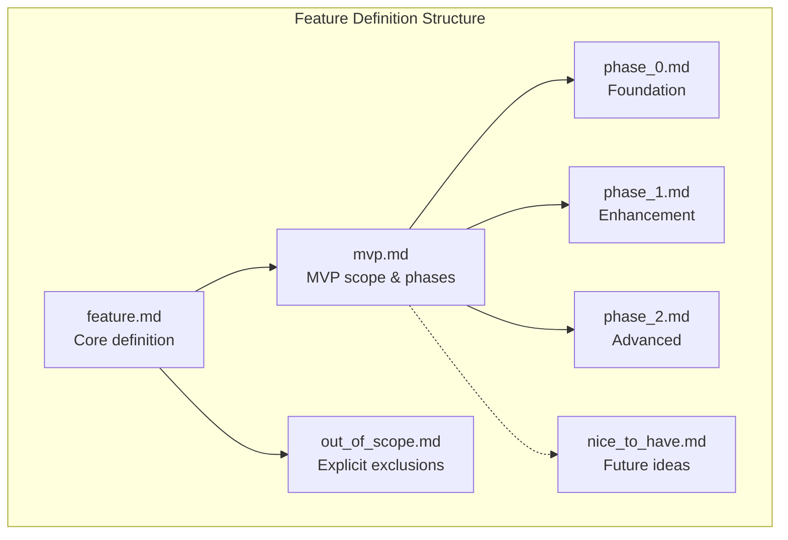
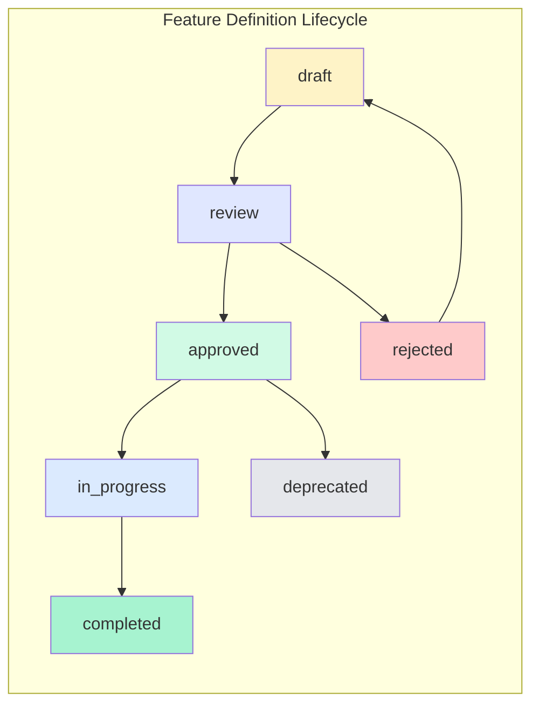

# OGT Docs - Define Feature

Complete guide for creating feature definition documents with phased delivery.

## Overview

Feature definitions specify WHAT a feature does, WHO it's for, and HOW it will be delivered in phases. Each feature is a folder containing the main definition, MVP scope, phase documents, and completion criteria.



## When to Use This Skill

Use `ogt-docs-define-feature` when:

- Defining a new product feature
- Specifying a user-facing capability
- Planning phased delivery of functionality
- Establishing MVP scope and definition of done
- Documenting feature requirements before implementation

## Folder Structure

```
docs/definitions/features/
├── global_search/
│   ├── feature.md              # Core feature definition
│   ├── mvp.md                  # MVP scope and phase inclusion
│   ├── phase_0.md              # Phase 0: Foundation/Core
│   ├── phase_1.md              # Phase 1: Enhanced
│   ├── phase_2.md              # Phase 2: Advanced
│   ├── nice_to_have.md         # Future enhancements
│   ├── out_of_scope.md         # Explicit exclusions
│   ├── dependencies.md         # Technical dependencies
│   ├── user_stories.md         # User stories (optional)
│   ├── wireframes/             # Visual designs (optional)
│   │   ├── search_modal.png
│   │   └── results_list.png
│   ├── .version
│   ├── .approved
│   └── .approved_by_product
│
├── user_authentication/
│   ├── feature.md
│   ├── mvp.md
│   ├── phase_0.md
│   ├── phase_1.md
│   ├── out_of_scope.md
│   └── .version
│
└── campaign_manager/
    ├── feature.md
    ├── mvp.md
    ├── phase_0.md
    ├── phase_1.md
    ├── phase_2.md
    ├── phase_3.md
    ├── nice_to_have.md
    ├── out_of_scope.md
    └── .version
```

---

## Feature Lifecycle



### Draft State

Feature is being defined, not ready for review.

```
{feature_slug}/
├── feature.md
├── mvp.md
├── phase_0.md
├── .version
└── .draft
```

### Approved State

Feature definition approved, ready for implementation.

```
{feature_slug}/
├── feature.md
├── mvp.md
├── phase_0.md
├── phase_1.md
├── .version
├── .approved
└── .approved_by_product
```

### In Progress State

Feature is being implemented.

```
{feature_slug}/
├── feature.md
├── mvp.md
├── phase_0.md
├── phase_1.md
├── .version
├── .approved
├── .in_progress
├── .current_phase              # Content: "0" or "1" etc.
└── .implementation_started_at
```

### Completed State

All MVP phases implemented.

```
{feature_slug}/
├── feature.md
├── mvp.md
├── phase_0.md
├── phase_1.md
├── .version
├── .approved
├── .completed
├── .completed_at
└── .verified
```

---

## Core Files

### feature.md

The primary feature definition document.

#### Example: global_search/feature.md

```markdown
# Feature: Global Search

## Overview

A universal search interface accessible via Ctrl+K that searches across all
content types (creatures, items, abilities, campaigns, etc.) with fuzzy matching,
instant results, and keyboard navigation.

## Problem Statement

Users currently navigate through multiple menus to find content. There's no way
to quickly search across all content types from anywhere in the application.

## Target Users

- **Primary**: Power users who know what they're looking for
- **Secondary**: New users exploring available content
- **Tertiary**: GMs preparing sessions who need quick access

## User Value

- Find any content in <2 seconds
- Stay in flow without menu navigation
- Discover related content through search

## Success Metrics

| Metric               | Target        | Measurement  |
| -------------------- | ------------- | ------------ |
| Time to find content | <2 seconds    | User testing |
| Search usage         | >50% of users | Analytics    |
| Search success rate  | >80%          | Analytics    |
| User satisfaction    | >4/5          | Survey       |

## Key Capabilities

1. **Universal Access**: Ctrl+K from anywhere opens search
2. **Fuzzy Matching**: "fir" matches "Fireball", "Fire Elemental"
3. **Instant Results**: Results appear as user types
4. **Keyboard Navigation**: Arrow keys, Enter to select
5. **Result Preview**: Hover/focus shows preview
6. **Recent Searches**: Quick access to recent queries
7. **Type Filtering**: Filter by content type

## User Experience

### Happy Path

1. User presses Ctrl+K
2. Search modal appears with cursor in input
3. User types query
4. Results appear instantly, ranked by relevance
5. User navigates with arrow keys
6. User presses Enter to go to selected result
7. Search modal closes, user is at selected content

### Edge Cases

- No results: Show "No results" with suggestions
- Many results: Show top 10 with "See all X results"
- Slow connection: Show loading state, then results
- Error: Show error message with retry option

## Technical Considerations

- Search index must be built at app boot
- Index must update when content changes
- Search must be <16ms for instant feel
- Consider debounce for API if server-side

## Dependencies

- MiniSearch library (or similar)
- Keyboard shortcut system
- Content type registry

## Related Features

- [Content Browsing](../content_browsing/)
- [Quick Actions](../quick_actions/)

## Related Definitions

- [Search Service](../../technical/search_service/)
```

---

### mvp.md

Defines MVP scope, which phases are included, and definition of done.

#### Example: global_search/mvp.md

````markdown
# MVP: Global Search

## MVP Philosophy

The MVP must deliver core value to users while being achievable in a reasonable
timeframe. It's better to ship a focused, working feature than a broad, buggy one.

## Phase Inclusion

| Phase    | Included in MVP | Rationale                 |
| -------- | --------------- | ------------------------- |
| Phase 0  | ✅ Yes          | Core functionality        |
| Phase 1  | ✅ Yes          | Essential UX polish       |
| Phase 2  | ❌ No           | Nice-to-have, post-launch |
| Phase 3+ | ❌ No           | Future enhancement        |

## MVP Scope Summary

### In Scope (Must Have)

- Ctrl+K shortcut opens search modal
- Search input with fuzzy matching
- Results from: creatures, items, abilities
- Keyboard navigation (arrows, enter, escape)
- Click to navigate to result
- Basic result display (name, type, icon)

### Out of Scope (Phase 2+)

- Recent searches
- Search history
- Advanced filters
- Search analytics
- Saved searches
- Search suggestions/autocomplete
- Result previews on hover

## Definition of Done

### Functional Requirements

- [ ] Ctrl+K opens search modal from any page
- [ ] Escape closes search modal
- [ ] Typing in input triggers search
- [ ] Results appear within 100ms of typing
- [ ] Results include creatures, items, abilities
- [ ] Fuzzy matching works (e.g., "fir" → "Fireball")
- [ ] Results are ranked by relevance
- [ ] Arrow keys navigate results
- [ ] Enter navigates to selected result
- [ ] Clicking result navigates to it
- [ ] "No results" state displays correctly
- [ ] Loading state displays during search
- [ ] Error state displays on failure

### Technical Requirements

- [ ] Search index builds at app initialization
- [ ] Search executes in <16ms
- [ ] Index updates when content changes
- [ ] TypeScript compiles without errors
- [ ] No console errors during usage
- [ ] Works on Chrome, Firefox, Safari
- [ ] Works on desktop (mobile is Phase 2)

### Quality Requirements

- [ ] Keyboard focus is managed correctly
- [ ] Accessible via screen reader
- [ ] Respects user's color scheme preference
- [ ] Animations are smooth (60fps)
- [ ] No memory leaks on repeated open/close

### Documentation Requirements

- [ ] User-facing help text written
- [ ] Technical implementation documented
- [ ] Keyboard shortcuts documented

## MVP Timeline

| Milestone           | Target Date | Status |
| ------------------- | ----------- | ------ |
| Definition approved | {date}      | ⏳     |
| Phase 0 complete    | {date}      | ⏳     |
| Phase 1 complete    | {date}      | ⏳     |
| MVP verification    | {date}      | ⏳     |
| MVP launch          | {date}      | ⏳     |

## MVP Verification Checklist

Before declaring MVP complete, verify each Definition of Done item:

```markdown
## MVP Verification: Global Search

Date: {date}
Verified by: {name}

### Functional

- [x] Ctrl+K opens modal: Tested on all pages
- [x] Escape closes modal: Works correctly
- [x] Search triggers on typing: 50ms debounce, works
      ...

### Technical

- [x] Index builds at init: Verified in console, 200ms
- [x] Search <16ms: Measured at 8ms average
      ...

### Result: PASS / FAIL
```
````

````

---

### phase_0.md

Foundation phase - the minimum viable core.

#### Example: global_search/phase_0.md

```markdown
# Phase 0: Global Search Foundation

## Phase Goal
Establish the core search infrastructure and basic UI. Users can search and
find content, but UX is minimal.

## Scope

### Included
- Search index service (MiniSearch integration)
- Basic search modal component
- Keyboard shortcut registration (Ctrl+K)
- Search input field
- Basic results list
- Navigation to result
- Index: creatures, items, abilities

### Not Included (Later Phases)
- Keyboard navigation of results
- Result type icons
- Result previews
- Recent searches
- Filters

## Deliverables

### 1. SearchIndexService
```typescript
// front/services/search-index.ts
interface SearchIndexService {
  initialize(): Promise<void>;
  search(query: string): SearchResult[];
  addDocument(doc: Searchable): void;
  removeDocument(id: string): void;
}
````

**Acceptance Criteria:**

- [ ] Indexes all creatures, items, abilities at init
- [ ] Search returns results in <16ms
- [ ] Fuzzy matching works
- [ ] Results sorted by relevance

### 2. GlobalSearchModal

```typescript
// front/components/features/GlobalSearchModal.tsx
interface GlobalSearchModalProps {
  isOpen: boolean;
  onClose: () => void;
  onSelect: (result: SearchResult) => void;
}
```

**Acceptance Criteria:**

- [ ] Opens centered on screen
- [ ] Has search input focused on open
- [ ] Shows results below input
- [ ] Closes on Escape or outside click

### 3. Keyboard Shortcut

**Acceptance Criteria:**

- [ ] Ctrl+K opens search from anywhere
- [ ] Cmd+K works on Mac
- [ ] Doesn't conflict with browser shortcuts
- [ ] Works when input is focused elsewhere

### 4. Results Display

**Acceptance Criteria:**

- [ ] Shows result name
- [ ] Shows result type (creature/item/ability)
- [ ] Clickable to navigate
- [ ] Shows "No results" when empty

## Technical Design


## Files to Create

| File                                              | Purpose                |
| ------------------------------------------------- | ---------------------- |
| `front/services/search-index.ts`                  | Search index service   |
| `front/components/features/GlobalSearchModal.tsx` | Search modal UI        |
| `front/hooks/use-global-search.ts`                | Search state and logic |
| `front/types/search.ts`                           | Search-related types   |

## Files to Modify

| File                      | Change                    |
| ------------------------- | ------------------------- |
| `front/app/App.tsx`       | Add keyboard listener     |
| `front/services/index.ts` | Export SearchIndexService |

## Definition of Done (Phase 0)

- [ ] SearchIndexService implemented and tested
- [ ] GlobalSearchModal renders correctly
- [ ] Ctrl+K/Cmd+K opens search
- [ ] Search returns relevant results
- [ ] Clicking result navigates correctly
- [ ] TypeScript compiles clean
- [ ] No console errors

## Estimated Effort

**Medium** (4-8 hours)

## Dependencies

- MiniSearch library must be installed
- Content services must expose getAllX() methods

````

---

### phase_1.md

Enhancement phase - UX improvements.

#### Example: global_search/phase_1.md

```markdown
# Phase 1: Global Search Enhancement

## Phase Goal
Improve UX with keyboard navigation, visual polish, and better result display.
Make search feel professional and efficient.

## Prerequisites
- Phase 0 complete and working

## Scope

### Included
- Keyboard navigation (arrow keys)
- Result type icons
- Result highlighting (matched text)
- Empty state improvement
- Loading state
- Animation/transitions
- Debounced input

### Not Included (Later Phases)
- Recent searches
- Filters
- Previews
- Saved searches

## Deliverables

### 1. Keyboard Navigation
**Acceptance Criteria:**
- [ ] Arrow down moves to next result
- [ ] Arrow up moves to previous result
- [ ] Selection wraps at top/bottom
- [ ] Enter navigates to selected
- [ ] Visual indicator on selected result

### 2. Result Type Icons
**Acceptance Criteria:**
- [ ] Creature results show creature icon
- [ ] Item results show item icon
- [ ] Ability results show ability icon
- [ ] Icons are consistent with app design

### 3. Match Highlighting
**Acceptance Criteria:**
- [ ] Matched text is highlighted in results
- [ ] Highlighting is visually distinct
- [ ] Works with fuzzy matches

### 4. States Polish
**Acceptance Criteria:**
- [ ] Loading spinner while searching
- [ ] "No results for X" message
- [ ] Error state with retry option

### 5. Animation
**Acceptance Criteria:**
- [ ] Modal fades in smoothly
- [ ] Results animate in
- [ ] Selection highlight transitions
- [ ] All animations 60fps

### 6. Input Debounce
**Acceptance Criteria:**
- [ ] Search debounced by 100ms
- [ ] No flicker on fast typing
- [ ] Immediate feel maintained

## Technical Design

```mermaid
stateDiagram-v2
    [*] --> Closed
    Closed --> Open: Ctrl+K
    Open --> Searching: User types
    Searching --> Results: Search complete
    Searching --> NoResults: No matches
    Searching --> Error: Search failed
    Results --> Selected: Arrow key
    Selected --> Results: Arrow key
    Selected --> Navigating: Enter
    Navigating --> Closed: Navigation complete
    Open --> Closed: Escape
    Results --> Closed: Escape
    NoResults --> Closed: Escape
    Error --> Searching: Retry
````

## Files to Modify

| File                                              | Change                        |
| ------------------------------------------------- | ----------------------------- |
| `front/components/features/GlobalSearchModal.tsx` | Add keyboard handling, states |
| `front/hooks/use-global-search.ts`                | Add debounce, selection state |
| `front/styles/global-search.css`                  | Add animations                |

## Definition of Done (Phase 1)

- [ ] Keyboard navigation works fluidly
- [ ] Result icons display correctly
- [ ] Match highlighting works
- [ ] All states display correctly
- [ ] Animations are smooth (60fps)
- [ ] Debounce prevents flicker
- [ ] TypeScript compiles clean
- [ ] No console errors

## Estimated Effort

**Medium** (4-6 hours)

````

---

### phase_2.md

Advanced phase - power features.

#### Example: global_search/phase_2.md

```markdown
# Phase 2: Global Search Advanced

## Phase Goal
Add power user features: recent searches, type filters, and result previews.
Make search a productivity tool.

## Prerequisites
- Phase 0 complete
- Phase 1 complete

## Scope

### Included
- Recent searches (last 10)
- Type filter buttons
- Result preview on hover
- Search across more content types
- Search suggestions

### Not Included (Later Phases)
- Saved searches
- Search analytics
- AI-powered suggestions

## Deliverables

### 1. Recent Searches
**Acceptance Criteria:**
- [ ] Last 10 searches stored in localStorage
- [ ] Recent searches shown when modal opens
- [ ] Click recent search to execute
- [ ] Clear recent searches option

### 2. Type Filters
**Acceptance Criteria:**
- [ ] Filter buttons for each content type
- [ ] Multiple filters can be active
- [ ] Filters persist during session
- [ ] "All" option to clear filters

### 3. Result Preview
**Acceptance Criteria:**
- [ ] Preview panel shows on result hover
- [ ] Preview shows: image, description, stats
- [ ] Preview doesn't block results list
- [ ] Preview loads lazily

### 4. Extended Content Types
**Acceptance Criteria:**
- [ ] Search includes: campaigns, scenarios
- [ ] Search includes: spells, feats
- [ ] Results grouped by type

## Definition of Done (Phase 2)

- [ ] Recent searches work correctly
- [ ] Type filters work correctly
- [ ] Previews load and display
- [ ] Extended content types searchable
- [ ] TypeScript compiles clean
- [ ] No console errors
- [ ] Performance still <16ms with filters

## Estimated Effort
**Large** (8-12 hours)
````

---

### nice_to_have.md

Future ideas that aren't planned for any phase yet.

#### Example: global_search/nice_to_have.md

```markdown
# Nice to Have: Global Search

Ideas for future enhancement, not currently planned for any phase.

## Ideas

### AI-Powered Search

Natural language queries like "show me fire spells for a level 5 wizard"

**Value**: Powerful for complex queries
**Effort**: High (requires AI integration)
**Priority**: Low (nice to have, not essential)

### Saved Searches

Save frequently used searches with custom names

**Value**: Power user productivity
**Effort**: Medium
**Priority**: Low

### Search Analytics Dashboard

Admin view of what users search for, failed searches

**Value**: Product insights
**Effort**: Medium
**Priority**: Medium (useful for product)

### Voice Search

"Hey app, search for dragons"

**Value**: Accessibility, hands-free
**Effort**: High
**Priority**: Low

### Search in Results

Ctrl+F style search within search results

**Value**: Large result sets
**Effort**: Low
**Priority**: Low

### Fuzzy Command Palette

Search for actions, not just content ("create campaign", "export data")

**Value**: Power users, keyboard-first
**Effort**: High
**Priority**: Medium

## Evaluation Criteria

When considering moving items to a phase:

1. User demand (support requests, feedback)
2. Competitive pressure (competitors have it)
3. Technical feasibility (dependencies ready)
4. Strategic alignment (company priorities)
```

---

### out_of_scope.md

Explicit exclusions to prevent scope creep.

#### Example: global_search/out_of_scope.md

```markdown
# Out of Scope: Global Search

Explicit exclusions from this feature. These will NOT be implemented as part
of Global Search.

## Permanently Out of Scope

### Server-Side Search

**What**: Search queries sent to backend
**Why excluded**:

- Adds latency
- Requires backend work
- Client-side is sufficient for our data size
  **Alternative**: May revisit if data exceeds client-side limits

### Search Within Documents

**What**: Full-text search inside document content
**Why excluded**:

- Significantly more complex
- Different use case (research vs navigation)
- Would require different index structure
  **Alternative**: Separate "Document Search" feature if needed

### Search Across Accounts

**What**: Search other users' public content
**Why excluded**:

- Privacy implications
- Requires backend
- Different product direction
  **Alternative**: Separate "Community Search" feature if ever needed

### Boolean Operators

**What**: AND, OR, NOT query syntax
**Why excluded**:

- Power user feature with low usage
- Complicates UX for most users
- Fuzzy search covers most cases
  **Alternative**: Type filters provide similar functionality

## Temporarily Out of Scope

### Mobile-Optimized Search

**What**: Search UI optimized for mobile
**Why excluded (for now)**:

- Desktop is primary platform currently
- Mobile requires different UX patterns
  **When to reconsider**: Mobile user base >20%

### Real-Time Index Updates

**What**: Index updates as other users create content
**Why excluded (for now)**:

- Single-user focus currently
- Requires websocket infrastructure
  **When to reconsider**: Multi-user collaboration features

## How to Handle Requests

When someone requests an out-of-scope item:

1. Point to this document
2. Explain the rationale
3. If compelling counter-argument, create a proposal
4. Don't implement without explicit scope change approval
```

---

### dependencies.md

Technical dependencies for the feature.

#### Example: global_search/dependencies.md

````markdown
# Dependencies: Global Search

## External Dependencies

### MiniSearch Library

- **What**: Client-side full-text search
- **Version**: ^6.0.0
- **Install**: `npm install minisearch`
- **Size**: ~6KB gzipped
- **License**: MIT
- **Why chosen**: Small, fast, fuzzy matching, used by VitePress

### No Other External Dependencies

Global Search intentionally has minimal external dependencies.

## Internal Dependencies

### Content Services

Search requires access to all content for indexing.

| Service         | Required Method | Purpose                   |
| --------------- | --------------- | ------------------------- |
| CreatureService | `getAll()`      | Index creatures           |
| ItemService     | `getAll()`      | Index items               |
| AbilityService  | `getAll()`      | Index abilities           |
| CampaignService | `getAll()`      | Index campaigns (Phase 2) |

### Router

Navigation after selection requires router access.

| Service | Required Method  | Purpose      |
| ------- | ---------------- | ------------ |
| Router  | `navigate(path)` | Go to result |

### Keyboard Shortcuts

Global shortcut registration.

| Service         | Required Method            | Purpose        |
| --------------- | -------------------------- | -------------- |
| KeyboardService | `register(combo, handler)` | Ctrl+K binding |

## Infrastructure Dependencies

### Local Storage (Phase 2)

Recent searches stored in localStorage.

### No Backend Dependencies

Search is entirely client-side.

## Dependency Verification

Before starting implementation, verify:

```bash
# Check MiniSearch is installed
grep "minisearch" package.json

# Check content services have getAll methods
grep -r "getAll" front/services/*.ts

# Check router is available
grep "useRouter" front/hooks/*.ts
```
````

````

---

## Signal Files for Features

### Status Signals

| Signal | Meaning |
|--------|---------|
| `.draft` | Definition in progress |
| `.ready_for_review` | Ready for product review |
| `.approved` | Approved for implementation |
| `.in_progress` | Implementation started |
| `.completed` | All MVP phases complete |
| `.verified` | MVP verified working |
| `.deprecated` | Feature deprecated |

### Phase Signals

| Signal | Content |
|--------|---------|
| `.current_phase` | Which phase is being implemented ("0", "1", etc.) |
| `.phase_0_complete` | Empty file when phase 0 done |
| `.phase_1_complete` | Empty file when phase 1 done |

### Attribution Signals

| Signal | Meaning |
|--------|---------|
| `.approved_by_product` | Product manager approved |
| `.approved_by_engineering` | Tech lead approved |
| `.implemented_by_{name}` | Who implemented |
| `.verified_by_{name}` | Who verified |

### Content Signals

| Signal | Content |
|--------|---------|
| `.version` | Schema version JSON |
| `.implementation_started_at` | Timestamp |
| `.completed_at` | Timestamp |

---

## Creating a Feature: The Process

```mermaid
flowchart TD
    A[Feature idea] --> B[Create feature folder]
    B --> C[Write feature.md]
    C --> D[Write mvp.md with DoD]
    D --> E[Write phase_0.md]
    E --> F[Write out_of_scope.md]
    F --> G[Add .draft signal]
    G --> H{Review meeting}
    H -->|Approved| I[Add .approved signal]
    H -->|Changes needed| C
    I --> J[Create tasks from phases]
    J --> K[Implement Phase 0]
    K --> L[Verify Phase 0]
    L --> M[Implement Phase 1]
    M --> N[Verify Phase 1]
    N --> O[MVP Verification]
    O --> P[Add .completed signal]
````

### Step 1: Gather Information

Ask clarifying questions:

1. **What problem does this solve?**
2. **Who is the primary user?**
3. **What does success look like?**
4. **What's the simplest version that provides value?**
5. **What should we explicitly NOT do?**
6. **What are the technical constraints?**
7. **What's the timeline expectation?**

### Step 2: Create Feature Folder

```bash
mkdir -p docs/definitions/features/{feature_slug}
```

### Step 3: Write Core Documents

1. `feature.md` - Full feature definition
2. `mvp.md` - MVP scope and Definition of Done
3. `phase_0.md` - Foundation phase
4. `out_of_scope.md` - Explicit exclusions

### Step 4: Add Signals

```bash
echo '{"schema": "1.0", "created": "'$(date -Iseconds)'"}' > .version
touch .draft
```

### Step 5: Request Review

```bash
rm .draft
touch .ready_for_review
```

### Step 6: After Approval

```bash
rm .ready_for_review
touch .approved
touch .approved_by_product
```

---

## Quality Checklist

Before requesting review:

- [ ] `feature.md` has clear problem statement
- [ ] `feature.md` defines target users
- [ ] `feature.md` has success metrics
- [ ] `mvp.md` clearly states phase inclusion
- [ ] `mvp.md` has complete Definition of Done
- [ ] `phase_0.md` is achievable and valuable alone
- [ ] `out_of_scope.md` has explicit exclusions
- [ ] All phases have estimated effort
- [ ] Dependencies identified
- [ ] `.version` file created
