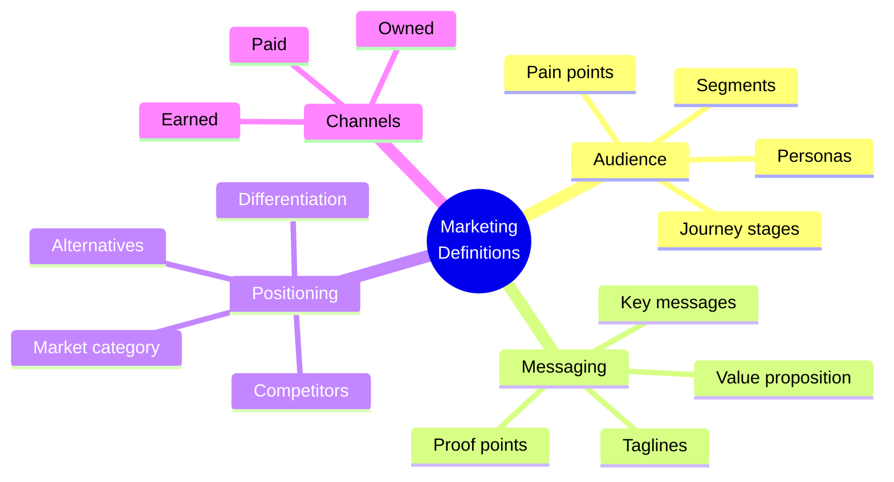
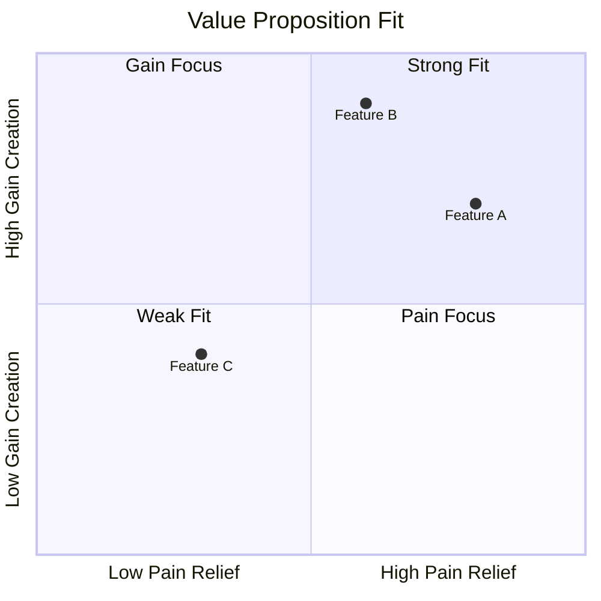
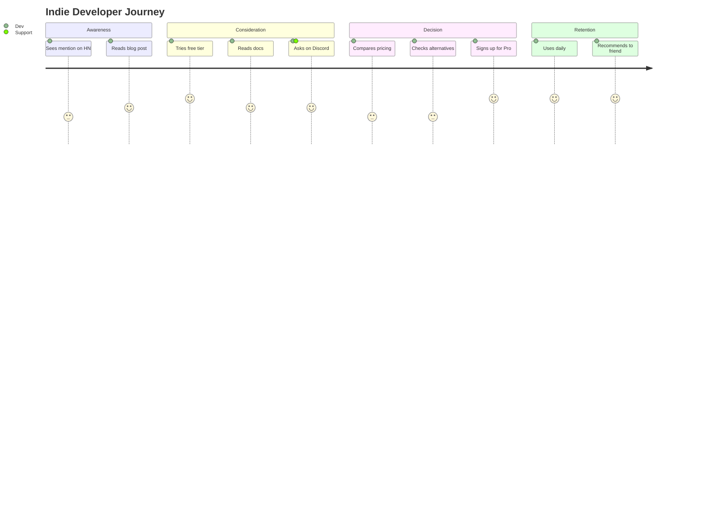

# OGT Docs - Define Marketing

Complete guide for creating marketing definition documents.

## Overview

Marketing definitions establish how you communicate your product's value to the market. They define who you're talking to, what you're saying, and how you're positioned against alternatives.



## When to Use This Skill

Use `ogt-docs-define-marketing` when defining:

- Value proposition and messaging
- Target audience and personas
- Market positioning and differentiation
- Go-to-market strategy
- Content themes and pillars
- Channel strategy

## Folder Structure

```
docs/definitions/marketing/
├── value_proposition/
│   ├── definition.md           # Core value proposition
│   ├── elevator_pitch.md       # 30-second pitch
│   ├── one_liner.md            # One sentence
│   ├── proof_points.md         # Evidence and social proof
│   └── .version
│
├── target_audience/
│   ├── definition.md           # Audience overview
│   ├── segments.md             # Market segments
│   ├── personas/               # Detailed personas
│   │   ├── indie_developer.md
│   │   ├── startup_founder.md
│   │   └── enterprise_buyer.md
│   ├── journey_stages.md       # Awareness → Purchase
│   └── .version
│
├── messaging/
│   ├── definition.md           # Messaging framework
│   ├── key_messages.md         # Core messages by audience
│   ├── taglines.md             # Tagline options
│   ├── boilerplate.md          # Standard descriptions
│   ├── objection_handling.md   # Common objections
│   └── .version
│
├── positioning/
│   ├── definition.md           # Positioning strategy
│   ├── competitive_landscape.md # Competitor analysis
│   ├── differentiation.md      # What makes us different
│   ├── category.md             # Market category definition
│   └── .version
│
├── content_strategy/
│   ├── definition.md           # Content philosophy
│   ├── pillars.md              # Content pillars/themes
│   ├── formats.md              # Content formats
│   ├── calendar.md             # Editorial calendar
│   └── .version
│
└── go_to_market/
    ├── definition.md           # GTM overview
    ├── launch_plan.md          # Launch strategy
    ├── channels.md             # Channel strategy
    ├── metrics.md              # Success metrics
    └── .version
```

---

## Marketing Definition Types

### 1. Value Proposition

Defines why customers should choose your product.

#### Example: value_proposition/

```
value_proposition/
├── definition.md
├── elevator_pitch.md
├── one_liner.md
├── proof_points.md
└── .version
```

#### definition.md

````markdown
# Definition: Value Proposition

## Overview

{Product} helps {target audience} {achieve outcome} by {key capability},
unlike {alternatives} which {limitation}.

## Value Proposition Canvas

### Customer Profile

#### Jobs to Be Done

What customers are trying to accomplish:

1. **Functional**: {task they need to complete}
2. **Social**: {how they want to be perceived}
3. **Emotional**: {how they want to feel}

#### Pains

Frustrations and obstacles:

1. {Pain 1}: Description
2. {Pain 2}: Description
3. {Pain 3}: Description

#### Gains

Desired outcomes and benefits:

1. {Gain 1}: Description
2. {Gain 2}: Description
3. {Gain 3}: Description

### Value Map

#### Products & Services

What we offer:

- {Core product}
- {Key features}
- {Services}

#### Pain Relievers

How we address pains:
| Pain | How We Relieve It |
|------|-------------------|
| {Pain 1} | {Solution} |
| {Pain 2} | {Solution} |

#### Gain Creators

How we create gains:
| Gain | How We Create It |
|------|------------------|
| {Gain 1} | {Feature/Benefit} |
| {Gain 2} | {Feature/Benefit} |

## Fit Assessment


````

## Hierarchy of Value

1. **Primary Value**: {The #1 reason customers buy}
2. **Secondary Value**: {Supporting benefits}
3. **Tertiary Value**: {Nice-to-haves}

## Proof Points

| Claim                 | Evidence                                 |
| --------------------- | ---------------------------------------- |
| "Fastest in category" | Benchmark: X ms vs Y ms industry average |
| "Most reliable"       | 99.9% uptime, Z customer testimonials    |
| "Easiest to use"      | N-minute setup, M% adoption rate         |

````

#### elevator_pitch.md

```markdown
# Elevator Pitch

## 30-Second Pitch

### Version 1: Problem-Solution
"You know how {target audience} struggle with {pain point}?
{Product} solves that by {key capability}.
Unlike {alternative}, we {key differentiator}.
That's why {social proof}."

### Version 2: Before-After
"Before {Product}, {target audience} had to {painful current state}.
Now, with {Product}, they can {desirable future state}.
In fact, {proof point}."

### Version 3: Analogy
"{Product} is like {familiar thing} for {target audience}.
Just as {familiar thing} helps {someone} do {something},
we help {target} achieve {outcome}."

## 10-Second Pitch

"{Product}: {Action verb} {outcome} for {audience}."

Examples:
- "Stripe: Accept payments for internet businesses."
- "Slack: Replace email for team communication."
- "{Product}: {Your version}."

## Pitch by Audience

### For Technical Users
"{Product} is a {technical category} that {technical benefit}.
It integrates with {technologies} and {technical proof point}."

### For Business Users
"{Product} helps your team {business outcome}
by {business capability}. Customers see {business metric improvement}."

### For Executives
"{Product} drives {strategic outcome}
while reducing {cost/risk}.
{Major customer} achieved {impressive result}."
````

---

### 2. Target Audience

Defines who you're marketing to.

#### Example: target_audience/personas/indie_developer.md

````markdown
# Persona: Indie Developer

## Overview

Independent software developers building projects on their own or in very
small teams. Highly technical, resource-constrained, value-conscious.

## Demographics

| Attribute    | Value                              |
| ------------ | ---------------------------------- |
| Role         | Sole developer / Technical founder |
| Company size | 1-5 people                         |
| Industry     | SaaS, games, developer tools       |
| Experience   | 3-10 years                         |
| Age range    | 25-40                              |
| Location     | Global, English-speaking           |

## Psychographics

### Goals

- Build a sustainable indie business
- Ship products quickly
- Maintain creative control
- Minimize operational overhead

### Challenges

- Limited time and budget
- Wearing multiple hats
- Choosing the right tools
- Avoiding vendor lock-in

### Values

- Transparency and honesty
- Quality over quantity
- Community and open source
- Independence and flexibility

## Behavior

### Discovery

- Hacker News, Reddit, Twitter
- Developer blogs and podcasts
- GitHub trending
- Word of mouth

### Evaluation

- Free tier or trial required
- Documentation quality matters
- Community activity and support
- Pricing transparency

### Decision Criteria

1. Does it solve my problem?
2. Can I afford it?
3. Is it reliable?
4. Can I switch away if needed?

## Messaging

### Key Message

"Build faster without the overhead. {Product} gives you {capability}
so you can focus on your product, not your infrastructure."

### Proof Points

- "X indie developers trust {Product}"
- "Set up in Y minutes"
- "Free tier for side projects"

### Objection Handling

| Objection        | Response                                             |
| ---------------- | ---------------------------------------------------- |
| "Too expensive"  | "Free tier covers most indie needs. Pro is ${X}/mo." |
| "Will it scale?" | "{Customer} scaled from 0 to 1M users on {Product}." |
| "Vendor lock-in" | "Export your data anytime. We support {standard}."   |

## Content Preferences

### Formats

- Technical blog posts
- Video tutorials (short, focused)
- Documentation
- Code examples

### Topics

- "How I built X with {Product}"
- Performance optimization
- Cost optimization
- Indie success stories

### Tone

- Casual, peer-to-peer
- Technical but accessible
- Honest about limitations
- No marketing fluff

## Journey Map


````

```

---

### 3. Positioning

Defines your place in the market.

#### Example: positioning/

```

positioning/
├── definition.md
├── competitive_landscape.md
├── differentiation.md
├── category.md
└── .version

````

#### definition.md

```markdown
# Definition: Positioning

## Positioning Statement

For {target audience}
who {need/want},
{Product} is a {category}
that {key benefit}.
Unlike {alternative},
{Product} {key differentiator}.

### Filled In
For **indie developers and small teams**
who **need to ship products fast without infrastructure overhead**,
**{Product}** is a **developer platform**
that **handles the boring stuff so you can focus on building**.
Unlike **traditional cloud providers**,
**{Product}** **just works with zero configuration**.

## Positioning Pillars

### Pillar 1: Simplicity
- Zero configuration
- Sensible defaults
- Works out of the box
- No DevOps required

### Pillar 2: Speed
- Instant deploys
- Edge-first architecture
- Fastest time-to-value
- Minutes, not hours

### Pillar 3: Reliability
- 99.9% uptime SLA
- Automatic scaling
- Built-in redundancy
- Enterprise-grade infrastructure

## Market Category

### Primary Category
{Category name} (e.g., "Developer Platform", "Backend-as-a-Service")

### Adjacent Categories
- {Adjacent 1}
- {Adjacent 2}

### Category We're Creating
{If creating new category}: "{New category name}"
Definition: {What this category means}

## Competitive Position

```mermaid
quadrantChart
    title Market Positioning
    x-axis Simple --> Complex
    y-axis Cheap --> Expensive
    quadrant-1 Enterprise
    quadrant-2 Premium Simple
    quadrant-3 Budget
    quadrant-4 Complex Budget
    Competitor A: [0.8, 0.8]
    Competitor B: [0.3, 0.3]
    Us: [0.2, 0.5]
````

## When to Use What Positioning

| Context             | Lead With                                      |
| ------------------- | ---------------------------------------------- |
| Technical audience  | Pillar 1 (Simplicity) + Pillar 2 (Speed)       |
| Business audience   | Pillar 2 (Speed) + Pillar 3 (Reliability)      |
| Enterprise audience | Pillar 3 (Reliability) + Pillar 1 (Simplicity) |

```

---

## Signal Files for Marketing Definitions

| Signal | Meaning |
|--------|---------|
| `.draft` | In progress |
| `.approved` | Approved by marketing |
| `.approved_by_marketing` | Marketing lead approved |
| `.approved_by_founder` | Founder approved (major positioning) |
| `.tested` | Validated with customers |
| `.version` | Schema version |
| `.last_reviewed` | Last review date |

---

## Quality Checklist

Before requesting review:

- [ ] Target audience clearly defined
- [ ] Value proposition is specific and differentiated
- [ ] Messaging speaks to audience pain points
- [ ] Proof points are verifiable
- [ ] Positioning is distinct from competitors
- [ ] All claims are supportable
- [ ] Tone is appropriate for audience
- [ ] Journey stages covered
```
