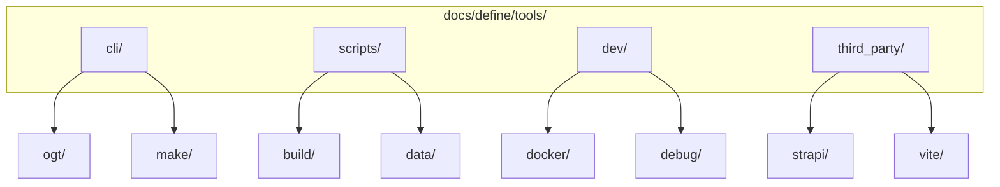

# OGT Docs - Define Tools

Complete guide for documenting project tools, CLIs, and utilities.

## Overview

Tools documentation ensures team members can effectively use CLIs, scripts, and integrations. Each tool is documented with usage examples, configuration options, and common workflows.



## When to Use

- Documenting a new CLI tool
- Adding a development script
- Integrating a third-party tool
- Creating tool usage guides
- Documenting configuration options

## Folder Structure

```
docs/define/tools/
├── cli/                            # Command-line interfaces
│   └── {tool_name}/
│       ├── definition.md           # Tool overview and purpose
│       ├── commands.md             # Command reference
│       ├── examples.md             # Usage examples
│       ├── config.md               # Configuration options
│       ├── .version                # Tool version
│       └── .install                # Installation method
│
├── scripts/                        # Project scripts
│   └── {script_name}/
│       ├── definition.md           # Script purpose
│       ├── usage.md                # How to use
│       └── .location               # Script file path
│
├── dev/                            # Development tools
│   └── {tool_name}/
│       ├── definition.md
│       ├── setup.md                # Setup instructions
│       └── workflow.md             # Common workflows
│
└── third_party/                    # External tools
    └── {tool_name}/
        ├── definition.md
        ├── integration.md          # How it integrates
        ├── config.md               # Our configuration
        └── .version                # Version we use
```

---

## Example: docs/define/tools/cli/ogt/

Documenting an internal CLI tool.

### Folder Structure

```
docs/define/tools/cli/ogt/
├── definition.md
├── commands.md
├── examples.md
├── config.md
├── .version
└── .install
```

### definition.md

````markdown
# Tool: OGT CLI

## Summary

OpenGameTools CLI for managing ORC data collections, running audits, and automating content workflows.

## Purpose

The OGT CLI provides:

- Data collection management (scan, status, signal)
- Content auditing and validation
- Generation pipeline control
- Database operations

## Installation

```bash
# Global install
npm install -g @orc/ogt-cli

# Project install (recommended)
npm install --save-dev @orc/ogt-cli

# Verify installation
ogt --version
```
````

## Quick Start

```bash
# Scan a collection
ogt scan creatures

# Check entry status
ogt status front/data/app-creatures/dragon

# Run audit
ogt audit creatures --check-assets
```

## Architecture

```
ogt
├── scan      # Scan collections for entries
├── status    # Get/set entry status
├── signal    # Manage skill signals
├── audit     # Run content audits
├── check     # Validate files/data
├── generate  # Content generation pipeline
├── db        # Database operations
└── report    # Generate reports
```

## Configuration

See config.md for configuration options.

## Related

- docs/define/tools/scripts/data/ - Data scripts
- docs/rules/code/ - Coding standards

````

### commands.md

```markdown
# OGT CLI Commands

## ogt scan

Scan collections for entries and their status.

### Usage

```bash
ogt scan <collection> [options]
````

### Options

| Option               | Description                      | Default |
| -------------------- | -------------------------------- | ------- |
| `--status <status>`  | Filter by status                 | all     |
| `--missing <signal>` | Find entries missing signal      | -       |
| `--format <format>`  | Output format (table, json, csv) | table   |
| `--limit <n>`        | Limit results                    | -       |

### Examples

```bash
# Scan all creatures
ogt scan creatures

# Find creatures missing portraits
ogt scan creatures --missing portrait

# Get JSON output
ogt scan creatures --format json

# Filter by status
ogt scan creatures --status draft
```

---

## ogt status

Get or set entry status.

### Usage

```bash
# Get status
ogt status <path>

# Set status
ogt status <path> <new_status>
```

### Status Values

- `stub` - Minimal placeholder
- `draft` - Work in progress
- `review` - Ready for review
- `approved` - Reviewed and approved
- `published` - Live in production

### Examples

```bash
# Get status
ogt status front/data/app-creatures/dragon
# Output: draft

# Set status
ogt status front/data/app-creatures/dragon approved
# Output: Status changed: draft -> approved
```

---

## ogt signal

Manage skill processing signals.

### Usage

```bash
# Check signal
ogt signal <path> <signal_name>

# Set signal
ogt signal <path> <signal_name> --set

# Clear signal
ogt signal <path> <signal_name> --clear
```

### Common Signals

| Signal           | Meaning             |
| ---------------- | ------------------- |
| `portrait`       | Has portrait image  |
| `description`    | Has description     |
| `stats`          | Has stat block      |
| `lore`           | Has lore/background |
| `ai_generated`   | Generated by AI     |
| `human_reviewed` | Reviewed by human   |

### Examples

```bash
# Check if entry has portrait
ogt signal front/data/app-creatures/dragon portrait
# Output: portrait: false

# Mark as having portrait
ogt signal front/data/app-creatures/dragon portrait --set

# Clear signal
ogt signal front/data/app-creatures/dragon ai_generated --clear
```

---

## ogt audit

Run content audits on collections.

### Usage

```bash
ogt audit <collection> [options]
```

### Options

| Option           | Description                    |
| ---------------- | ------------------------------ |
| `--check-assets` | Verify asset files exist       |
| `--check-schema` | Validate against schema        |
| `--check-links`  | Verify internal links          |
| `--fix`          | Auto-fix issues where possible |
| `--report`       | Generate audit report          |

### Examples

```bash
# Full audit
ogt audit creatures --check-assets --check-schema

# Generate report
ogt audit creatures --report > audit-report.md

# Auto-fix issues
ogt audit creatures --fix
```

---

## ogt check

Validate files and data.

### Subcommands

```bash
ogt check assets <path> <asset_name>   # Check for missing assets
ogt check slugs <path>                  # Validate slug conventions
ogt check indexed <collection>          # Verify index exports
ogt check data <path>                   # Validate against schema
```

### Examples

```bash
# Check for missing portraits
ogt check assets static/public/creatures portrait.png -r

# Validate slugs
ogt check slugs front/data/app-creatures -r

# Check index exports
ogt check indexed creatures
```

---

## ogt generate

Content generation pipeline.

### Usage

```bash
ogt generate <collection> <entry> [options]
```

### Options

| Option            | Description             |
| ----------------- | ----------------------- |
| `--prompt <type>` | Generate prompt only    |
| `--apply`         | Apply generated content |
| `--model <model>` | AI model to use         |
| `--dry-run`       | Preview without changes |

### Examples

```bash
# Generate description for creature
ogt generate creatures dragon --prompt description

# Apply generated content
ogt generate creatures dragon --apply

# Preview changes
ogt generate creatures dragon --dry-run
```

````

### examples.md

```markdown
# OGT CLI Examples

## Common Workflows

### New Entry Workflow

```bash
# 1. Create entry folder
mkdir -p front/data/app-creatures/phoenix

# 2. Create minimal data.ts
cat > front/data/app-creatures/phoenix/data.ts << 'EOF'
export const phoenix = {
  slug: 'phoenix',
  name: 'Phoenix',
  type: 'creature',
};
EOF

# 3. Set initial status
ogt status front/data/app-creatures/phoenix stub

# 4. Generate content
ogt generate creatures phoenix --prompt description
ogt generate creatures phoenix --apply

# 5. Update status
ogt status front/data/app-creatures/phoenix draft
````

### Audit Before Release

```bash
# 1. Run full audit
ogt audit creatures --check-assets --check-schema --check-links

# 2. Review issues
ogt audit creatures --report | less

# 3. Fix auto-fixable issues
ogt audit creatures --fix

# 4. Verify fixes
ogt audit creatures --check-assets
```

### Find Incomplete Entries

```bash
# Find entries without portraits
ogt scan creatures --missing portrait

# Find entries without descriptions
ogt scan creatures --missing description

# Find stubs that need work
ogt scan creatures --status stub
```

### Batch Status Update

```bash
# Move all draft to review
for entry in $(ogt scan creatures --status draft --format csv | tail -n +2); do
  ogt status "$entry" review
done
```

### Export Report

```bash
# Generate CSV of all entries with status
ogt scan creatures --format csv > creatures-status.csv

# Generate full audit report
ogt audit creatures --report > audit-$(date +%Y%m%d).md
```

````

### config.md

```markdown
# OGT CLI Configuration

## Configuration File

OGT looks for configuration in:
1. `ogt.config.js` in project root
2. `ogt` key in `package.json`
3. Command-line arguments (highest priority)

## Configuration Options

### ogt.config.js

```javascript
module.exports = {
  // Data directories
  dataDir: 'front/data',
  staticDir: 'static/public',

  // Collections
  collections: {
    creatures: {
      dataPath: 'app-creatures',
      staticPath: 'creatures',
      schema: 'schemas/creature.json',
    },
    items: {
      dataPath: 'app-items',
      staticPath: 'items',
      schema: 'schemas/item.json',
    },
  },

  // Asset requirements
  assets: {
    portrait: {
      filename: 'portrait.png',
      required: true,
      dimensions: { width: 512, height: 512 },
    },
    thumbnail: {
      filename: 'thumbnail.png',
      required: false,
      dimensions: { width: 128, height: 128 },
    },
  },

  // Generation settings
  generate: {
    model: 'claude-3-opus',
    temperature: 0.7,
    maxTokens: 2000,
  },

  // Output settings
  output: {
    format: 'table',
    colors: true,
    verbose: false,
  },
};
````

### Environment Variables

| Variable         | Description      | Default         |
| ---------------- | ---------------- | --------------- |
| `OGT_DATA_DIR`   | Data directory   | `front/data`    |
| `OGT_STATIC_DIR` | Static assets    | `static/public` |
| `OGT_MODEL`      | Default AI model | `claude-3-opus` |
| `OGT_VERBOSE`    | Verbose output   | `false`         |

### Command-Line Overrides

```bash
# Override data directory
ogt scan creatures --data-dir ./custom/data

# Override output format
ogt scan creatures --format json

# Enable verbose mode
ogt scan creatures -v
```

```

### .version

```

1.2.0

```

### .install

```

npm install -g @orc/ogt-cli

```

---

## Example: docs/define/tools/scripts/build/

Documenting build scripts.

### Folder Structure

```

docs/define/tools/scripts/build/
├── definition.md
├── usage.md
└── .location

````

### definition.md

```markdown
# Script: Build Scripts

## Summary

Collection of build scripts for frontend and backend builds.

## Scripts

| Script | Location | Purpose |
|--------|----------|---------|
| `build:front` | package.json | Build frontend |
| `build:back` | package.json | Build backend |
| `build:all` | package.json | Build everything |
| `build:docker` | Makefile | Build Docker images |

## Quick Reference

```bash
# Frontend build
yarn build:front

# Backend build
yarn build:back

# Full build
yarn build:all

# Docker build
make build
````

````

### usage.md

```markdown
# Build Scripts Usage

## Frontend Build

### Development Build

```bash
yarn build:front
````

Outputs to `front/dist/`.

### Production Build

```bash
NODE_ENV=production yarn build:front
```

Enables minification and tree-shaking.

### Build Options

```bash
# Analyze bundle size
yarn build:front --analyze

# Generate sourcemaps
yarn build:front --sourcemap

# Specify output directory
yarn build:front --outDir ./custom-dist
```

## Backend Build

### Standard Build

```bash
yarn build:back
```

Builds Strapi admin panel.

### Production Build

```bash
NODE_ENV=production yarn build:back
```

## Docker Build

### Build All Images

```bash
make build
```

### Build Specific Service

```bash
docker-compose build orc-front
docker-compose build orc-back
```

### Build with No Cache

```bash
make build-no-cache
```

## CI/CD

Build is triggered automatically:

- On push to main: Full build
- On PR: Frontend only
- On release tag: Production build + deploy

```

### .location

```

package.json scripts
Makefile

```

---

## Example: docs/define/tools/dev/docker/

Documenting development tools.

### Folder Structure

```

docs/define/tools/dev/docker/
├── definition.md
├── setup.md
└── workflow.md

````

### definition.md

```markdown
# Tool: Docker Development

## Summary

Docker Compose setup for local development of all ORC services.

## Services

| Service | Port | Image |
|---------|------|-------|
| orc-front | 23001 | node:20-alpine |
| orc-back | 23050 | node:20-alpine |
| orc-back-postgres | 23030 | postgres:16 |
| orc-n8n | 23020 | n8nio/n8n |
| orc-static | 23010 | nginx:alpine |

## Quick Start

```bash
# Start all services
docker-compose up -d

# View logs
docker-compose logs -f

# Stop services
docker-compose down
````

## Files

- `docker-compose.yml` - Service definitions
- `.env` - Environment variables
- `Makefile` - Common commands

````

### setup.md

```markdown
# Docker Setup

## Prerequisites

- Docker Engine 24+
- Docker Compose 2.0+
- 8GB RAM minimum

## Initial Setup

### 1. Clone and Configure

```bash
# Clone repository
git clone https://github.com/org/orc.git
cd orc

# Copy environment template
cp .env.example .env

# Edit .env with your values
vim .env
````

### 2. Build Images

```bash
# Build all images
docker-compose build

# Or use make
make build
```

### 3. Start Services

```bash
# Start in background
docker-compose up -d

# Verify services
docker-compose ps
```

### 4. Initialize Database

```bash
# Run migrations
docker-compose exec orc-back yarn strapi db:migrate

# Seed data (optional)
docker-compose exec orc-back yarn seed
```

### 5. Access Services

- Frontend: http://localhost:23001
- Backend: http://localhost:23050/admin
- N8N: http://localhost:23020

## Troubleshooting

### Port Conflicts

```bash
# Check what's using a port
lsof -i :23001

# Change port in .env
PORT_FRONT=23101
```

### Container Won't Start

```bash
# View container logs
docker-compose logs orc-back

# Rebuild from scratch
docker-compose down -v
docker-compose build --no-cache
docker-compose up -d
```

### Database Connection Issues

```bash
# Verify postgres is running
docker-compose ps orc-back-postgres

# Check connection
docker-compose exec orc-back-postgres psql -U postgres
```

````

### workflow.md

```markdown
# Docker Workflows

## Daily Development

### Start Day

```bash
# Start services
docker-compose up -d

# Verify all running
docker-compose ps

# Tail logs
docker-compose logs -f orc-front orc-back
````

### During Development

```bash
# Restart after code change (hot reload usually works)
docker-compose restart orc-front

# View specific service logs
docker-compose logs -f orc-back --tail 100

# Run command in container
docker-compose exec orc-front yarn test
```

### End Day

```bash
# Stop services
docker-compose stop

# Or remove containers (preserves data)
docker-compose down
```

## Common Tasks

### Rebuild After Dependency Change

```bash
# Rebuild specific service
docker-compose build orc-front
docker-compose up -d orc-front
```

### Reset Database

```bash
# Stop and remove volumes
docker-compose down -v

# Start fresh
docker-compose up -d

# Re-seed
docker-compose exec orc-back yarn seed
```

### Run Tests

```bash
# Frontend tests
docker-compose exec orc-front yarn test

# Backend tests
docker-compose exec orc-back yarn test
```

### Debug Container

```bash
# Shell into container
docker-compose exec orc-front sh

# View container details
docker-compose inspect orc-front
```

## Make Commands

| Command         | Description                   |
| --------------- | ----------------------------- |
| `make up`       | Start all services            |
| `make down`     | Stop all services             |
| `make logs`     | Tail all logs                 |
| `make recreate` | Force recreate containers     |
| `make build`    | Build all images              |
| `make clean`    | Remove containers and volumes |

````

---

## Creating New Tool Documentation

```mermaid
flowchart TD
    A[New Tool] --> B{Type?}

    B -->|CLI| C[cli/{name}/]
    B -->|Script| D[scripts/{name}/]
    B -->|Dev Tool| E[dev/{name}/]
    B -->|External| F[third_party/{name}/]

    C --> G[Create Folder]
    D --> G
    E --> G
    F --> G

    G --> H[Write definition.md]
    H --> I{Has Commands?}

    I -->|Yes| J[Add commands.md]
    I -->|No| K[Add usage.md]

    J --> L[Add examples.md]
    K --> L

    L --> M{Configurable?}
    M -->|Yes| N[Add config.md]
    M -->|No| O[Add signals]
    N --> O

    O --> P[.version, .install, etc.]
````

---

## Signal Files Reference

| Signal         | Type    | Content         | Purpose              |
| -------------- | ------- | --------------- | -------------------- |
| `.version`     | Content | Version string  | Track tool version   |
| `.install`     | Content | Install command | How to install       |
| `.location`    | Content | File path       | Where script lives   |
| `.deprecated`  | Empty   | -               | Tool is deprecated   |
| `.replaced_by` | Content | New tool path   | Point to replacement |

---

## Documentation Quality Checklist

Before finalizing tool documentation:

- [ ] Purpose is clearly explained
- [ ] Installation/setup documented
- [ ] All commands documented
- [ ] Options/flags listed
- [ ] Examples for common use cases
- [ ] Configuration options explained
- [ ] Troubleshooting section included
- [ ] Version documented
- [ ] Related tools cross-referenced
