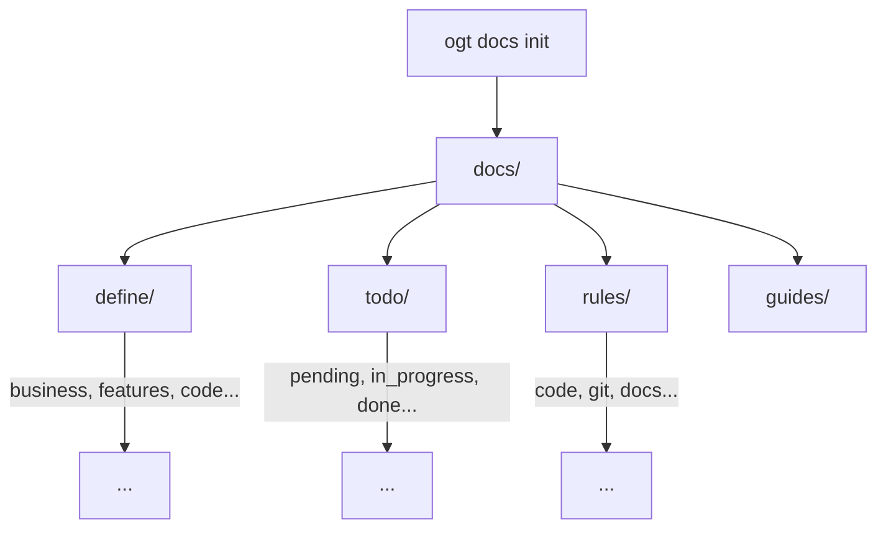

# OGT Docs - Init

Initialize the docs-first folder structure for a new or existing project.

## Overview

This skill creates the complete `docs/` folder hierarchy for a docs-first project. It sets up folders for definitions, tasks, rules, and all supporting structure.



## When to Use

- Setting up a brand new project
- Adding docs-first structure to existing project
- Migrating from another documentation system
- Onboarding team to docs-first workflow

## Complete Folder Structure

```
docs/
├── define/                         # Definitions (WHAT)
│   ├── business/                   # Business model
│   │   ├── pricing/
│   │   ├── users/
│   │   ├── revenue/
│   │   └── positioning/
│   │
│   ├── features/                   # Product features
│   │   └── {feature_name}/
│   │       ├── feature.md
│   │       ├── mvp.md
│   │       ├── phase_0.md
│   │       └── ...
│   │
│   ├── code/                       # Technical definitions
│   │   ├── architecture/
│   │   ├── services/
│   │   ├── data_models/
│   │   └── api/
│   │
│   ├── marketing/                  # Marketing definitions
│   │   ├── value_proposition/
│   │   ├── personas/
│   │   ├── messaging/
│   │   └── positioning/
│   │
│   ├── branding/                   # Brand identity
│   │   ├── visual_identity/
│   │   ├── voice_tone/
│   │   └── guidelines/
│   │
│   └── tools/                      # Tool documentation
│       ├── cli/
│       ├── scripts/
│       └── third_party/
│
├── todo/                           # Tasks (DOING)
│   ├── pending/                    # Not started
│   ├── in_progress/                # Being worked on
│   ├── review/                     # Awaiting review
│   ├── blocked/                    # Cannot proceed
│   ├── done/                       # Completed
│   ├── rejected/                   # Declined
│   ├── implemented/                # Deployed
│   └── audit_log/                  # Audit history
│
├── rules/                          # Standards (HOW)
│   ├── code/                       # Coding standards
│   │   ├── general/
│   │   ├── typescript/
│   │   ├── naming/
│   │   ├── front/
│   │   └── back/
│   │
│   ├── git/                        # Git workflow
│   │   ├── commits/
│   │   ├── branches/
│   │   ├── pull_requests/
│   │   └── reviews/
│   │
│   ├── docs/                       # Documentation standards
│   │   ├── structure/
│   │   └── formatting/
│   │
│   └── style/                      # Style guides
│       ├── ui/
│       └── api/
│
├── guides/                         # How-to guides
│   ├── getting_started/
│   ├── development/
│   └── deployment/
│
├── agents/                         # AI agent definitions
│   ├── _shared/                    # Shared context
│   │   ├── CONTEXT.md
│   │   ├── SKILLS.md
│   │   └── DOCS_STRUCTURE.md
│   │
│   └── {agent_name}/
│       └── AGENT.md
│
├── skills/                         # AI skills
│   └── {skill_name}/
│       └── SKILL.md
│
└── _templates/                     # Templates for new docs
    ├── task.md
    ├── feature.md
    ├── definition.md
    ├── rule.md
    └── tool.md
```

---

## Initialization Steps

### Step 1: Create Root Structure

```bash
mkdir -p docs/{define,todo,rules,guides,agents,skills,_templates}
```

### Step 2: Create Define Subfolders

```bash
# Business
mkdir -p docs/define/business/{pricing,users,revenue,positioning}

# Features
mkdir -p docs/define/features

# Code
mkdir -p docs/define/code/{architecture,services,data_models,api}

# Marketing
mkdir -p docs/define/marketing/{value_proposition,personas,messaging,positioning}

# Branding
mkdir -p docs/define/branding/{visual_identity,voice_tone,guidelines}

# Tools
mkdir -p docs/define/tools/{cli,scripts,dev,third_party}
```

### Step 3: Create Todo Subfolders

```bash
mkdir -p docs/todo/{pending,in_progress,review,blocked,done,rejected,implemented,audit_log}
```

### Step 4: Create Rules Subfolders

```bash
# Code rules
mkdir -p docs/rules/code/{general,typescript,naming,errors,async,front,back}

# Git rules
mkdir -p docs/rules/git/{commits,branches,pull_requests,reviews,merging,tags}

# Docs rules
mkdir -p docs/rules/docs/{structure,formatting}

# Style rules
mkdir -p docs/rules/style/{ui,api}
```

### Step 5: Create Guides Subfolders

```bash
mkdir -p docs/guides/{getting_started,development,deployment}
```

### Step 6: Create Agent Structure

```bash
mkdir -p docs/agents/_shared
```

### Step 7: Create Templates

See Templates section below.

---

## Templates

### docs/\_templates/task.md

```markdown
# Task: {Title}

## Summary

One paragraph describing what needs to be done and why.

## Objectives

- Specific objective 1
- Specific objective 2
- Specific objective 3

## Acceptance Criteria

- [ ] Verifiable criterion 1
- [ ] Verifiable criterion 2
- [ ] Verifiable criterion 3
- [ ] TypeScript compiles clean (if applicable)

## Dependencies

- {dependency} or "None"

## Estimated Effort

{Tiny|Small|Medium|Large|XLarge} ({time estimate})

## References

- Relevant link or file path
```

### docs/\_templates/feature.md

```markdown
# Feature: {Name}

## Summary

One paragraph explaining the feature and its value.

## User Stories

As a {user type}, I want to {action}, so that {benefit}.

## Scope

### In Scope

- Item 1
- Item 2

### Out of Scope

- Item 1
- Item 2

## Success Metrics

- Metric 1
- Metric 2

## Phases

See mvp.md and phase files for implementation details.
```

### docs/\_templates/definition.md

```markdown
# {Name}

## Summary

One paragraph explaining what this is.

## Details

Detailed explanation of the concept, entity, or component.

## Structure
```

{structure diagram or tree}

```

## Examples

### Example 1

{description and example}

### Example 2

{description and example}

## Related

- Link to related definition
- Link to related rule
```

### docs/\_templates/rule.md

```markdown
# Rule: {Name}

## Summary

One sentence stating the rule clearly.

## Rationale

Why this rule exists.

## The Rule

Clear statement using RFC 2119 keywords (MUST, SHOULD, MAY).

## Examples

### Correct

{correct example}

### Incorrect

{incorrect example with explanation}

## Exceptions

Documented exceptions.

## Enforcement

How the rule is enforced.
```

### docs/\_templates/tool.md

````markdown
# Tool: {Name}

## Summary

Brief description of the tool.

## Purpose

What problem it solves.

## Installation

```bash
{installation command}
```
````

## Quick Start

```bash
{basic usage}
```

## Commands

| Command | Description   |
| ------- | ------------- |
| {cmd1}  | {description} |
| {cmd2}  | {description} |

## Configuration

{configuration options}

## Examples

{usage examples}

````

---

## Shared Agent Context

### docs/agents/_shared/CONTEXT.md

```markdown
# Project Context

## Project Name

{Project Name}

## Description

{One paragraph description}

## Tech Stack

- Frontend: {stack}
- Backend: {stack}
- Database: {database}
- Infrastructure: {infra}

## Repository

{repo URL}

## Key Directories

````

{project}/
├── {dir1}/ # {purpose}
├── {dir2}/ # {purpose}
└── docs/ # Documentation (docs-first)

```

## Current Focus

{What the team is currently working on}

## Key Decisions

1. {Decision 1} - {rationale}
2. {Decision 2} - {rationale}
```

### docs/agents/\_shared/SKILLS.md

```markdown
# Available Skills

Skills available to all agents in this project.

## Documentation Skills

| Skill                | Trigger         | Purpose            |
| -------------------- | --------------- | ------------------ |
| ogt-docs-create-task | "create a task" | Create new task    |
| ogt-docs-define      | "define X"      | Create definitions |
| ogt-docs-rules       | "create rule"   | Create rules       |
| ogt-docs-audit-task  | "audit tasks"   | Verify tasks       |

## Code Skills

{project-specific code skills}

## Tool Skills

{project-specific tool skills}
```

### docs/agents/\_shared/DOCS_STRUCTURE.md

```markdown
# Documentation Structure

## Folder Convention

Every documentable item is a **folder**, not a file.
```

docs/{section}/{category}/{item_name}/
├── {type}.md # Primary document (task.md, feature.md, etc.)
├── {supporting}.md # Supporting documents
└── .{signal} # Signal files

```

## Signal Files

| Signal | Type | Purpose |
|--------|------|---------|
| `.version` | Content | Schema version |
| `.priority` | Content | Priority level |
| `.blocked` | Empty | Item is blocked |
| `.verified` | Empty | Item verified |

## Workflow

Tasks move between folders:
```

pending/ -> in_progress/ -> review/ -> done/ -> implemented/

```

Features evolve through phases:
```

mvp.md -> phase_0.md -> phase_1.md -> ...

```

```

---

## Init Script

Complete initialization script:

```bash
#!/bin/bash
# init-docs.sh - Initialize docs-first structure

set -e

echo "Initializing docs-first structure..."

# Create main directories
mkdir -p docs/{define,todo,rules,guides,agents,skills,_templates}

# Define subdirectories
mkdir -p docs/define/business/{pricing,users,revenue,positioning}
mkdir -p docs/define/features
mkdir -p docs/define/code/{architecture,services,data_models,api}
mkdir -p docs/define/marketing/{value_proposition,personas,messaging,positioning}
mkdir -p docs/define/branding/{visual_identity,voice_tone,guidelines}
mkdir -p docs/define/tools/{cli,scripts,dev,third_party}

# Todo subdirectories
mkdir -p docs/todo/{pending,in_progress,review,blocked,done,rejected,implemented,audit_log}

# Rules subdirectories
mkdir -p docs/rules/code/{general,typescript,naming,errors,async,front,back}
mkdir -p docs/rules/git/{commits,branches,pull_requests,reviews,merging,tags}
mkdir -p docs/rules/docs/{structure,formatting}
mkdir -p docs/rules/style/{ui,api}

# Guides subdirectories
mkdir -p docs/guides/{getting_started,development,deployment}

# Agent structure
mkdir -p docs/agents/_shared

# Create template files
cat > docs/_templates/task.md << 'EOF'
# Task: {Title}

## Summary

One paragraph describing what needs to be done and why.

## Objectives

- Specific objective 1
- Specific objective 2

## Acceptance Criteria

- [ ] Verifiable criterion 1
- [ ] Verifiable criterion 2
- [ ] TypeScript compiles clean

## Dependencies

None

## Estimated Effort

Medium (2-4 hours)
EOF

cat > docs/_templates/feature.md << 'EOF'
# Feature: {Name}

## Summary

One paragraph explaining the feature.

## User Stories

As a user, I want to {action}, so that {benefit}.

## Scope

### In Scope

- Item 1

### Out of Scope

- Item 1

## Success Metrics

- Metric 1
EOF

cat > docs/_templates/definition.md << 'EOF'
# {Name}

## Summary

One paragraph explaining what this is.

## Details

Detailed explanation.

## Examples

Example 1

## Related

- Related link
EOF

cat > docs/_templates/rule.md << 'EOF'
# Rule: {Name}

## Summary

One sentence stating the rule.

## Rationale

Why this rule exists.

## The Rule

MUST/SHOULD/MAY statement.

## Examples

### Correct

Example

### Incorrect

Example

## Enforcement

How enforced.
EOF

# Create shared agent context
cat > docs/agents/_shared/CONTEXT.md << 'EOF'
# Project Context

## Project Name

{Project Name}

## Description

{Description}

## Tech Stack

- Frontend:
- Backend:
- Database:

## Key Directories

```

project/
├── src/
└── docs/

```
EOF

cat > docs/agents/_shared/DOCS_STRUCTURE.md << 'EOF'
# Documentation Structure

Every documentable item is a folder, not a file.

## Signal Files

| Signal | Purpose |
|--------|---------|
| `.version` | Schema version |
| `.priority` | Priority level |
| `.verified` | Item verified |
EOF

echo "Done! Structure created in docs/"
echo ""
echo "Next steps:"
echo "1. Edit docs/agents/_shared/CONTEXT.md with project info"
echo "2. Create initial feature definitions in docs/define/features/"
echo "3. Add first tasks to docs/todo/pending/"
```

---

## Verification

After initialization, verify the structure:

```bash
# Count directories created
find docs -type d | wc -l
# Expected: ~60 directories

# Check key directories exist
test -d docs/define/features && echo "features: OK"
test -d docs/todo/pending && echo "pending: OK"
test -d docs/rules/code && echo "code rules: OK"
test -d docs/_templates && echo "templates: OK"

# Check templates exist
test -f docs/_templates/task.md && echo "task template: OK"
test -f docs/_templates/feature.md && echo "feature template: OK"
```

---

## Post-Init Steps

### 1. Configure Project Context

Edit `docs/agents/_shared/CONTEXT.md`:

```bash
vim docs/agents/_shared/CONTEXT.md
```

Fill in:

- Project name
- Description
- Tech stack
- Key directories

### 2. Create First Feature

```bash
mkdir -p docs/define/features/user_auth
cp docs/_templates/feature.md docs/define/features/user_auth/feature.md
vim docs/define/features/user_auth/feature.md
```

### 3. Create First Task

```bash
mkdir -p docs/todo/pending/setup_project
cp docs/_templates/task.md docs/todo/pending/setup_project/task.md
vim docs/todo/pending/setup_project/task.md
```

### 4. Add Essential Rules

Start with commit message format:

```bash
mkdir -p docs/rules/git/commits
cp docs/_templates/rule.md docs/rules/git/commits/rule.md
vim docs/rules/git/commits/rule.md
```

---

## Customization

### Minimal Init

For smaller projects, use minimal structure:

```bash
mkdir -p docs/{define/features,todo/{pending,done},rules/code,_templates}
```

### Extended Init

For larger projects, add:

```bash
# Multiple environments
mkdir -p docs/define/environments/{dev,staging,prod}

# Multiple teams
mkdir -p docs/todo/{frontend,backend,devops}

# Detailed rules
mkdir -p docs/rules/code/{react,node,database}
```

---

## Signal Files Reference

| Signal         | Created During | Content             |
| -------------- | -------------- | ------------------- |
| `.version`     | First document | `{"schema": "1.0"}` |
| `.initialized` | Init           | Timestamp           |
| `.last_audit`  | Audit          | Timestamp           |

---

## Init Checklist

- [ ] All main directories created
- [ ] Define subdirectories created
- [ ] Todo workflow directories created
- [ ] Rules categories created
- [ ] Templates created
- [ ] Shared agent context created
- [ ] CONTEXT.md filled in
- [ ] First feature defined
- [ ] First task created
- [ ] Essential rules documented
