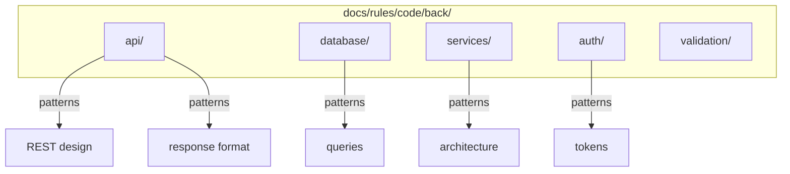

# OGT Docs - Rules Code Back

Backend-specific coding standards for APIs, databases, and services.

## Overview

Backend rules establish consistent patterns for API design, database operations, service architecture, and server-side logic.



## When to Use

- Creating API design standards
- Defining database patterns
- Establishing service architecture
- Writing authentication rules
- Setting validation patterns

## Folder Structure

```
docs/rules/code/back/
├── api/                            # API design
│   ├── rest_design/
│   ├── response_format/
│   ├── versioning/
│   └── error_responses/
│
├── database/                       # Database patterns
│   ├── queries/
│   ├── migrations/
│   ├── naming/
│   └── transactions/
│
├── services/                       # Service architecture
│   ├── structure/
│   ├── dependencies/
│   └── error_handling/
│
├── auth/                           # Authentication
│   ├── tokens/
│   ├── sessions/
│   └── permissions/
│
└── validation/                     # Input validation
    ├── request_validation/
    └── sanitization/
```

---

## Example: docs/rules/code/back/api/rest_design/

### rule.md

```markdown
# Rule: RESTful API Design

## Summary

APIs MUST follow RESTful conventions for resource naming, HTTP methods, and status codes.

## The Rules

### 1. Resource Naming

**MUST** use plural nouns for collections.
```

GET /api/users # Collection
GET /api/users/123 # Single resource
POST /api/users # Create

````

### 2. HTTP Methods

| Method | Use Case | Idempotent |
|--------|----------|------------|
| GET | Retrieve | Yes |
| POST | Create | No |
| PUT | Replace | Yes |
| PATCH | Update | Yes |
| DELETE | Remove | Yes |

### 3. Status Codes

| Code | Use When |
|------|----------|
| 200 | Successful GET/PUT/PATCH |
| 201 | Successful POST |
| 204 | Successful DELETE |
| 400 | Invalid input |
| 401 | Not authenticated |
| 403 | Not authorized |
| 404 | Not found |
| 422 | Validation failed |

## Examples

### Correct

```typescript
router.get('/users', async (ctx) => {
  ctx.status = 200;
  ctx.body = { data: users };
});

router.post('/users', async (ctx) => {
  const user = await userService.create(ctx.request.body);
  ctx.status = 201;
  ctx.body = { data: user };
});
````

### Incorrect

```typescript
// BAD - verbs in URL
router.post('/api/createUser', ...);

// BAD - wrong status
router.post('/users', async (ctx) => {
  ctx.status = 200;  // Should be 201
});
```

````

---

## Example: docs/rules/code/back/database/queries/

### rule.md

```markdown
# Rule: Database Queries

## Summary

Database queries MUST be parameterized, efficient, and properly scoped.

## The Rules

### 1. Always Parameterize

```typescript
// CORRECT
await db.query('SELECT * FROM users WHERE id = $1', [userId]);

// FORBIDDEN - SQL injection
await db.query(`SELECT * FROM users WHERE id = ${userId}`);
````

### 2. Select Only Needed Columns

```typescript
// CORRECT
await db.query("SELECT id, name FROM users WHERE id = $1", [id]);

// AVOID
await db.query("SELECT * FROM users WHERE id = $1", [id]);
```

### 3. Always Limit Results

```typescript
// CORRECT
await db.query("SELECT * FROM posts LIMIT $1 OFFSET $2", [limit, offset]);
```

### 4. Avoid N+1 Queries

```typescript
// BAD - N+1
for (const user of users) {
  user.posts = await db.query("SELECT * FROM posts WHERE user_id = $1", [
    user.id,
  ]);
}

// GOOD - batch
const posts = await db.query("SELECT * FROM posts WHERE user_id = ANY($1)", [
  userIds,
]);
```

### 5. Use Transactions

```typescript
await db.transaction(async (trx) => {
  await trx.query("UPDATE accounts SET balance = balance - $1 WHERE id = $2", [
    amount,
    fromId,
  ]);
  await trx.query("UPDATE accounts SET balance = balance + $1 WHERE id = $2", [
    amount,
    toId,
  ]);
});
```

````

---

## Example: docs/rules/code/back/services/structure/

### rule.md

```markdown
# Rule: Service Structure

## Summary

Services MUST follow consistent structure with clear separation of concerns.

## The Rules

### 1. Single Responsibility

```typescript
// CORRECT - focused services
class UserService { /* user operations */ }
class AuthService { /* authentication */ }
class EmailService { /* email sending */ }
````

### 2. Dependency Injection

```typescript
// CORRECT
class UserService {
  constructor(
    private db: Database,
    private emailService: EmailService,
  ) {}
}

// INCORRECT - hard to test
class UserService {
  private db = new Database();
}
```

### 3. Domain-Specific Errors

```typescript
// CORRECT
class UserNotFoundError extends Error {
  constructor(public userId: string) {
    super(`User not found: ${userId}`);
  }
}

// INCORRECT
throw new Error("Not found");
```

### 4. Method Naming

| Operation    | Pattern    |
| ------------ | ---------- |
| Get single   | `findById` |
| Get multiple | `findAll`  |
| Create       | `create`   |
| Update       | `update`   |
| Delete       | `delete`   |

````

---

## Example: docs/rules/code/back/auth/tokens/

### rule.md

```markdown
# Rule: Authentication Tokens

## Summary

Tokens MUST be securely generated, stored, and validated.

## The Rules

### 1. Secure Generation

```typescript
// CORRECT
import { randomBytes } from 'crypto';
const token = randomBytes(32).toString('hex');

// INCORRECT - predictable
const token = Date.now().toString();
````

### 2. Token Expiration

| Token Type     | Max Lifetime  |
| -------------- | ------------- |
| Access Token   | 15-60 minutes |
| Refresh Token  | 7-30 days     |
| Password Reset | 1 hour        |

### 3. Secure Storage

| Context | Storage         |
| ------- | --------------- |
| Browser | httpOnly cookie |
| Mobile  | Secure storage  |
| Server  | Hashed in DB    |

### 4. Full Validation

```typescript
async function validateToken(token: string): Promise<User> {
  const payload = jwt.verify(token, secret);
  const user = await userService.findById(payload.userId);
  if (!user || !user.isActive) throw new InvalidTokenError();
  return user;
}
```

### 5. Revocation

```typescript
async function logout(userId: string, refreshToken: string) {
  await db.refreshTokens.delete({ where: { token: hashToken(refreshToken) } });
}
```

````

---

## Creating Backend Rules

```mermaid
flowchart TD
    A[Identify Pattern] --> B{Category}

    B -->|API| C[api/]
    B -->|Database| D[database/]
    B -->|Services| E[services/]
    B -->|Auth| F[auth/]

    C --> G[Create Rule Folder]
    D --> G
    E --> G
    F --> G

    G --> H[Write rule.md]
    H --> I[Add examples.md]
    I --> J[Security review if auth/db]
````

---

## Signal Files Reference

| Signal             | Content | Purpose              |
| ------------------ | ------- | -------------------- |
| `.version`         | JSON    | Schema version       |
| `.enforced_by`     | List    | Tools that enforce   |
| `.security_review` | Date    | Last security review |

---

## Backend Rule Checklist

- [ ] Rule is backend/server specific
- [ ] Security implications addressed
- [ ] Performance considerations noted
- [ ] Database patterns follow best practices
- [ ] Error handling included
- [ ] Examples use TypeScript
