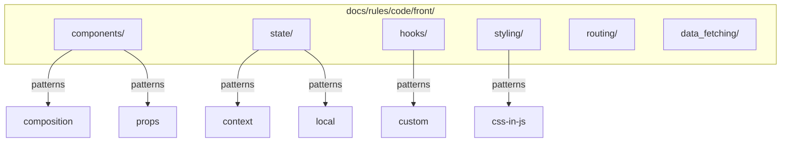

# OGT Docs - Rules Code Front

Frontend-specific coding standards for React/TypeScript applications.

## Overview

Frontend rules establish consistent patterns for React components, state management, styling, and client-side architecture.



## When to Use

- Creating React component standards
- Defining state management patterns
- Establishing styling conventions
- Writing custom hook guidelines
- Setting data fetching patterns
- Defining routing conventions

## Folder Structure

```
docs/rules/code/front/
├── components/                     # Component patterns
│   ├── composition/
│   │   ├── rule.md
│   │   └── examples.md
│   ├── props/
│   │   ├── rule.md
│   │   └── examples.md
│   ├── naming/
│   │   ├── rule.md
│   │   └── examples.md
│   └── file_structure/
│       ├── rule.md
│       └── examples.md
│
├── state/                          # State management
│   ├── local_state/
│   │   ├── rule.md
│   │   └── examples.md
│   ├── context/
│   │   ├── rule.md
│   │   └── examples.md
│   └── derived_state/
│       ├── rule.md
│       └── examples.md
│
├── hooks/                          # Custom hooks
│   ├── naming/
│   │   ├── rule.md
│   │   └── examples.md
│   ├── dependencies/
│   │   ├── rule.md
│   │   └── examples.md
│   └── patterns/
│       ├── rule.md
│       └── examples.md
│
├── styling/                        # CSS/Styling
│   ├── approach/
│   │   ├── rule.md
│   │   └── examples.md
│   ├── naming/
│   │   ├── rule.md
│   │   └── examples.md
│   └── responsive/
│       ├── rule.md
│       └── examples.md
│
├── data_fetching/                  # Data fetching
│   ├── patterns/
│   │   ├── rule.md
│   │   └── examples.md
│   └── error_handling/
│       ├── rule.md
│       └── examples.md
│
└── routing/                        # Routing
    ├── structure/
    │   ├── rule.md
    │   └── examples.md
    └── navigation/
        ├── rule.md
        └── examples.md
```

---

## Example: docs/rules/code/front/components/composition/

Component composition patterns.

### rule.md

````markdown
# Rule: Component Composition

## Summary

Components MUST use composition over prop drilling for flexible, reusable designs.

## Rationale

Composition patterns:

- Reduce prop drilling
- Increase reusability
- Improve testability
- Enable flexible layouts

## The Rules

### 1. Prefer Children Over Props

**SHOULD** pass content via children rather than render props.

```tsx
// PREFERRED
<Card>
  <CardHeader>Title</CardHeader>
  <CardBody>Content</CardBody>
</Card>

// AVOID
<Card
  header={<span>Title</span>}
  body={<span>Content</span>}
/>
```
````

### 2. Use Compound Components

**SHOULD** use compound component pattern for related components.

```tsx
// CORRECT - compound components
<Select>
  <Select.Option value="a">Option A</Select.Option>
  <Select.Option value="b">Option B</Select.Option>
</Select>

// AVOID - array of objects
<Select options={[
  { value: 'a', label: 'Option A' },
  { value: 'b', label: 'Option B' },
]} />
```

### 3. Avoid Prop Drilling

**MUST NOT** pass props more than 2 levels deep. Use context or composition.

```tsx
// BAD - prop drilling
<App user={user}>
  <Layout user={user}>
    <Header user={user}>
      <UserMenu user={user} />  // 4 levels!
    </Header>
  </Layout>
</App>

// GOOD - context
<UserProvider user={user}>
  <App>
    <Layout>
      <Header>
        <UserMenu />  // Uses useUser()
      </Header>
    </Layout>
  </App>
</UserProvider>
```

### 4. Single Responsibility

Each component **MUST** have one clear purpose.

- Display components: render UI
- Container components: manage state/data
- Layout components: arrange children

## Examples

### Correct: Flexible Card Component

```tsx
// Compound component pattern
const Card = ({ children, className }: CardProps) => (
  <div className={cn("card", className)}>{children}</div>
);

Card.Header = ({ children }: { children: ReactNode }) => (
  <div className="card-header">{children}</div>
);

Card.Body = ({ children }: { children: ReactNode }) => (
  <div className="card-body">{children}</div>
);

Card.Footer = ({ children }: { children: ReactNode }) => (
  <div className="card-footer">{children}</div>
);

// Usage - flexible composition
<Card>
  <Card.Header>
    <h2>Title</h2>
    <IconButton icon="close" />
  </Card.Header>
  <Card.Body>
    <p>Any content here</p>
  </Card.Body>
</Card>;
```

### Incorrect: Inflexible Props-Based

```tsx
// BAD - limited flexibility
interface CardProps {
  title: string;
  subtitle?: string;
  body: string;
  footer?: string;
  showCloseButton?: boolean;
  onClose?: () => void;
  headerIcon?: ReactNode;
  // Props multiply as requirements grow...
}

const Card = ({ title, subtitle, body, ... }: CardProps) => (
  // Complex conditional rendering
);
```

## Enforcement

- Code review checklist
- ESLint custom rules for prop drilling detection

````

---

## Example: docs/rules/code/front/state/local_state/

Local state management rules.

### rule.md

```markdown
# Rule: Local State Management

## Summary

Component state MUST be kept as local as possible and lifted only when necessary.

## Rationale

Local state:
- Improves performance (fewer re-renders)
- Reduces complexity
- Makes components self-contained
- Easier to test

## The Rules

### 1. Start Local

**MUST** start with local state and lift only when needed.

```tsx
// START HERE - local state
const [count, setCount] = useState(0);

// LIFT when siblings need it
// LIFT when parent needs it
// LIFT when distant components need it
````

### 2. Colocation

**MUST** keep state close to where it's used.

```tsx
// CORRECT - state in component that uses it
function SearchInput() {
  const [query, setQuery] = useState("");
  return <input value={query} onChange={(e) => setQuery(e.target.value)} />;
}

// INCORRECT - state lifted unnecessarily
function App() {
  const [searchQuery, setSearchQuery] = useState("");
  return <SearchInput query={searchQuery} setQuery={setSearchQuery} />;
}
```

### 3. Derive Don't Duplicate

**MUST** derive state from existing state rather than duplicating.

```tsx
// CORRECT - derived
const [items, setItems] = useState<Item[]>([]);
const completedCount = items.filter((i) => i.completed).length;

// INCORRECT - duplicated state
const [items, setItems] = useState<Item[]>([]);
const [completedCount, setCompletedCount] = useState(0);
// Now you have to keep them in sync!
```

### 4. Use Appropriate Hook

| Scenario                         | Hook                               |
| -------------------------------- | ---------------------------------- |
| Simple value                     | `useState`                         |
| Complex object with many updates | `useReducer`                       |
| Previous value needed            | `useRef` + `useState`              |
| Derived async data               | `useMemo` or data fetching library |

## Examples

### Correct: Appropriate State Location

```tsx
// Form with local state
function ContactForm() {
  const [name, setName] = useState("");
  const [email, setEmail] = useState("");
  const [message, setMessage] = useState("");

  // Derived state
  const isValid = name.length > 0 && email.includes("@");

  return (
    <form>
      <input value={name} onChange={(e) => setName(e.target.value)} />
      <input value={email} onChange={(e) => setEmail(e.target.value)} />
      <textarea value={message} onChange={(e) => setMessage(e.target.value)} />
      <button disabled={!isValid}>Submit</button>
    </form>
  );
}
```

### Correct: useReducer for Complex State

```tsx
type State = {
  items: Item[];
  filter: "all" | "active" | "completed";
  editingId: string | null;
};

type Action =
  | { type: "ADD_ITEM"; payload: Item }
  | { type: "TOGGLE_ITEM"; payload: string }
  | { type: "SET_FILTER"; payload: State["filter"] }
  | { type: "START_EDITING"; payload: string };

function reducer(state: State, action: Action): State {
  switch (action.type) {
    case "ADD_ITEM":
      return { ...state, items: [...state.items, action.payload] };
    // ... other cases
  }
}

function TodoList() {
  const [state, dispatch] = useReducer(reducer, initialState);
  // ...
}
```

## Enforcement

- Code review
- ESLint react-hooks/exhaustive-deps

````

---

## Example: docs/rules/code/front/hooks/naming/

Custom hook naming rules.

### rule.md

```markdown
# Rule: Custom Hook Naming

## Summary

Custom hooks MUST be named with `use` prefix and describe their purpose.

## Rationale

Consistent naming:
- Enables React's hooks linting
- Communicates purpose clearly
- Follows React conventions
- Makes hooks discoverable

## The Rules

### 1. Use Prefix Required

**MUST** start with `use` followed by PascalCase description.

```typescript
// CORRECT
useUserData
useLocalStorage
useDebounce
useCreatureList

// INCORRECT
getUserData      // Not a hook name
UseUserData      // Wrong case
use_user_data    // Wrong format
````

### 2. Describe the Data or Action

**SHOULD** name after what it returns or does.

| Hook Returns    | Name Pattern                 |
| --------------- | ---------------------------- |
| User data       | `useUser`, `useCurrentUser`  |
| List of items   | `useItems`, `useCreatures`   |
| Boolean state   | `useIsOpen`, `useIsLoading`  |
| Toggle function | `useToggle`, `useDisclosure` |
| Async operation | `useFetch`, `useQuery`       |

### 3. File Naming

**MUST** match file name to hook name in kebab-case.

```
hooks/
  use-user-data.ts      -> export function useUserData()
  use-local-storage.ts  -> export function useLocalStorage()
  use-debounce.ts       -> export function useDebounce()
```

## Examples

### Correct

```typescript
// use-creature-data.ts
export function useCreatureData(slug: string) {
  const [creature, setCreature] = useState<Creature | null>(null);
  const [isLoading, setIsLoading] = useState(true);

  useEffect(() => {
    fetchCreature(slug)
      .then(setCreature)
      .finally(() => setIsLoading(false));
  }, [slug]);

  return { creature, isLoading };
}

// use-toggle.ts
export function useToggle(initial = false) {
  const [value, setValue] = useState(initial);
  const toggle = useCallback(() => setValue((v) => !v), []);
  const setTrue = useCallback(() => setValue(true), []);
  const setFalse = useCallback(() => setValue(false), []);

  return { value, toggle, setTrue, setFalse };
}
```

### Incorrect

```typescript
// BAD - not descriptive
export function useData() { ... }

// BAD - wrong prefix
export function fetchUserData() { ... }  // Looks like regular function

// BAD - file mismatch
// File: userData.ts
export function useUserData() { ... }  // Should be use-user-data.ts
```

## Enforcement

- ESLint react-hooks/rules-of-hooks
- File naming linter

````

---

## Example: docs/rules/code/front/styling/approach/

Styling approach rules.

### rule.md

```markdown
# Rule: Styling Approach

## Summary

Projects MUST use a consistent styling approach and SHOULD prefer CSS-in-JS or utility classes.

## Rationale

Consistent styling:
- Reduces context switching
- Enables type-safe styles
- Improves maintainability
- Colocates styles with components

## The Rules

### 1. Choose One Approach

**MUST** use one primary styling approach per project:

| Approach | When to Use |
|----------|-------------|
| Tailwind CSS | Utility-first, rapid development |
| CSS Modules | Scoped CSS, traditional CSS knowledge |
| styled-components | Component-based, dynamic styles |
| Vanilla Extract | Type-safe, zero runtime |

### 2. Consistent Application

**MUST** apply chosen approach consistently across all components.

### 3. Component-Scoped Styles

**MUST NOT** use global styles except for:
- CSS reset/normalize
- CSS variables (design tokens)
- Base typography

### 4. Design Tokens

**SHOULD** use design tokens for colors, spacing, typography.

```tsx
// CORRECT - using tokens
<div className="p-4 bg-primary text-white" />
<div style={{ padding: tokens.spacing.md }} />

// INCORRECT - magic values
<div style={{ padding: '16px', backgroundColor: '#3b82f6' }} />
````

## Examples

### Tailwind CSS Approach

```tsx
// Component with Tailwind
function Card({ title, children }: CardProps) {
  return (
    <div className="rounded-lg border border-gray-200 bg-white p-4 shadow-sm">
      <h2 className="mb-2 text-lg font-semibold text-gray-900">{title}</h2>
      <div className="text-gray-600">{children}</div>
    </div>
  );
}

// With cn() for conditional classes
function Button({ variant, children }: ButtonProps) {
  return (
    <button
      className={cn(
        "rounded px-4 py-2 font-medium transition-colors",
        variant === "primary" && "bg-blue-500 text-white hover:bg-blue-600",
        variant === "secondary" &&
          "bg-gray-200 text-gray-900 hover:bg-gray-300",
      )}
    >
      {children}
    </button>
  );
}
```

### CSS Modules Approach

```tsx
// Card.module.css
.card {
  border-radius: var(--radius-lg);
  border: 1px solid var(--color-border);
  padding: var(--spacing-md);
}

.title {
  font-size: var(--font-size-lg);
  font-weight: var(--font-weight-semibold);
}

// Card.tsx
import styles from './Card.module.css';

function Card({ title, children }: CardProps) {
  return (
    <div className={styles.card}>
      <h2 className={styles.title}>{title}</h2>
      {children}
    </div>
  );
}
```

## Enforcement

- ESLint Tailwind plugin (if using Tailwind)
- Code review

````

---

## Creating Frontend Rules

```mermaid
flowchart TD
    A[Identify Pattern] --> B{Category}

    B -->|Components| C[components/]
    B -->|State| D[state/]
    B -->|Hooks| E[hooks/]
    B -->|Styling| F[styling/]
    B -->|Data| G[data_fetching/]
    B -->|Routes| H[routing/]

    C --> I[Create Rule Folder]
    D --> I
    E --> I
    F --> I
    G --> I
    H --> I

    I --> J[Write rule.md]
    J --> K[Add examples.md]
    K --> L[Configure ESLint if applicable]
    L --> M[Add to review checklist]
````

---

## Signal Files Reference

| Signal           | Content   | Purpose                   |
| ---------------- | --------- | ------------------------- |
| `.version`       | JSON      | Schema version            |
| `.enforced_by`   | List      | Tools that enforce        |
| `.eslint_rule`   | Rule name | ESLint rule if applicable |
| `.react_version` | Version   | React version requirement |

---

## Frontend Rule Checklist

- [ ] Rule is React/frontend specific
- [ ] Examples use TypeScript + React
- [ ] Shows correct and incorrect patterns
- [ ] Mentions relevant ESLint rules
- [ ] Considers React best practices
- [ ] References React documentation if applicable
- [ ] Performance implications noted
