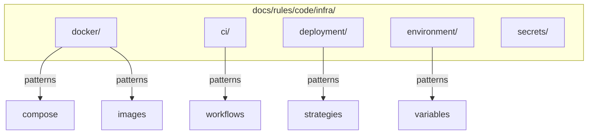

# OGT Docs - Rules Code Infra

Infrastructure-specific coding standards for Docker, CI/CD, and deployment.

## Overview

Infrastructure rules establish consistent patterns for containerization, continuous integration, deployment, and environment management.



## When to Use

- Creating Docker/container standards
- Defining CI/CD workflow patterns
- Establishing deployment strategies
- Writing environment configuration rules
- Setting secrets management standards

## Folder Structure

```
docs/rules/code/infra/
├── docker/                         # Container rules
│   ├── images/
│   │   ├── rule.md
│   │   └── examples.md
│   ├── compose/
│   │   ├── rule.md
│   │   └── examples.md
│   └── security/
│       ├── rule.md
│       └── examples.md
│
├── ci/                             # CI/CD rules
│   ├── workflows/
│   │   ├── rule.md
│   │   └── examples.md
│   ├── testing/
│   │   ├── rule.md
│   │   └── examples.md
│   └── artifacts/
│       ├── rule.md
│       └── examples.md
│
├── deployment/                     # Deployment rules
│   ├── strategies/
│   │   ├── rule.md
│   │   └── examples.md
│   ├── rollback/
│   │   ├── rule.md
│   │   └── examples.md
│   └── health_checks/
│       ├── rule.md
│       └── examples.md
│
├── environment/                    # Environment config
│   ├── variables/
│   │   ├── rule.md
│   │   └── examples.md
│   ├── files/
│   │   ├── rule.md
│   │   └── examples.md
│   └── validation/
│       ├── rule.md
│       └── examples.md
│
└── secrets/                        # Secrets management
    ├── storage/
    │   ├── rule.md
    │   └── examples.md
    └── rotation/
        ├── rule.md
        └── examples.md
```

---

## Example: docs/rules/code/infra/docker/images/

Docker image building rules.

### rule.md

````markdown
# Rule: Docker Image Best Practices

## Summary

Docker images MUST be minimal, secure, and reproducible.

## Rationale

Well-built images:

- Start faster
- Use less storage
- Have smaller attack surface
- Build consistently

## The Rules

### 1. Use Multi-Stage Builds

**MUST** use multi-stage builds to minimize final image size.

```dockerfile
# CORRECT - multi-stage
FROM node:20-alpine AS builder
WORKDIR /app
COPY package*.json ./
RUN npm ci
COPY . .
RUN npm run build

FROM node:20-alpine AS runner
WORKDIR /app
COPY --from=builder /app/dist ./dist
COPY --from=builder /app/node_modules ./node_modules
CMD ["node", "dist/main.js"]

# INCORRECT - single stage with dev deps
FROM node:20
WORKDIR /app
COPY . .
RUN npm install
RUN npm run build
CMD ["node", "dist/main.js"]
```
````

### 2. Use Specific Base Image Tags

**MUST** pin base image versions. **MUST NOT** use `latest`.

```dockerfile
# CORRECT
FROM node:20.11.0-alpine3.19

# INCORRECT
FROM node:latest
FROM node:20
```

### 3. Order Layers for Caching

**MUST** order COPY commands from least to most frequently changed.

```dockerfile
# CORRECT - dependencies first
COPY package*.json ./
RUN npm ci
COPY . .

# INCORRECT - invalidates cache on every change
COPY . .
RUN npm ci
```

### 4. Use .dockerignore

**MUST** have .dockerignore to exclude unnecessary files.

```
# .dockerignore
node_modules
.git
*.md
.env*
tests
coverage
```

### 5. Run as Non-Root

**MUST** run containers as non-root user.

```dockerfile
# Create non-root user
RUN addgroup -g 1001 appgroup && \
    adduser -u 1001 -G appgroup -D appuser

USER appuser
```

### 6. Use HEALTHCHECK

**SHOULD** include health check for orchestration.

```dockerfile
HEALTHCHECK --interval=30s --timeout=3s --start-period=5s --retries=3 \
  CMD wget --quiet --tries=1 --spider http://localhost:3000/health || exit 1
```

## Examples

### Correct: Production Node.js Image

```dockerfile
# Build stage
FROM node:20.11.0-alpine3.19 AS builder

WORKDIR /app

# Dependencies first (cached)
COPY package*.json ./
RUN npm ci --only=production

# Source code
COPY tsconfig.json ./
COPY src ./src
RUN npm run build

# Production stage
FROM node:20.11.0-alpine3.19 AS runner

# Security updates
RUN apk --no-cache upgrade

# Non-root user
RUN addgroup -g 1001 nodejs && \
    adduser -u 1001 -G nodejs -D nodejs

WORKDIR /app

# Copy only production artifacts
COPY --from=builder --chown=nodejs:nodejs /app/dist ./dist
COPY --from=builder --chown=nodejs:nodejs /app/node_modules ./node_modules
COPY --from=builder --chown=nodejs:nodejs /app/package.json ./

USER nodejs

EXPOSE 3000

HEALTHCHECK --interval=30s --timeout=3s \
  CMD wget --quiet --tries=1 --spider http://localhost:3000/health || exit 1

CMD ["node", "dist/main.js"]
```

## Enforcement

- Dockerfile linter (hadolint)
- Image scanning in CI
- Size limits in CI

````

---

## Example: docs/rules/code/infra/docker/compose/

Docker Compose rules.

### rule.md

```markdown
# Rule: Docker Compose Configuration

## Summary

Docker Compose files MUST be well-organized, secure, and environment-aware.

## The Rules

### 1. Use Version 3.8+

**MUST** use Compose file version 3.8 or later.

```yaml
version: '3.8'
````

### 2. Explicit Service Dependencies

**MUST** declare dependencies with `depends_on` and health checks.

```yaml
services:
  api:
    depends_on:
      db:
        condition: service_healthy
      redis:
        condition: service_started
```

### 3. Named Volumes for Persistence

**MUST** use named volumes for persistent data.

```yaml
volumes:
  postgres_data:

services:
  db:
    volumes:
      - postgres_data:/var/lib/postgresql/data
```

### 4. Networks for Isolation

**SHOULD** use custom networks to isolate services.

```yaml
networks:
  frontend:
  backend:

services:
  web:
    networks:
      - frontend
  api:
    networks:
      - frontend
      - backend
  db:
    networks:
      - backend # Not accessible from frontend
```

### 5. Environment Files

**MUST** use .env files for environment-specific config.

```yaml
services:
  api:
    env_file:
      - .env
      - .env.local # Overrides
```

### 6. Resource Limits

**SHOULD** set resource limits for production.

```yaml
services:
  api:
    deploy:
      resources:
        limits:
          cpus: "1"
          memory: 512M
        reservations:
          cpus: "0.25"
          memory: 128M
```

## Examples

### Correct: Production-Ready Compose

```yaml
version: "3.8"

services:
  frontend:
    build:
      context: ./front
      dockerfile: Dockerfile
    ports:
      - "${PORT_FRONT:-3000}:3000"
    environment:
      - NODE_ENV=production
      - API_URL=http://api:4000
    depends_on:
      api:
        condition: service_healthy
    networks:
      - frontend
    restart: unless-stopped
    deploy:
      resources:
        limits:
          memory: 256M

  api:
    build:
      context: ./back
      dockerfile: Dockerfile
    ports:
      - "${PORT_BACK:-4000}:4000"
    env_file:
      - .env
    depends_on:
      db:
        condition: service_healthy
    networks:
      - frontend
      - backend
    restart: unless-stopped
    healthcheck:
      test: ["CMD", "wget", "-q", "--spider", "http://localhost:4000/health"]
      interval: 30s
      timeout: 10s
      retries: 3

  db:
    image: postgres:16-alpine
    volumes:
      - postgres_data:/var/lib/postgresql/data
    environment:
      POSTGRES_DB: ${DB_NAME}
      POSTGRES_USER: ${DB_USER}
      POSTGRES_PASSWORD: ${DB_PASSWORD}
    networks:
      - backend
    restart: unless-stopped
    healthcheck:
      test: ["CMD-SHELL", "pg_isready -U ${DB_USER}"]
      interval: 10s
      timeout: 5s
      retries: 5

networks:
  frontend:
  backend:

volumes:
  postgres_data:
```

## Enforcement

- docker-compose config validation
- CI lint check

````

---

## Example: docs/rules/code/infra/ci/workflows/

CI workflow rules.

### rule.md

```markdown
# Rule: CI Workflow Standards

## Summary

CI workflows MUST be fast, reliable, and provide clear feedback.

## The Rules

### 1. Fail Fast

**MUST** run fastest checks first.

```yaml
jobs:
  lint:        # Seconds
    ...
  typecheck:   # Seconds
    ...
  test-unit:   # Minutes
    needs: [lint, typecheck]
  test-e2e:    # Minutes
    needs: [test-unit]
  deploy:      # After all pass
    needs: [test-e2e]
````

### 2. Parallel Where Possible

**SHOULD** run independent jobs in parallel.

```yaml
jobs:
  lint: ...
  typecheck: ...
  test-unit:
    needs: [lint, typecheck] # Both run in parallel, then unit tests
```

### 3. Cache Dependencies

**MUST** cache dependencies to speed up builds.

```yaml
- uses: actions/cache@v4
  with:
    path: ~/.npm
    key: ${{ runner.os }}-node-${{ hashFiles('**/package-lock.json') }}
    restore-keys: |
      ${{ runner.os }}-node-
```

### 4. Explicit Triggers

**MUST** clearly define workflow triggers.

```yaml
on:
  push:
    branches: [main, develop]
  pull_request:
    branches: [main]
  workflow_dispatch: # Manual trigger
```

### 5. Timeout Limits

**MUST** set job timeouts to prevent runaway builds.

```yaml
jobs:
  test:
    timeout-minutes: 15
```

### 6. Status Checks

**MUST** require status checks before merge.

Configure in GitHub:

- Require `lint` to pass
- Require `test` to pass
- Require `build` to pass

## Examples

### Correct: Complete CI Workflow

```yaml
name: CI

on:
  push:
    branches: [main]
  pull_request:
    branches: [main]

concurrency:
  group: ${{ github.workflow }}-${{ github.ref }}
  cancel-in-progress: true

jobs:
  lint:
    runs-on: ubuntu-latest
    timeout-minutes: 5
    steps:
      - uses: actions/checkout@v4
      - uses: actions/setup-node@v4
        with:
          node-version: 20
          cache: "npm"
      - run: npm ci
      - run: npm run lint

  typecheck:
    runs-on: ubuntu-latest
    timeout-minutes: 5
    steps:
      - uses: actions/checkout@v4
      - uses: actions/setup-node@v4
        with:
          node-version: 20
          cache: "npm"
      - run: npm ci
      - run: npm run typecheck

  test:
    needs: [lint, typecheck]
    runs-on: ubuntu-latest
    timeout-minutes: 15
    steps:
      - uses: actions/checkout@v4
      - uses: actions/setup-node@v4
        with:
          node-version: 20
          cache: "npm"
      - run: npm ci
      - run: npm test -- --coverage
      - uses: codecov/codecov-action@v4

  build:
    needs: [test]
    runs-on: ubuntu-latest
    timeout-minutes: 10
    steps:
      - uses: actions/checkout@v4
      - uses: actions/setup-node@v4
        with:
          node-version: 20
          cache: "npm"
      - run: npm ci
      - run: npm run build
      - uses: actions/upload-artifact@v4
        with:
          name: build
          path: dist/
```

## Enforcement

- Required status checks in GitHub
- Branch protection rules

````

---

## Example: docs/rules/code/infra/environment/variables/

Environment variable rules.

### rule.md

```markdown
# Rule: Environment Variables

## Summary

Environment variables MUST be documented, validated, and securely managed.

## The Rules

### 1. Document All Variables

**MUST** maintain .env.example with all required variables.

```bash
# .env.example

# Database
DB_HOST=localhost
DB_PORT=5432
DB_NAME=myapp
DB_USER=postgres
DB_PASSWORD=  # Required, no default

# API
API_PORT=3000
API_URL=http://localhost:3000

# Auth
JWT_SECRET=  # Required, no default
JWT_EXPIRY=15m
````

### 2. Prefix by Domain

**SHOULD** prefix variables by service/domain.

```bash
# CORRECT
DB_HOST=...
DB_PORT=...
REDIS_URL=...
AUTH_JWT_SECRET=...

# AVOID
HOST=...        # Ambiguous
SECRET=...      # Which secret?
```

### 3. Validate on Startup

**MUST** validate required variables at application start.

```typescript
// config.ts
const requiredEnv = ["DB_HOST", "DB_PASSWORD", "JWT_SECRET"];

for (const key of requiredEnv) {
  if (!process.env[key]) {
    throw new Error(`Missing required environment variable: ${key}`);
  }
}
```

### 4. Type Conversion

**MUST** convert and validate types.

```typescript
const config = {
  port: parseInt(process.env.PORT || "3000", 10),
  debug: process.env.DEBUG === "true",
  timeout: parseInt(process.env.TIMEOUT || "5000", 10),
};

if (isNaN(config.port)) {
  throw new Error("PORT must be a number");
}
```

### 5. Never Commit Secrets

**MUST NOT** commit .env files with secrets.

```gitignore
# .gitignore
.env
.env.local
.env.*.local
```

### 6. Environment-Specific Files

**SHOULD** use environment-specific files.

```
.env.example      # Template (committed)
.env              # Local development (not committed)
.env.test         # Test environment
.env.production   # Production (not committed, use secrets manager)
```

## Examples

### Correct: Validated Config Module

```typescript
// config/index.ts
import { z } from "zod";

const envSchema = z.object({
  NODE_ENV: z
    .enum(["development", "production", "test"])
    .default("development"),

  // Database
  DB_HOST: z.string().min(1),
  DB_PORT: z.string().transform(Number).pipe(z.number().int().positive()),
  DB_NAME: z.string().min(1),
  DB_USER: z.string().min(1),
  DB_PASSWORD: z.string().min(1),

  // API
  API_PORT: z.string().transform(Number).default("3000"),
  API_URL: z.string().url(),

  // Auth
  JWT_SECRET: z.string().min(32),
  JWT_EXPIRY: z.string().default("15m"),
});

export const config = envSchema.parse(process.env);
```

## Enforcement

- Startup validation
- CI check for .env.example completeness

````

---

## Creating Infrastructure Rules

```mermaid
flowchart TD
    A[Identify Pattern] --> B{Category}

    B -->|Containers| C[docker/]
    B -->|CI/CD| D[ci/]
    B -->|Deploy| E[deployment/]
    B -->|Config| F[environment/]
    B -->|Secrets| G[secrets/]

    C --> H[Create Rule Folder]
    D --> H
    E --> H
    F --> H
    G --> H

    H --> I[Write rule.md]
    I --> J[Add examples.md]
    J --> K[Configure linting]
````

---

## Signal Files Reference

| Signal             | Content | Purpose                     |
| ------------------ | ------- | --------------------------- |
| `.version`         | JSON    | Schema version              |
| `.enforced_by`     | List    | Tools that enforce          |
| `.docker_version`  | Version | Docker version requirement  |
| `.compose_version` | Version | Compose version requirement |

---

## Infrastructure Rule Checklist

- [ ] Rule is infrastructure specific
- [ ] Security implications addressed
- [ ] Examples use appropriate syntax (YAML, Dockerfile)
- [ ] Mentions relevant linting tools
- [ ] Performance/cost considerations noted
- [ ] Reproducibility emphasized
