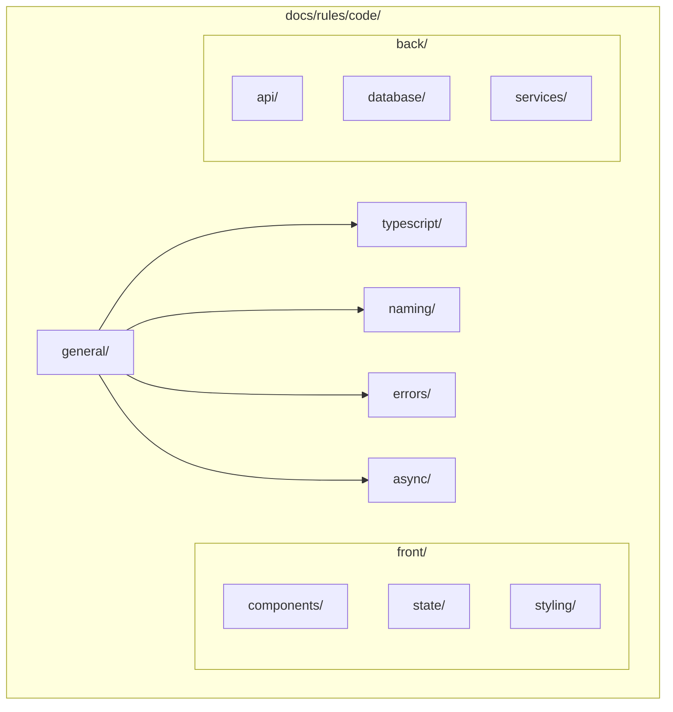

# OGT Docs - Rules Code

Complete guide for creating and managing coding standards and rules.

## Overview

Coding rules establish consistent patterns across the codebase. They are enforceable (via linters, type checkers, CI) and documented with examples.



## When to Use

- Creating new coding standards
- Documenting TypeScript patterns
- Establishing naming conventions
- Defining error handling patterns
- Setting architecture rules
- Updating existing code rules

## Folder Structure

```
docs/rules/code/
├── general/                        # Cross-cutting rules
│   ├── rule.md
│   ├── examples.md
│   ├── .version
│   └── .enforced_by
│
├── typescript/                     # TypeScript-specific
│   ├── strict_mode/
│   ├── type_assertions/
│   ├── generics/
│   └── unions/
│
├── naming/                         # Naming conventions
│   ├── files/
│   ├── variables/
│   ├── functions/
│   ├── types/
│   └── constants/
│
├── errors/                         # Error handling
│   ├── catching/
│   ├── throwing/
│   └── logging/
│
├── async/                          # Async patterns
│   ├── promises/
│   └── error_handling/
│
├── imports/                        # Import organization
│   ├── ordering/
│   └── barrel_files/
│
├── front/                          # Frontend-specific
│   ├── components/
│   ├── state/
│   ├── hooks/
│   └── styling/
│
└── back/                           # Backend-specific
    ├── api/
    ├── database/
    └── services/
```

---

## Example: docs/rules/code/general/

Root coding standards that apply everywhere.

### Folder Structure

```
docs/rules/code/general/
├── rule.md
├── examples.md
├── .version
└── .enforced_by
```

### rule.md

````markdown
# Rule: General Coding Standards

## Summary

All code MUST follow these fundamental standards for consistency and maintainability.

## Rationale

Consistent code is easier to read, review, maintain, and debug.

## The Rules

### 1. Single Responsibility

Each function, class, or module MUST have one clear purpose.

- Functions SHOULD be under 30 lines
- Files SHOULD be under 300 lines

### 2. Explicit Over Implicit

- **MUST NOT** rely on implicit type coercion
- **MUST** use explicit return statements
- **MUST** use explicit comparisons (`===` not `==`)

### 3. Fail Fast

- **MUST** validate function parameters at entry
- **MUST** throw on invalid input (not return null)

### 4. No Magic Values

- **MUST** extract magic numbers to named constants
- **MUST** extract magic strings to constants or enums

### 5. Immutability Preference

- **SHOULD** use `const` over `let`
- **MUST NOT** use `var`
- **SHOULD** prefer spread over mutation

## Examples

### Correct

```typescript
// Named constants
const MAX_RETRY_ATTEMPTS = 3;
const CACHE_TTL_MS = 60 * 1000;

// Explicit comparisons
if (user.role === 'admin') { ... }

// Immutable update
const updatedUser = { ...user, lastLogin: new Date() };
```
````

### Incorrect

```typescript
// Magic values
setTimeout(callback, 86400000);  // What is this?

// Implicit coercion
if (user.role == 'admin') { ... }  // Use ===

// Mutation
user.lastLogin = new Date();  // Mutates original
```

## Enforcement

- ESLint rules
- TypeScript strict mode
- Code review

```

### .enforced_by

```

eslint
typescript strict mode
code review

````

---

## Example: docs/rules/code/naming/files/

File naming conventions.

### rule.md

```markdown
# Rule: File Naming Conventions

## Summary

All source files MUST follow consistent naming patterns based on content type.

## The Rules

| Type | Pattern | Example |
|------|---------|---------|
| React Component | `PascalCase.tsx` | `CreatureCard.tsx` |
| React Hook | `use-{name}.ts` | `use-creature-data.ts` |
| Service | `{name}-service.ts` | `auth-service.ts` |
| Utility | `{name}.ts` | `string-utils.ts` |
| Types | `{name}.types.ts` | `creature.types.ts` |
| Test | `{name}.test.ts` | `auth-service.test.ts` |
| Index/Barrel | `index.ts` | `index.ts` |

### Directory Names

- **MUST** use kebab-case for directories
- **SHOULD** match domain concept (plural for collections)

## Examples

### Correct

````

src/
components/
creatures/
CreatureCard.tsx
creature-card.types.ts
index.ts
hooks/
use-creature-data.ts
services/
auth-service.ts

```

### Incorrect

```

src/
Components/ # Should be lowercase
CreatureCards/ # Should be kebab-case
creatureCard.tsx # Should be PascalCase
Hooks/
useCreatureData.ts # Should be use-creature-data.ts

```

## Enforcement

- ESLint file naming plugin
- Pre-commit hook
```

---

## Example: docs/rules/code/errors/catching/

Error handling rules.

### rule.md

````markdown
# Rule: Error Catching

## Summary

All caught errors MUST be properly typed, logged, and handled - never silently swallowed.

## The Rules

### 1. Never Catch and Ignore

**MUST NOT** have empty catch blocks.

### 2. Type Caught Errors

**MUST** type errors as `unknown` and narrow appropriately.

```typescript
try {
  await fetchData();
} catch (error: unknown) {
  if (error instanceof NetworkError) {
    handleNetworkError(error);
  } else if (error instanceof Error) {
    handleGenericError(error);
  }
}
```
````

### 3. Log Before Rethrowing

**MUST** log errors if rethrowing or transforming.

### 4. Recover or Fail Gracefully

**MUST** either recover meaningfully or fail gracefully.

## Examples

### Correct

```typescript
async function fetchUser(id: string): Promise<User> {
  try {
    return await api.get(`/users/${id}`);
  } catch (error: unknown) {
    if (isNotFoundError(error)) {
      throw new UserNotFoundError(id);
    }
    logger.error("Unexpected error", { id, error });
    throw error;
  }
}
```

### Incorrect

```typescript
// Silent swallow - FORBIDDEN
try {
  await saveAnalytics(event);
} catch (e) {}

// Untyped error access
try {
  await fetchData();
} catch (e) {
  console.log(e.message); // e is unknown!
}
```

## Enforcement

- ESLint no-empty catch
- TypeScript useUnknownInCatchVariables

````

---

## Example: docs/rules/code/async/promises/

Async/await patterns.

### rule.md

```markdown
# Rule: Promise Handling

## Summary

All Promises MUST be properly awaited or have rejections handled.

## The Rules

### 1. Always Await or Handle

```typescript
// CORRECT - awaited
const data = await fetchData();

// CORRECT - fire-and-forget with handler
sendAnalytics(event).catch(logError);

// FORBIDDEN - floating promise
fetchData();  // No await, no handler
````

### 2. Use async/await Over .then()

**SHOULD** prefer async/await for readability.

### 3. Parallel When Independent

**SHOULD** use Promise.all for independent operations.

```typescript
// CORRECT - parallel
const [users, posts] = await Promise.all([fetchUsers(), fetchPosts()]);

// INEFFICIENT - sequential
const users = await fetchUsers();
const posts = await fetchPosts();
```

### 4. No Async in Constructors

**MUST NOT** do async work in constructors.

```typescript
// CORRECT - factory function
class Service {
  private constructor(private data: Data) {}

  static async create(): Promise<Service> {
    const data = await loadData();
    return new Service(data);
  }
}
```

## Enforcement

- ESLint @typescript-eslint/no-floating-promises
- ESLint require-await

````

---

## Creating New Code Rules

```mermaid
flowchart TD
    A[Identify Pattern] --> B{Category}
    B -->|Types| C[typescript/]
    B -->|Names| D[naming/]
    B -->|Errors| E[errors/]
    B -->|Async| F[async/]
    B -->|General| G[general/]
    B -->|Frontend| H[front/]
    B -->|Backend| I[back/]

    C --> J[Create Rule Folder]
    D --> J
    E --> J
    F --> J
    G --> J
    H --> J
    I --> J

    J --> K[Write rule.md]
    K --> L[Add examples.md]
    L --> M[Configure Enforcement]
    M --> N{Automated?}

    N -->|ESLint| O[Add ESLint Rule]
    N -->|TypeScript| P[Add tsconfig Option]
    N -->|Manual| Q[Add to Review Checklist]

    O --> R[Update CI]
    P --> R
    Q --> S[Announce]
    R --> S
````

### Steps

1. **Identify**: Find pattern needing standardization
2. **Categorize**: Choose appropriate subfolder
3. **Create folder**: `docs/rules/code/{category}/{rule_name}/`
4. **Write rule.md**: Clear rule with rationale and examples
5. **Add examples.md**: Comprehensive correct/incorrect examples
6. **Configure enforcement**: ESLint, TypeScript, or review checklist
7. **Update CI**: Add automated checks
8. **Announce**: Communicate to team

---

## Signal Files Reference

| Signal           | Type    | Content             | Purpose               |
| ---------------- | ------- | ------------------- | --------------------- |
| `.version`       | Content | JSON schema version | Track rule version    |
| `.enforced_by`   | Content | List of tools       | Document enforcement  |
| `.deprecated`    | Empty   | -                   | Mark as deprecated    |
| `.superseded_by` | Content | Path to new rule    | Point to replacement  |
| `.eslint_rule`   | Content | ESLint rule name    | Link to linter config |

---

## Rule Quality Checklist

Before finalizing a code rule:

- [ ] Rule is specific and unambiguous
- [ ] Rationale explains the "why"
- [ ] Uses RFC 2119 keywords correctly
- [ ] At least 2 correct examples
- [ ] At least 2 incorrect examples with explanations
- [ ] Examples actually compile/run
- [ ] Exceptions are documented
- [ ] Enforcement mechanism specified
- [ ] ESLint rule identified (if applicable)
- [ ] Cross-referenced with related rules
