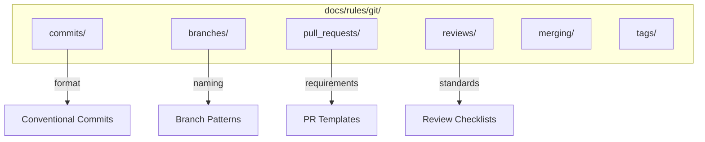

# OGT Docs - Rules Git

Complete guide for creating and managing Git workflow rules.

## Overview

Git rules establish consistent version control practices. They cover commit messages, branch naming, pull request requirements, and code review standards.



## When to Use

- Establishing commit message conventions
- Defining branch naming patterns
- Setting PR requirements and templates
- Creating code review standards
- Defining merge strategies
- Setting up release tagging

## Folder Structure

```
docs/rules/git/
├── commits/                        # Commit message rules
│   ├── rule.md
│   ├── examples.md
│   ├── .version
│   └── .enforced_by
│
├── branches/                       # Branch naming rules
│   ├── rule.md
│   ├── examples.md
│   └── .enforced_by
│
├── pull_requests/                  # PR requirements
│   ├── rule.md
│   ├── template.md                 # PR template
│   ├── examples.md
│   └── .enforced_by
│
├── reviews/                        # Code review standards
│   ├── rule.md
│   ├── checklist.md               # Review checklist
│   └── examples.md
│
├── merging/                        # Merge strategy rules
│   ├── rule.md
│   └── examples.md
│
└── tags/                           # Release tagging rules
    ├── rule.md
    └── examples.md
```

---

## Example: docs/rules/git/commits/

Commit message format rules.

### Folder Structure

```
docs/rules/git/commits/
├── rule.md
├── examples.md
├── .version
└── .enforced_by
```

### rule.md

```markdown
# Rule: Commit Message Format

## Summary

All commit messages MUST follow Conventional Commits format.

## Rationale

Consistent commit messages enable:

- Automated changelog generation
- Semantic versioning automation
- Easy history navigation
- Clear communication of changes

## The Rule

### Format
```

<type>(<scope>): <description>

[optional body]

[optional footer(s)]

```

### Types

| Type | Use When |
|------|----------|
| `feat` | New feature |
| `fix` | Bug fix |
| `docs` | Documentation only |
| `style` | Formatting, no code change |
| `refactor` | Neither fixes nor adds feature |
| `perf` | Performance improvement |
| `test` | Adding/updating tests |
| `chore` | Maintenance tasks |
| `ci` | CI/CD changes |
| `build` | Build system changes |

### Requirements

1. **MUST** use lowercase type
2. **MUST** use imperative mood ("add" not "added")
3. **MUST** limit first line to 72 characters
4. **SHOULD** include scope for clarity
5. **MUST** reference issue number for bug fixes
6. **MUST** mark breaking changes with `!` or footer

### Breaking Changes

Two ways to indicate breaking changes:

```

feat(api)!: change auth header format

```

Or:

```

feat(api): change auth header format

BREAKING CHANGE: Authorization header now requires "Bearer " prefix

```

## Examples

### Correct

```

feat(auth): add Steam OAuth provider

Implement Steam OpenID authentication flow.
Follows existing Google/Discord pattern.

Closes #456

```

```

fix(api): handle null response from legacy endpoint

The /v0/users endpoint can return null for deleted users.
Add null check and return 404 instead of 500.

Fixes #789

```

```

refactor(components): extract CardBase from entity cards

DRY refactor - all entity cards now extend CardBase.
No functional changes.

```

### Incorrect

```

Fixed bug # No type, vague
FEAT: Add feature # Wrong case
feat(auth): Added Steam OAuth # Past tense
feat: implement the new system... # Too long (>72 chars)

```

## Exceptions

- Merge commits may use default message
- Revert commits may use git's default format

## Enforcement

- commitlint in pre-commit hook
- CI check on PRs
- PR review

## References

- [Conventional Commits](https://www.conventionalcommits.org/)
```

### examples.md

```markdown
# Commit Message Examples

## Feature Commits
```

feat(creatures): add CR filtering to creature list

Allow filtering creatures by Challenge Rating range.
Uses dual-handle slider component.

Related: #234

```

```

feat(search): implement fuzzy search with MiniSearch

Replace substring matching with indexed fuzzy search.
Results ranked by relevance score.

Performance: <16ms for 10k entries

Closes #567

```

## Bug Fix Commits

```

fix(cards): prevent image flash on card hover

Card images were reloading on every hover due to
missing key prop in map. Add stable key based on
entity slug.

Fixes #890

```

```

fix(auth): handle expired refresh tokens gracefully

When refresh token expires, redirect to login instead
of showing error page. Clear local storage on redirect.

Fixes #891
Fixes #892

```

## Refactor Commits

```

refactor(services): extract API client from services

Move HTTP logic to dedicated ApiClient class.
Services now use dependency injection.

No functional changes. Improves testability.

```

## Documentation Commits

```

docs(readme): add Docker setup instructions

Document docker-compose workflow for new developers.
Include troubleshooting section for common issues.

```

## Breaking Change Commits

```

feat(api)!: rename /monsters to /creatures

BREAKING CHANGE: All /api/monsters/_ endpoints now at /api/creatures/_

Migration:

- Update all fetch calls
- /monsters/:slug -> /creatures/:slug

Deprecation notice sent 2026-01-01.
Old endpoints removed 2026-02-01.

```

## Chore Commits

```

chore(deps): update dependencies

- react 18.2 -> 19.0
- vite 5.0 -> 7.3
- typescript 5.3 -> 5.8

No breaking changes.

```

## CI Commits

```

ci(github): add automated release workflow

Trigger on version tags, build and publish to npm.
Uses semantic-release for changelog generation.

```

```

### .enforced_by

```
commitlint
husky pre-commit hook
GitHub Actions CI
PR review checklist
```

---

## Example: docs/rules/git/branches/

Branch naming conventions.

### rule.md

```markdown
# Rule: Branch Naming Conventions

## Summary

All branches MUST follow the pattern `{type}/{ticket}-{description}`.

## Rationale

Consistent branch naming:

- Links work to tickets/issues
- Indicates purpose at a glance
- Enables automation (CI triggers, auto-linking)
- Simplifies cleanup

## The Rule

### Format
```

{type}/{ticket}-{short-description}

```

### Types

| Type | Use For |
|------|---------|
| `feature` | New features |
| `fix` | Bug fixes |
| `hotfix` | Urgent production fixes |
| `refactor` | Code refactoring |
| `docs` | Documentation |
| `test` | Test additions |
| `chore` | Maintenance |
| `release` | Release preparation |

### Requirements

1. **MUST** use lowercase
2. **MUST** include ticket number (or `no-ticket` if none)
3. **MUST** use hyphens for word separation
4. **SHOULD** keep description under 30 characters
5. **MUST NOT** include special characters except hyphen

### Protected Branches

- `main` - Production code
- `develop` - Integration branch (if used)

**MUST NOT** push directly to protected branches.

## Examples

### Correct

```

feature/ORC-123-steam-oauth
fix/ORC-456-null-response-crash
hotfix/ORC-789-login-broken
refactor/ORC-101-extract-card-base
docs/no-ticket-api-readme
chore/ORC-202-update-deps
release/v1.2.0

```

### Incorrect

```

steam-oauth # No type, no ticket
feature/steam_oauth # Underscores
Feature/ORC-123-Steam-OAuth # Uppercase
feature/ORC-123-implement-the-new-steam-oauth-provider # Too long
feature/steam oauth # Spaces

```

## Exceptions

- `main`, `develop` are allowed as-is
- Dependabot branches follow their own format

## Enforcement

- Branch protection rules
- CI validation
- PR checks
```

---

## Example: docs/rules/git/pull_requests/

PR requirements and templates.

### rule.md

```markdown
# Rule: Pull Request Requirements

## Summary

All PRs MUST include a description, link to ticket, and pass CI checks.

## Rationale

Well-documented PRs:

- Enable effective code review
- Provide context for future readers
- Link work to requirements
- Ensure quality before merge

## The Rules

### Required Elements

1. **MUST** have descriptive title (not branch name)
2. **MUST** include summary of changes
3. **MUST** link to ticket/issue
4. **MUST** pass all CI checks
5. **MUST** have at least one approval (for non-trivial changes)
6. **SHOULD** include testing notes
7. **SHOULD** include screenshots for UI changes

### Title Format
```

[TYPE] Brief description (#ticket)

```

Examples:
- `[Feature] Add Steam OAuth (#ORC-123)`
- `[Fix] Handle null API response (#ORC-456)`
- `[Refactor] Extract CardBase component (#ORC-101)`

### Size Guidelines

- **SHOULD** be under 400 lines changed
- Large PRs **SHOULD** be split into smaller PRs
- If >400 lines, add explanation of why

### Review Requirements

| Change Type | Required Approvals |
|-------------|-------------------|
| Documentation only | 0 (self-merge OK) |
| Small fix (<50 lines) | 1 |
| Feature/Refactor | 1 |
| Breaking change | 2 |
| Security-related | 2 |

## Exceptions

- Automated dependency updates may auto-merge if CI passes
- Documentation-only changes may self-merge

## Enforcement

- GitHub branch protection rules
- Required status checks
- PR template
```

### template.md

```markdown
## Summary

Brief description of what this PR does.

## Related Issue

Fixes #(issue number)

## Type of Change

- [ ] Bug fix (non-breaking change that fixes an issue)
- [ ] New feature (non-breaking change that adds functionality)
- [ ] Breaking change (fix or feature that would cause existing functionality to change)
- [ ] Documentation update
- [ ] Refactoring (no functional changes)
- [ ] Chore (dependencies, build, CI)

## Changes Made

- Change 1
- Change 2
- Change 3

## Testing

Describe how you tested these changes:

- [ ] Unit tests added/updated
- [ ] Manual testing performed
- [ ] E2E tests added/updated

## Screenshots (if applicable)

| Before | After |
| ------ | ----- |
| img    | img   |

## Checklist

- [ ] My code follows the project's coding standards
- [ ] I have performed a self-review of my code
- [ ] I have commented my code where needed
- [ ] I have updated the documentation
- [ ] My changes generate no new warnings
- [ ] I have added tests that prove my fix/feature works
- [ ] New and existing tests pass locally
- [ ] Any dependent changes have been merged
```

---

## Example: docs/rules/git/reviews/

Code review standards.

### rule.md

```markdown
# Rule: Code Review Standards

## Summary

All code reviews MUST be constructive, timely, and thorough.

## Rationale

Effective code review:

- Catches bugs before production
- Shares knowledge across team
- Maintains code quality
- Improves developer skills

## The Rules

### Reviewer Responsibilities

1. **MUST** respond within 24 hours (business days)
2. **MUST** provide actionable feedback
3. **MUST** approve or request changes (no silent stalls)
4. **SHOULD** suggest alternatives when blocking
5. **MUST** distinguish blocking vs. non-blocking comments

### Comment Conventions

Use prefixes to clarify intent:

| Prefix        | Meaning                   | Blocking? |
| ------------- | ------------------------- | --------- |
| `blocker:`    | Must fix before merge     | Yes       |
| `question:`   | Need clarification        | Maybe     |
| `suggestion:` | Consider this alternative | No        |
| `nit:`        | Minor style preference    | No        |
| `praise:`     | Positive feedback         | No        |

### What to Review

1. **Correctness**: Does it do what it claims?
2. **Design**: Is the approach appropriate?
3. **Readability**: Is it understandable?
4. **Tests**: Are changes tested?
5. **Documentation**: Are comments/docs updated?
6. **Security**: Any security concerns?
7. **Performance**: Any performance issues?

### Author Responsibilities

1. **MUST** respond to all comments
2. **MUST** resolve or discuss blockers
3. **SHOULD** implement non-blocking suggestions or explain why not
4. **MUST NOT** merge with unresolved blockers

## Examples

### Good Review Comments
```

blocker: This query is vulnerable to SQL injection.
Use parameterized queries instead:
`db.query('SELECT * FROM users WHERE id = ?', [userId])`

question: Why is this timeout set to 30 seconds?
Seems long for a user-facing request.

suggestion: Consider extracting this into a helper function.
It's used in three places.

nit: Prefer `const` over `let` here since it's never reassigned.

praise: Nice use of discriminated unions here!
Makes the error handling very clean.

```

### Poor Review Comments

```

This is wrong. # No explanation
I wouldn't do it this way. # No alternative
??? # Meaningless
LGTM # (for complex PR without real review)

```

## Enforcement

- Review time tracked in GitHub insights
- Stale PR alerts
- Review checklist in PR template
```

### checklist.md

```markdown
# Code Review Checklist

Use this checklist when reviewing PRs:

## Basics

- [ ] PR description explains the changes
- [ ] Related issue is linked
- [ ] CI checks pass

## Code Quality

- [ ] Code follows project coding standards
- [ ] No unnecessary complexity
- [ ] No code duplication
- [ ] Functions/methods have single responsibility
- [ ] Names are clear and descriptive

## Correctness

- [ ] Logic is correct
- [ ] Edge cases are handled
- [ ] Error handling is appropriate
- [ ] No obvious bugs

## Testing

- [ ] New code has tests
- [ ] Tests cover edge cases
- [ ] Existing tests still pass
- [ ] Test names describe what they test

## Security

- [ ] No secrets in code
- [ ] Input is validated
- [ ] No SQL injection risks
- [ ] No XSS vulnerabilities
- [ ] Auth/authz is correct

## Performance

- [ ] No N+1 queries
- [ ] No unnecessary re-renders
- [ ] Large data sets paginated
- [ ] Expensive operations optimized or async

## Documentation

- [ ] Code comments where needed
- [ ] API docs updated
- [ ] README updated if needed

## Final

- [ ] I would be comfortable maintaining this code
- [ ] Changes match what the PR description claims
```

---

## Example: docs/rules/git/merging/

Merge strategy rules.

### rule.md

```markdown
# Rule: Merge Strategy

## Summary

All merges to main MUST use squash merge with a descriptive commit message.

## Rationale

Squash merging:

- Keeps main history clean
- Each commit represents one complete feature/fix
- Simplifies git bisect
- Enables clean reverts

## The Rules

### Default: Squash Merge

1. **MUST** use squash merge for feature branches
2. **MUST** write descriptive squash commit message
3. **SHOULD** include PR number in commit message
4. **MUST** delete branch after merge

### Exceptions: Regular Merge

Use regular merge only for:

- Release branches to main (preserve history)
- Long-running branches with meaningful commits

### Commit Message for Squash

Follow same format as regular commits:
```

feat(auth): add Steam OAuth provider (#123)

Implement Steam OpenID authentication flow including:

- Steam provider configuration
- Callback handler
- Session management

Closes #456

```

### Branch Cleanup

**MUST** delete merged branches:
- GitHub: Enable "Automatically delete head branches"
- Local: `git fetch --prune` regularly

## Enforcement

- GitHub branch protection: Require squash merge
- Automatic branch deletion enabled
- CI reminder for stale branches
```

---

## Example: docs/rules/git/tags/

Release tagging rules.

### rule.md

```markdown
# Rule: Release Tags

## Summary

All releases MUST be tagged with semantic version following `v{major}.{minor}.{patch}`.

## Rationale

Semantic versioning:

- Communicates impact of changes
- Enables automated releases
- Provides clear upgrade path
- Links releases to code state

## The Rules

### Version Format
```

v{MAJOR}.{MINOR}.{PATCH}

```

- **MAJOR**: Breaking changes
- **MINOR**: New features, backward compatible
- **PATCH**: Bug fixes, backward compatible

### Pre-release Tags

```

v1.2.0-alpha.1
v1.2.0-beta.1
v1.2.0-rc.1

````

### Tagging Process

1. **MUST** tag from main branch
2. **MUST** update version in package.json first
3. **MUST** use annotated tags (not lightweight)
4. **MUST** include release notes in tag message

```bash
# Correct
git tag -a v1.2.0 -m "Release v1.2.0: Feature X, Fix Y"

# Incorrect
git tag v1.2.0  # Lightweight tag, no message
````

### Release Notes

**MUST** include:

- Summary of changes
- Breaking changes (if any)
- Migration notes (if needed)
- Contributors

## Examples

### Correct Tags

```
v1.0.0          # First stable release
v1.1.0          # New feature
v1.1.1          # Bug fix
v2.0.0          # Breaking change
v2.0.0-beta.1   # Pre-release
```

### Incorrect Tags

```
1.0.0           # Missing 'v' prefix
v1.0            # Missing patch version
release-1.0.0   # Wrong format
v1.0.0.0        # Too many parts
```

## Enforcement

- CI validates tag format
- Release workflow triggered by tags
- Changelog generated from commits

````

---

## Creating New Git Rules

```mermaid
flowchart TD
    A[Identify Need] --> B{Category}

    B -->|Commit| C[commits/]
    B -->|Branch| D[branches/]
    B -->|PR| E[pull_requests/]
    B -->|Review| F[reviews/]
    B -->|Merge| G[merging/]
    B -->|Release| H[tags/]

    C --> I[Create Folder]
    D --> I
    E --> I
    F --> I
    G --> I
    H --> I

    I --> J[Write rule.md]
    J --> K[Add examples.md]
    K --> L{Has Template?}

    L -->|Yes| M[Add template.md]
    L -->|No| N[Configure Enforcement]
    M --> N

    N --> O{Enforcement Type}
    O -->|Hook| P[Add to husky]
    O -->|CI| Q[Add GH Action]
    O -->|GitHub| R[Configure Settings]

    P --> S[Document in .enforced_by]
    Q --> S
    R --> S

    S --> T[Announce to Team]
````

---

## Signal Files Reference

| Signal         | Type    | Content             | Purpose              |
| -------------- | ------- | ------------------- | -------------------- |
| `.version`     | Content | JSON schema version | Track rule version   |
| `.enforced_by` | Content | List of tools       | Document enforcement |
| `.deprecated`  | Empty   | -                   | Mark as deprecated   |
| `.template`    | Content | Template file path  | Link to templates    |

---

## Rule Quality Checklist

Before finalizing a git rule:

- [ ] Rule is clear and unambiguous
- [ ] Format patterns are documented
- [ ] At least 3 correct examples
- [ ] At least 3 incorrect examples
- [ ] Exceptions are documented
- [ ] Enforcement mechanism configured
- [ ] GitHub settings updated if needed
- [ ] Pre-commit hooks updated if needed
- [ ] CI workflow added if needed
- [ ] Team notified of new rule
