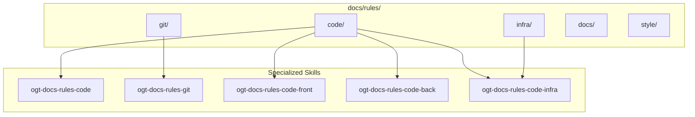
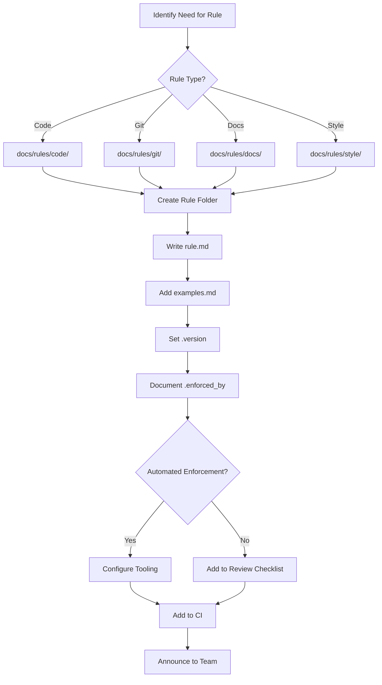

# OGT Docs - Rules

Root skill for managing project rules and standards. Rules define enforceable conventions that all contributors (human and AI) must follow.

## Overview

Rules are the codified standards of a project. Unlike guidelines (suggestions) or documentation (information), rules are **enforceable** and **verifiable**. They live in `docs/rules/` and are organized by domain.



## When to Use

- Creating new project rules or standards
- Updating existing rules
- Looking up rules for a specific domain
- Enforcing rules during code review
- Setting up rules for a new project

## Sub-Skills

| Skill                       | Domain           | Use When                                     |
| --------------------------- | ---------------- | -------------------------------------------- |
| `ogt-docs-rules-code`       | Coding standards | TypeScript, naming, patterns, error handling |
| `ogt-docs-rules-code-front` | Frontend code    | React, components, state, styling            |
| `ogt-docs-rules-code-back`  | Backend code     | API design, database, services               |
| `ogt-docs-rules-code-infra` | Infrastructure   | Docker, CI/CD, deployment                    |
| `ogt-docs-rules-git`        | Git workflow     | Commits, branches, PRs, reviews              |

## Folder Structure

```
docs/rules/
├── code/                           # Coding standards
│   ├── general/                    # Cross-cutting code rules
│   │   ├── rule.md                 # Primary rule definition
│   │   ├── examples.md             # Good/bad examples
│   │   ├── .version                # Schema version
│   │   └── .enforced_by            # How it's enforced (eslint, tsc, etc.)
│   │
│   ├── typescript/                 # TypeScript-specific rules
│   │   ├── rule.md
│   │   ├── examples.md
│   │   └── .enforced_by
│   │
│   ├── naming/                     # Naming conventions
│   │   ├── rule.md
│   │   ├── examples.md
│   │   └── .enforced_by
│   │
│   ├── front/                      # Frontend-specific rules
│   │   ├── components/
│   │   ├── state/
│   │   ├── styling/
│   │   └── routing/
│   │
│   ├── back/                       # Backend-specific rules
│   │   ├── api/
│   │   ├── database/
│   │   └── services/
│   │
│   └── infra/                      # Infrastructure rules
│       ├── docker/
│       ├── ci/
│       └── deployment/
│
├── git/                            # Git workflow rules
│   ├── commits/                    # Commit message format
│   │   ├── rule.md
│   │   ├── examples.md
│   │   └── .enforced_by
│   │
│   ├── branches/                   # Branch naming
│   │   ├── rule.md
│   │   └── examples.md
│   │
│   ├── pull_requests/              # PR requirements
│   │   ├── rule.md
│   │   └── template.md
│   │
│   └── reviews/                    # Code review standards
│       ├── rule.md
│       └── checklist.md
│
├── docs/                           # Documentation rules
│   ├── structure/                  # Folder organization
│   ├── formatting/                 # Markdown standards
│   └── comments/                   # Code comments
│
└── style/                          # Style guides
    ├── ui/                         # UI/UX consistency
    ├── api/                        # API style
    └── naming/                     # Naming conventions
```

---

## Rule Definition Structure

Every rule is a **folder** containing at minimum a `rule.md` file.

### rule.md Template

```markdown
# Rule: {Rule Name}

## Summary

One sentence stating the rule clearly and unambiguously.

## Rationale

Why this rule exists. What problems it prevents. What benefits it provides.

## The Rule

Clear, specific statement of what MUST, SHOULD, or MUST NOT be done.

Use RFC 2119 keywords:

- **MUST** / **REQUIRED** - Absolute requirement
- **MUST NOT** / **SHALL NOT** - Absolute prohibition
- **SHOULD** / **RECOMMENDED** - Recommended but exceptions exist
- **SHOULD NOT** - Not recommended but exceptions exist
- **MAY** / **OPTIONAL** - Truly optional

## Examples

### Correct

{Show correct usage}

### Incorrect

{Show incorrect usage with explanation}

## Exceptions

Documented cases where this rule may be relaxed.

## Enforcement

How this rule is enforced:

- Automated (linter, type checker, CI)
- Manual (code review)
- Both

## References

- Related rules
- External standards
- Tooling documentation
```

---

## Example: docs/rules/code/typescript/

Complete example of a TypeScript rules folder.

### Folder Structure

```
docs/rules/code/typescript/
├── rule.md
├── examples.md
├── .version
└── .enforced_by
```

### rule.md

````markdown
# Rule: TypeScript Strict Mode

## Summary

All TypeScript code MUST compile with strict mode enabled.

## Rationale

Strict mode catches common errors at compile time:

- Implicit any types
- Null/undefined access
- Unused variables
- Missing return types

This prevents runtime errors and improves code quality.

## The Rule

1. **MUST** enable `"strict": true` in tsconfig.json
2. **MUST NOT** use `@ts-ignore` without explanatory comment
3. **MUST NOT** use `any` type except in documented exceptions
4. **SHOULD** prefer `unknown` over `any` for unknown types
5. **MUST** fix all TypeScript errors before committing

## Examples

### Correct

```typescript
// Explicit types
function calculateTotal(items: CartItem[]): number {
  return items.reduce((sum, item) => sum + item.price, 0);
}

// Unknown instead of any
function parseJSON(text: string): unknown {
  return JSON.parse(text);
}

// Type guards for unknown
function isUser(value: unknown): value is User {
  return typeof value === "object" && value !== null && "id" in value;
}
```
````

### Incorrect

```typescript
// Implicit any - TS7006
function process(data) {
  // ERROR: Parameter 'data' implicitly has 'any' type
  return data.value;
}

// Using any
function handleResponse(response: any) {
  // AVOID: Use unknown or specific type
  return response.data;
}

// ts-ignore without comment
// @ts-ignore  // BAD: No explanation
const result = brokenLibrary.call();
```

## Exceptions

1. Third-party library definitions that require `any`
2. Migration of legacy JavaScript (with tracking issue)
3. Test mocks where type safety is less critical

When using exceptions, add comment:

```typescript
// Exception: Legacy API returns untyped response (see #123)
const data = legacyApi.fetch() as any;
```

## Enforcement

- **Automated**: `tsc --noEmit` in pre-commit hook and CI
- **Automated**: ESLint `@typescript-eslint/no-explicit-any`
- **Manual**: Code review for exception documentation

## References

- [TypeScript Strict Mode](https://www.typescriptlang.org/tsconfig#strict)
- docs/rules/code/general/ - General coding standards

````

### examples.md

```markdown
# TypeScript Examples

Extended examples for TypeScript rules.

## Type Inference vs Explicit Types

### When to Use Explicit Types

```typescript
// Function return types - ALWAYS explicit
function fetchUser(id: string): Promise<User> {
  return api.get(`/users/${id}`);
}

// Exported constants - ALWAYS explicit
export const DEFAULT_TIMEOUT: number = 5000;

// Complex objects - ALWAYS explicit
const config: AppConfig = {
  apiUrl: process.env.API_URL,
  timeout: 5000,
};
````

### When Inference is Acceptable

```typescript
// Local variables with obvious types
const count = 0; // Inferred as number
const name = "test"; // Inferred as string
const items = [1, 2, 3]; // Inferred as number[]

// Arrow functions in callbacks
users.filter((user) => user.active); // Parameter type inferred from array
```

## Union Types

### Discriminated Unions

```typescript
// CORRECT: Use discriminated unions
type Result<T> = { success: true; data: T } | { success: false; error: Error };

function handleResult<T>(result: Result<T>) {
  if (result.success) {
    console.log(result.data); // TypeScript knows data exists
  } else {
    console.error(result.error); // TypeScript knows error exists
  }
}
```

### Avoid Loose Unions

```typescript
// INCORRECT: Loose union without discriminant
type Response = {
  data?: User;
  error?: Error;
};

// Problem: Both could be undefined, or both could be set
```

## Generic Constraints

```typescript
// CORRECT: Constrain generics appropriately
function getProperty<T, K extends keyof T>(obj: T, key: K): T[K] {
  return obj[key];
}

// INCORRECT: Unconstrained generic
function getValue<T>(obj: T, key: string): any {
  // Returns any!
  return (obj as any)[key];
}
```

````

### .version

```json
{ "schema": "1.0", "created": "2026-01-15T10:00:00Z", "updated": "2026-02-01T14:00:00Z" }
````

### .enforced_by

```
tsc --noEmit
eslint --ext .ts,.tsx
pre-commit hook
CI pipeline
```

---

## Example: docs/rules/git/commits/

Complete example of commit message rules.

### Folder Structure

```
docs/rules/git/commits/
├── rule.md
├── examples.md
├── .version
└── .enforced_by
```

### rule.md

```markdown
# Rule: Commit Message Format

## Summary

All commit messages MUST follow Conventional Commits format.

## Rationale

Consistent commit messages enable:

- Automated changelog generation
- Semantic versioning automation
- Easy history navigation
- Clear communication of changes

## The Rule

### Format
```

<type>(<scope>): <description>

[optional body]

[optional footer(s)]

```

### Types

| Type | Use When |
|------|----------|
| `feat` | New feature |
| `fix` | Bug fix |
| `docs` | Documentation only |
| `style` | Formatting, no code change |
| `refactor` | Code change that neither fixes nor adds |
| `perf` | Performance improvement |
| `test` | Adding/updating tests |
| `chore` | Maintenance tasks |
| `ci` | CI/CD changes |

### Requirements

1. **MUST** use lowercase type
2. **MUST** use imperative mood in description ("add" not "added")
3. **MUST** limit first line to 72 characters
4. **SHOULD** include scope for clarity
5. **MUST** reference issue number in footer for bug fixes
6. **MUST** mark breaking changes with `!` or `BREAKING CHANGE:` footer

## Examples

### Correct

```

feat(auth): add Steam OAuth provider

Implement Steam OpenID authentication flow.
Follows existing Google/Discord pattern.

Closes #456

```

```

fix(api): handle null response from legacy endpoint

The /v0/users endpoint can return null for deleted users.
Add null check and return 404 instead of 500.

Fixes #789

```

```

refactor(components): extract CardBase from entity cards

DRY refactor - all entity cards now extend CardBase.
No functional changes.

```

```

feat(api)!: change authentication header format

BREAKING CHANGE: Authorization header now requires "Bearer " prefix.
Migration guide: docs/guides/auth_migration.md

```

### Incorrect

```

Fixed bug // No type, no scope, vague

```

```

FEAT: Add new feature // Wrong case

```

```

feat(auth): Added Steam OAuth // Past tense

```

```

feat: implement the new user authentication system with Steam support and update all related components // Too long

```

## Exceptions

- Merge commits may use default message
- Revert commits may use git's default format

## Enforcement

- **Automated**: commitlint in pre-commit hook
- **Automated**: CI check on PR
- **Manual**: PR review

## References

- [Conventional Commits](https://www.conventionalcommits.org/)
- [Angular Commit Guidelines](https://github.com/angular/angular/blob/main/CONTRIBUTING.md#commit)
```

### examples.md

```markdown
# Commit Message Examples

## Feature Commits
```

feat(creatures): add CR filtering to creature list

Allow filtering creatures by Challenge Rating range.
Uses dual-handle slider component.

Related: #234

```

```

feat(search): implement fuzzy search with MiniSearch

Replace substring matching with indexed fuzzy search.
Results ranked by relevance score.

Performance: <16ms for 10k entries

Closes #567

```

## Bug Fix Commits

```

fix(cards): prevent image flash on card hover

Card images were reloading on every hover due to
missing key prop in map. Add stable key based on
entity slug.

Fixes #890

```

```

fix(auth): handle expired refresh tokens gracefully

When refresh token expires, redirect to login instead
of showing error page. Clear local storage on redirect.

Fixes #891
Fixes #892

```

## Refactor Commits

```

refactor(services): extract API client from services

Move HTTP logic to dedicated ApiClient class.
Services now use dependency injection.

No functional changes. Improves testability.

```

## Documentation Commits

```

docs(readme): add Docker setup instructions

Document docker-compose workflow for new developers.
Include troubleshooting section for common issues.

```

## Breaking Change Commits

```

feat(api)!: rename /monsters to /creatures

BREAKING CHANGE: All /api/monsters/_ endpoints now at /api/creatures/_

Migration:

- Update all fetch calls
- /monsters/:slug -> /creatures/:slug
- Search params unchanged

Deprecation notice sent 2026-01-01.
Old endpoints removed 2026-02-01.

```

```

### .enforced_by

```
commitlint
husky pre-commit
GitHub Actions CI
```

---

## Creating New Rules



### Steps

1. **Choose domain**: code/, git/, docs/, style/
2. **Create folder**: `docs/rules/{domain}/{rule_name}/`
3. **Write rule.md**: Use template above
4. **Add examples.md**: Comprehensive good/bad examples
5. **Create .version**: Schema versioning
6. **Document .enforced_by**: List enforcement mechanisms
7. **Configure automation**: ESLint rules, commit hooks, CI checks
8. **Announce**: Communicate new rule to team

---

## Signal Files Reference

| Signal                | Type    | Content                            | Purpose                 |
| --------------------- | ------- | ---------------------------------- | ----------------------- |
| `.version`            | Content | JSON with schema, created, updated | Track rule version      |
| `.enforced_by`        | Content | List of tools/processes            | Document enforcement    |
| `.deprecated`         | Empty   | -                                  | Mark rule as deprecated |
| `.superseded_by`      | Content | Path to new rule                   | Point to replacement    |
| `.approved_by_{name}` | Empty   | -                                  | Track approval          |

---

## Rule Quality Checklist

Before finalizing a rule:

- [ ] Summary is one clear sentence
- [ ] Rationale explains WHY (not just what)
- [ ] Uses RFC 2119 keywords correctly
- [ ] Has at least 2 correct examples
- [ ] Has at least 2 incorrect examples with explanations
- [ ] Exceptions are documented
- [ ] Enforcement mechanism is specified
- [ ] Examples compile/work if code
- [ ] No ambiguity in requirements
- [ ] Cross-referenced with related rules
